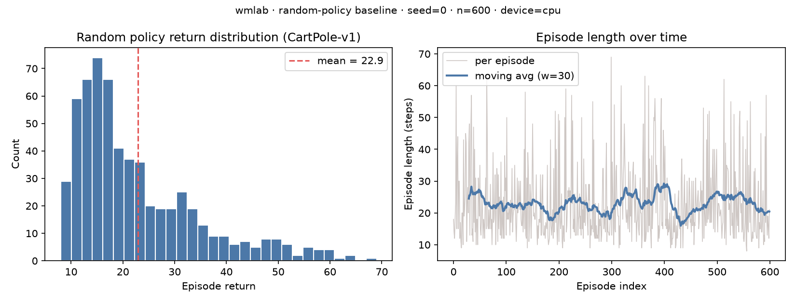
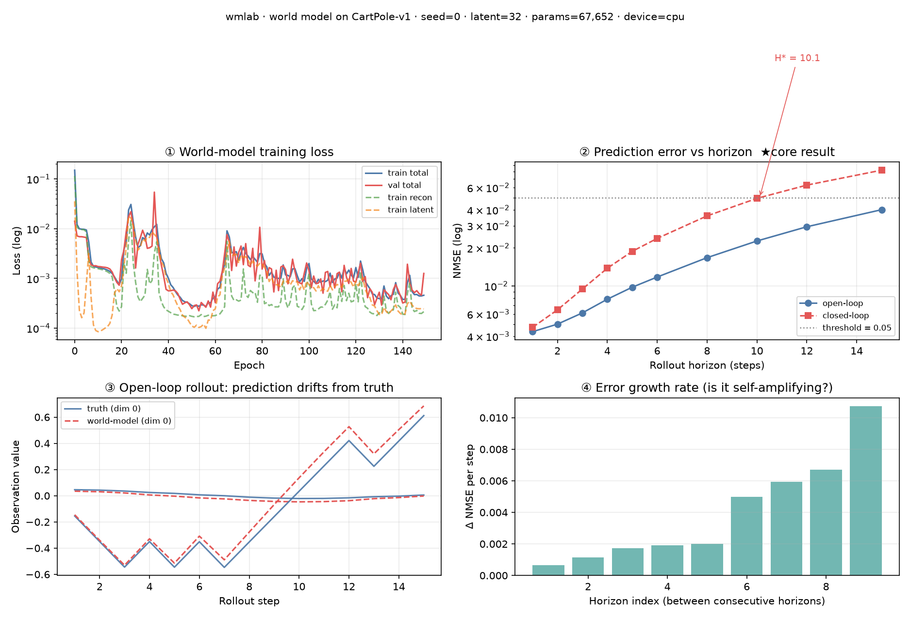

# world-model-lab

> 世界模型 + rollout + 可靠视界评测的最小可复现框架。
> 场景锚点：**UAV / 无线通信**（本框架先用 CartPole 级任务把训练循环跑通，再换场景，只动 `wmlab/envs/`）。

## 这个仓库解决什么问题

世界模型（world model）在 rollout 到第 N 步之后会失准，但**几乎没人明确回答"第几步开始不准、为什么"**。
本仓库的目标是把这件事做成**可测量、可复现、可对比**的：

- 统一的环境接口（`envs`），换场景不改模型与评测代码
- 最小的世界模型实现（`models`），编码器 + 潜空间转移 + 解码器
- 潜空间 rollout（`rollout`），支持任意视界
- **可靠视界（reliable horizon）**定义与测量（`eval`）——预测误差首次超过阈值的那一步

## 快速开始

```bash
# 1) 环境（本机已建好 ai-lab，见项目文档）
conda activate ai-lab

# 2) 随机策略 baseline，产出第一张图
python scripts/01_random_baseline.py

# 3) 训练一个世界模型，产出 loss 曲线 + 多步预测误差曲线
python scripts/02_train_world_model.py
```

所有结果图写入 `outputs/`（不进版本库）。

## 目录结构

```
wmlab/
  envs/     环境适配层。统一接口，换 UAV/信道场景只加 Adapter
  models/   世界模型。编码器 / 潜空间转移 / 解码器
  rollout/  潜空间多步 rollout，以及误差随视界增长的测量
  eval/     指标：NMSE、可靠视界、预测区间覆盖率
  utils/    设备选择（CPU/云 GPU 无痛切换）、随机种子
scripts/    可直接运行的入口脚本（编号即依赖顺序）
configs/    YAML 配置（device: auto 时自动选 cuda 或 cpu）
outputs/    ★ 结果图与日志，已 gitignore
```

## 设计约定（为云 GPU 迁移服务）

1. **设备无关**：任何 `.to(...)` 都走 `wmlab.utils.device.get_device()`，代码里不出现硬编码 `.cuda()`。
   本机无独显（CPU 起步），云端租 GPU 后 `--device cuda` 即可，不改代码。
2. **种子固定**：`set_seed()` 统一设置 python / numpy / torch，保证曲线可复现。
3. **配置外置**：超参走 `configs/*.yaml`，不写死在脚本里，便于扫参。
4. **结果落盘**：所有图与指标写 `outputs/`，README 里引用的图都从它来。

## 结果（2026-09-17 首次测量，CPU 全部跑通）

### ① 随机策略 baseline



CartPole-v1，600 集随机策略：平均回报 **22.9**（std 11.9），最长 69 步，共 13733 步。
随机策略平均 20 步出头就倒 —— 这也是当下 `horizons` 上限取 15 的原因。

### ② 世界模型与可靠视界 ★ core result



| 指标 | 值 |
|---|---|
| 参数量 | 67,652 |
| train / val loss | 0.1502 → 0.0005 / 0.0013 |
| **可靠视界（开环）** | **> 15 步**（测得范围内 NMSE 最高 0.011，未触及阈值 0.05） |
| **可靠视界（闭环）** | **10.1 步**（NMSE 首次超过 0.05，线性插值） |

**怎么读这张图**：开环 rollout 到 15 步仍然可靠；但一旦把模型自己的预测喂回去（闭环），
第 10 步就不可信。子图④ 的「每步误差增量」是**递增**的 —— 说明误差在**自我放大**，而不是线性累积。
这正是「该不该预测」这个问题可以量化的地方。

**明确待改进**：开环在测得的 15 步内没超阈，说明要么阈值 0.05 偏宽、要么视界太短、要么两者都有。
下一步换 Pendulum（每集固定 200 步）把视界拉到 50+，才能给出开环的真实 H\*。**当前数字不足以下结论。**

## 当前状态

- [x] 环境接口 + CartPole 适配器
- [x] 最小世界模型（MLP 版）
- [x] 多步 rollout 误差曲线 + 可靠视界指标
- [ ] 换场景：UAV 轨迹 / 无线信道（下一步）
- [ ] 因子化潜空间（确定性 H_t + 随机 Z_t）与不确定性校准
- [ ] 扩散策略动作头（对齐 diffusion policy）

## 参考

- 课题地图与选题：见父项目 `D:\workbuddy\researchproject`
- 方法来源：Dreamer 系（潜空间想象训练）、JEPA 系（联合嵌入预测）
