# world-model-lab

> 世界模型 + rollout + 可靠视界评测的最小可复现框架。
> 场景锚点：**UAV / 无线通信**（本框架先用 CartPole 级任务把训练循环跑通，再换场景，只动 `wmlab/envs/`）。

## 这个仓库解决什么问题

世界模型（world model）在 rollout 到第 N 步之后会失准，但**几乎没人明确回答"第几步开始不准、为什么"**。
本仓库的目标是把这件事做成**可测量、可复现、可对比**的：

- 统一的环境接口（`envs`），换场景不改模型与评测代码
- 最小的世界模型实现（`models`），编码器 + 潜空间转移 + 解码器
- 潜空间 rollout（`rollout`），支持任意视界
- **可靠视界（reliable horizon）**定义与测量（`eval`）——**第 h 步自身**的预测误差
  首次超过阈值的那一步（"逐点"口径；用累积口径会系统性抬高 H\*，见 §设计约定 7）
- **通信接入层**（`envs/channel.py`）——把世界模型接到丢包/时延信道 + AoI 记账，
  把 H\* 读成"多久必须传一次"（X24/X25/X26）
- **时延地板**（`eval/tracking.py`）——时延**真的延迟**信息之后，误差多出一个
  **与模型无关的下界** `2(1 − ρ_o(D))`（X27）：这是"生成年龄 ≠ 传输年龄"的实测证据

## 快速开始

```bash
# 1) 环境（本机已建好 ai-lab，见项目文档）
conda activate D:\devtools\miniconda3\envs\ai-lab
# 或在 VSCode 里直接用任务：Terminal -> Run Task -> wmlab: 环境自检

# 2) 环境自检（15 项，含中文字体链路）
python scripts/00_check_env.py

# 3) 随机策略 baseline，产出第一张图
python scripts/01_random_baseline.py

# 4) 训练一个世界模型，产出 loss 曲线 + 多步预测误差曲线
python scripts/02_train_world_model.py

# 5) 分析误差增长的形态（饱和 / 线性累积 / 自我放大，三选一）
python scripts/03_analyze_horizon_curve.py outputs/02_world_model_pendulum.json

# 6) 通信接入：X24 等价性 + X25 调度帕累托 + X26 解析对账（约 3 min，全程 CPU）
python scripts/04_channel_tracking.py --config configs/channel.yaml
python scripts/04_channel_tracking.py --config configs/channel.yaml --quick   # 冒烟

# 7) X26 对账细节（离线曲线 vs 在线实测、插值敏感性、H* 两口径）—— 读 04 的产物，不重训
python scripts/05_diagnose_x26_gap.py

# 8) X27 时延地板（读 04 的 checkpoint，不重训；约 1–2 min）
python scripts/06_delay_floor.py --quick   # 冒烟：2 条 × 200 步
python scripts/06_delay_floor.py

# 9) X3/X4：种子重复 × 阈值敏感性（CPU，约 13 min；含 5 次完整重训）
python scripts/07_seeds_threshold.py --quick            # 冒烟：2 种子、小 epoch
python scripts/07_seeds_threshold.py --seeds 0 1 2 3 4

# 10) 自检（50 项，不依赖 pytest；每个用例对应一次真实踩过的坑）
python tests/test_channel_and_aoi.py

# 11) X22：C17 的 safe horizon 在本场景**能不能实证**（12 项断言，秒级；不训练、不需 GPU）
python scripts/08_x22_theory_check.py

# 12) X30：任务锚定的 H*（UAV 闭环控制，约 2 min CPU；误差阈值 vs 任务失败的比值）
python scripts/16_task_horizon.py
```

换环境只换配置，代码不动（长视界那轮就是这么做控制变量的）：

```bash
python scripts/02_train_world_model.py --config configs/pendulum.yaml --tag 02_world_model_pendulum
```

所有结果图写入 `outputs/`（不进版本库）。

## 目录结构

```
wmlab/
  envs/     环境适配层。统一接口，换 UAV/信道场景只加 Adapter
  models/   世界模型。编码器 / 潜空间转移 / 解码器
  rollout/  潜空间多步 rollout，以及误差随视界增长的测量
  eval/     指标：NMSE、可靠视界、预测区间覆盖率
  utils/    设备选择（CPU/云 GPU 无痛切换）、随机种子、统一绘图样式
scripts/    可直接运行的入口脚本（编号即依赖顺序；00 = 环境自检）
configs/    YAML 配置（device: auto 时自动选 cuda 或 cpu）
outputs/    ★ 结果图与日志，已 gitignore
```

## 设计约定（为云 GPU 迁移服务）

1. **设备无关**：任何 `.to(...)` 都走 `wmlab.utils.device.get_device()`，代码里不出现硬编码 `.cuda()`。
   本机无独显（CPU 起步），云端租 GPU 后 `--device cuda` 即可，不改代码。
2. **种子固定**：`set_seed()` 统一设置 python / numpy / torch，保证曲线可复现。
3. **配置外置**：超参走 `configs/*.yaml`，不写死在脚本里，便于扫参。
4. **结果落盘**：所有图与指标写 `outputs/`，README 里引用的图都从它来。
5. **样式随代码走**：中文字体由 `wmlab.utils.plot.apply_style()` 显式设置（探测
   YaHei / PingFang / Noto CJK 等并逐个回退），**不依赖 `MPLCONFIGDIR` 等进程环境**——
   换机器、换终端、上云，图里中文都不会变方块；负号渲染同步修复。
6. **依赖锁定**：`requirements.lock.txt` 记录本机全量依赖（torch 为 +cpu 版，
   上云时替换为对应 CUDA 版本即可）。
7. ★ **口径必须显式**（2026-09-20 立）：任何"误差"数字都要写清三件事 ——
   **逐点还是累积**、**在哪个评测集上**、**除以哪个方差**。原因不抽象：H\* 这一个指标，
   在同一个 Pendulum 模型上就出现过 `64.83 / 51.96 / 42.99 / 39.01 / 25.71 / 25.57`
   六个数，全部"正确"，只是口径不同。代码层面已做成默认安全：
   `multi_step_error_curve()` / `closed_loop_error_curve()` **同时返回两个口径**；
   `reliable_horizon(..., calibration="cumulative")` 会**发警告**；
   `NmseCurve` 在 lengths 不匹配时**直接抛错**（而不是静默截断）。
8. ★ **报 H\* 还要写第四件事：种子数与滑窗采样数**（2026-09-20 X3/X4 补）。
   H\* 是"首次穿越"，属于曲线的极值泛函，对**种子**和**采样量**都比曲线本身敏感得多：
   5 个种子的 H\* 落在 **13.13 – 42.99**（CV **0.42**）；`n_samples` 从 256 提到 4096
   又会系统性挪动它。所以 `reliable_horizon` 的输入是"一条曲线"，而**一条曲线本身也不够** ——
   ⇒ 正确形式是 `H* = 26.9 ± 11.4 (5 seeds, n_samples=4096, θ=0.05)`
   或直接报对 θ 的**幂律标度** `α`（那个在均值上是稳的）。
   ★ 推论：**`NaN`/`Inf` 不得静默通过** —— `NaN <= 阈值` 恒为 False，
   会被当成"已超阈"返回**虚假偏小**的 H\*（实测触发过：弱模型观测空间闭环第 131 步后爆到 3.9e34）。
   现在会直接 `raise ValueError`。

## 结果（CPU，全部可复现；同种子重跑逐位一致）

### ① 随机策略 baseline


CartPole-v1，600 集随机策略：平均回报 **22.9**（std 11.9），最长 69 步，共 13733 步。
随机策略平均 20 步出头就倒 —— 这也是当下 `horizons` 上限取 15 的原因。

### ② 世界模型与可靠视界（第一轮：CartPole，短视界）


| 指标 | 值（逐点口径） | 累积口径（历史） |
|---|---|---|
| 环境 / 数据 | CartPole-v1，600 集随机策略，13,733 步 | 同 |
| 参数量 | 67,652 | 同 |
| train / val loss | 0.1502 → 0.0005 / 0.0013 | 同 |
| **可靠视界（开环）** | **12.95** ← 逐点口径才能测出 | `None`（视界上限 15 步内测不出） |
| **可靠视界（闭环）** | **6.96** | 10.1 |

**注意：这一轮的结论后来被修正了两次**（详见 ③ 与"误差口径"一节）。当时由图④ 得到
「误差在自我放大」，但有两个问题：

- **15 是数据上限，不是模型上限** —— 随机策略在 CartPole 上平均只活 22.9 步，
  `horizons` 物理上就设不到更大，所以「开环 > 15」什么也没测到；
- **图④ 的口径有缺陷** —— 当时写的是 `inc = np.diff(nmse)`，而 `horizons` 间隔不等
  （…2, 2, 3, 5, 5, 10…），**直接差分会把「采样间隔变大」混进「误差增长加速」**；
- **H\* 的误差口径也不对**（2026-09-20 发现）—— 当时用**累积平均** NMSE，
  它把前 h-1 步的误差摊成均值，穿越阈值更晚 ⇒ H\* 被抬高，开环甚至直接测不出。
  换成**逐点**口径后：开环从 `None` 变成 **12.95**，闭环从 10.1 变成 **6.96**。

### ③ ★ 核心结果：Pendulum 长视界（2026-09-18）

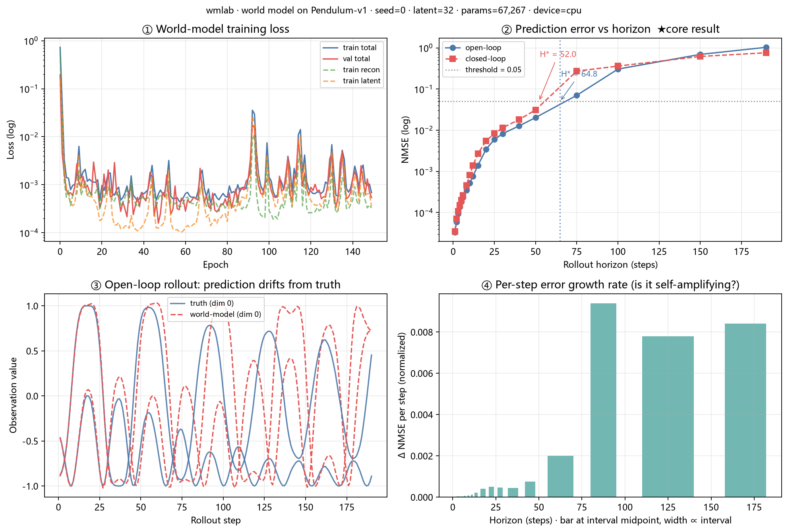

换到 `Pendulum-v1`（每集固定 200 步）把视界抬到 **190**。
**模型 / 损失 / 优化器 / 阈值全部不动，只换数据供给** —— 这是控制变量，不是调参：

| 指标 | 值（逐点口径 ★） | 累积口径（2026-09-18 首次报出） |
|---|---|---|
| 环境 / 数据 | Pendulum-v1，300 集随机策略，60,000 步（每集 200.0 步） | 同 |
| 参数量 | 67,267（obs_dim=3，连续动作） | 同 |
| train / val loss | 0.7298 → 0.0007 / 0.0005 | 同 |
| **可靠视界（开环）** | **42.99** | 64.83 |
| **可靠视界（闭环）** | **39.01** | 51.96 |
| 阈值 | NMSE > 0.05（`rel` 口径，与上一轮同口径，未改） | 同 |

> **为什么两个数字不一样**：累积口径算的是 `mse(pred[:, :h], tgt[:, :h])`（把前 h 步
> 一起平均），而 `reliable_horizon` 问的是"第 h 步**本身**首次超阈"。
> 前者是后者的**运行平均**，穿越阈值必然更晚 ⇒ **累积口径系统性抬高 H\***
> （开环 +50.8%、闭环 +33.2%）。**"开环 > 闭环"的方向不变，"误差饱和"的形态判定也不变。**

**三条结论**（每步增量表可用 `scripts/03_analyze_horizon_curve.py` 复现）：

1. **开环 H\* 第一次是个有限数字：42.99 步**（逐点口径）。上一轮那个「> 15」是区间下界。

2. **误差增长是「饱和」，不是「自我放大」。** 每步增量在 h≈88 处到达峰值
   （开环 9.4e-3、闭环 3.5e-3 每步），之后**掉头**：开环回撤 17%、闭环回撤 63%。
   上一轮之所以看到「自我放大」，是因为 CartPole 只测到 15 步，**整段都落在饱和曲线的上升段**
   —— 用短视界数据外推长视界行为，得到的是错觉。正确描述是：
   **每步误差增长率先升后降，最终饱和到目标方差（NMSE → 1，即「完全不可预测」的上界）**。

3. **两条曲线在 h ≈ 100–150 处交叉**：中期闭环更差，超长视界开环更差。

   | 视界 | 开环 NMSE | 闭环 NMSE | 谁更差 |
   |---|---|---|---|
   | 50 | 0.0203 | 0.0311 | 闭环 |
   | 75 | 0.0704 | **0.2728** | 闭环（差 3.9×） |
   | 100 | 0.3051 | 0.3612 | 闭环（略） |
   | 150 | 0.6951 | 0.6191 | 开环 |
   | 190 | **1.0313** | **0.7613** | 开环（差 1.4×） |

   机制解释 —— ★ **两者测的不是同一件事**（早在 CartPole 那轮读代码时就发现了，
   见 `D:\workbuddy\researchproject\04-实验与代码\实验记录\2026-09-17-...` §8）：

   | | 实现 | 误差在哪累积 |
   |---|---|---|
   | 开环 `multi_step_error_curve` | `encode` **一次** → 潜空间连推 H 步 → 最后统一 `decode` | **潜空间**，全程无纠错，误差无界 |
   | 闭环 `closed_loop_error_curve` | 每步 `encode → transition → decode`，输入是上一步的预测观测 | **观测空间**，每步自带一次隐式纠错 |

   所以：**中期闭环更差**，是因为每步多了一次 encode/decode 的**往返误差**在叠加；
   **超长视界开环更差**，是因为潜空间 rollout 没有任何机制把状态拉回编码器流形附近，
   误差无界增长（NMSE > 1 即**比「直接预测均值」还差**）。
   交叉现象本身可复现，但**机制归因仍属推测** —— 要坐实需补第三种曲线（潜空间闭环）。

**怎么读这张图**：子图② 是对数坐标的 NMSE 曲线 —— 实线是**逐点**口径（H\* 的定义口径），
淡色虚线是**累积**口径，两者的间距就是这个口径选择的影响力，不需要另开一张图解释。
子图③ 是一条真实轨迹的 190 步开环预测：前 30 步基本贴合，之后相位逐渐偏移。
子图④ 直接画**逐点**误差（`nmse_per_step`）—— 它本身就是"每一步有多准"，
不需要再对累积曲线做差分（那正是 2026-09-18 修掉的那处口径缺陷）。

**诚实的边界**：以上都是**随机策略**数据、**CPU**、MLP 世界模型。
**跨环境数字不可比** —— Pendulum 与 CartPole 的 H\* 不能直接比较（状态维度、动作空间、
每集长度都不同），这里只作「各测一次」。也**尚未回答**「该不该预测」这个科研问题（那是消融实验的事）。
**★ H\* 的数值同时依赖三个字段**：口径（逐点/累积）、评测集、归一化分母 ——
换任何一个都会变（同一个 Pendulum 模型：短 val 集上 42.99，held-out 长集 + global 分母上 25.71）。
引用 H\* 时必须三个一起写。

> ### ⚠️ 单种子限定（2026-09-20 补，见 §⑥）
>
> 上面这两个数（**42.99 / 39.01**）是 **seed = 0 一个种子**的结果。
> 补跑 5 个种子后：**H\*(开环) = 26.9 ± 11.4**，五个种子的原始值是
> **42.99 / 32.09 / 13.13 / 20.22 / 26.20** —— **最大值是最小值的 3.3 倍**。
>
> ⇒ **42.99 属于"最好的那个种子"**。本节的机制结论（饱和、开环>闭环、h≈100–150 交叉）
> 在 seed=0 上成立且被 §⑥ 证明**不依赖阈值选择**，但**任何一个 H\* 的具体数值都不可单独引用**。
> 这不是瑕疵，是这类"首次穿越"指标的固有性质 —— 详见 §⑥。

### ④ ★ 通信接入：把 H\* 当成"多久必须传一次"（2026-09-20，X24 / X25 / X26）

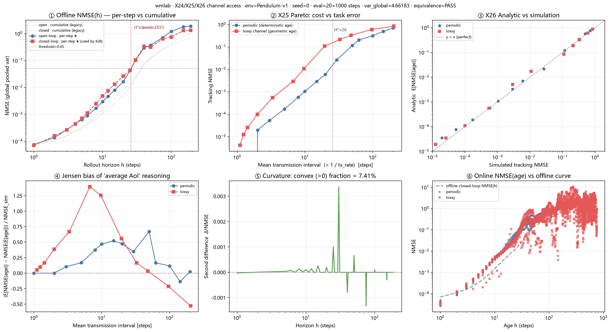

在 `wmlab/envs/channel.py` 加一层**薄信道适配器**（Bernoulli 丢包 + 时延），
把世界模型接到一个 AoI（信息年龄）记账器上，问三个问题：

| 编号 | 问题 | 结果 |
|---|---|---|
| **X24** | 信道层**有没有偷偷改动力学**？ | ✅ 三层等价性全过：E1 动力学 bit-exact（`max\|diff\| = 0.0`）、E2 裸 env 与 p=0 信道的 H\* 逐位一致、E3 实测 E[age] 收敛到理论 `p/(1-p)`（p=0.9 时 8.924 vs 9.000） |
| **X25** | 把 H\* 当"多久必须传一次"，它值不值？ | 传输率–NMSE 帕累托前沿画出来了；Kneedle 拐点在**间隔 62.5 步**（NMSE 0.205），而 H\*(闭环)=**25.6** 落在拐点**左侧** ⇒ **按 H\* 传输是保守的**（多花通信换误差）。容忍丢包率 **p\*(H=25.6, δ=1%) = 0.8408** ⇒ **在 Pendulum 上通信不是瓶颈** |
| **X26** | 离线测的 NMSE(h) 曲线**能不能预测在线跟踪误差**？ | ✅ 能。改用同口径后，解析 vs 仿真的中位相对偏差 **9.9%**（修正前是 56%，但那是口径造成的假缺口） |

**★ X24 为什么必须先做**：信道层一旦污染了动力学，所有历史结论作废。E1 的判据写死为
**逐位相等**（`np.array_equal`，不是 `allclose`），且信道用自己的 RNG（seed + 7919 偏移），
只有 `loss_prob > 0` 时才消耗随机数 —— 所以"加一层信道"不会顺带换掉被采样的轨迹。

**★ X25 的可复用结论**：`H*` 与"最优传输间隔"**不是同一个数**，两者差 2.4 倍。
把 H\* 直接当发送周期用会**过度通信**。真正的决策量是帕累托拐点，H\* 只给出"误差容忍度"。

**★ X26 的价值在方法**：`E[NMSE(age)] = Σ pmf(age)·NMSE(age)` 需要对曲线插值，
所以"离线曲线 ↔ 在线跟踪"的**口径必须严格一致**。下面这张图就是这次对账：

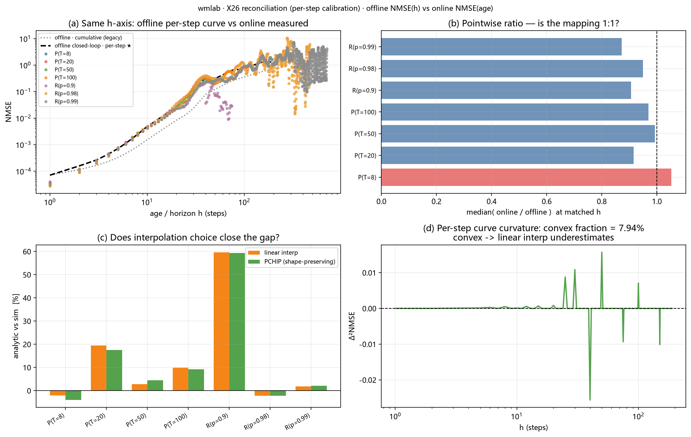

四联图说明：**(a)** 离线逐点曲线与在线实测（按 age 分组）落在同一量级；
**(b)** 在线/离线 中位比值：P(T=8)=1.05、P(T=50)=0.99、P(T=100)=0.97、R(p=0.99)=0.87 —— **映射成立**；
**(c)** 线性插值 vs 保形插值（PCHIP）对结论影响不大（大间隔处相差 ~1%），
所以**不需要为插值引入 scipy**；**(d)** 曲线在大视界段是凹的（饱和），
这正是 Jensen gap 变号的区间 —— 也是下面这条结论的依据。

**★ 一条可以直接写进论文的结论（Jensen 效应）**：在**相同平均 AoI** 下，
**age 方差更大的调度族（随机丢包）误差更高** —— 40/40 个匹配点上成立，中位比值 **20.8×**。
这是"只优化平均 AoI 不够，必须管尾部"的直接证据，也是本课题与
"任务级 AoI 拆成生成年龄 + 传输年龄"（讲座①）的接口。

**这次对账还揪出了两个 bug，都是"数字记下来了但条件没记下来"的同一类**：

1. **累积 vs 逐点口径**（见上面的 H\* 更正表）；
2. **`NmseCurve` 静默截断**：把**稠密**的逐点数组（长度 190）配给**稀疏**的 `horizons`（19 个）
   时，`np.asarray(nmse)[order]` 不报错、直接截断，于是把"第 1..19 步的值"当成了
   "视界 1..190 的值"，大间隔调度的解析值离谱地小（T=200：解析/仿真 = 0.016/0.703）。
   现在 `NmseCurve` 直接抛错，并有回归测试锁住。

### ⑤ ★ 时延：**不用模型** vs **用模型**，差在哪（2026-09-20，X27）

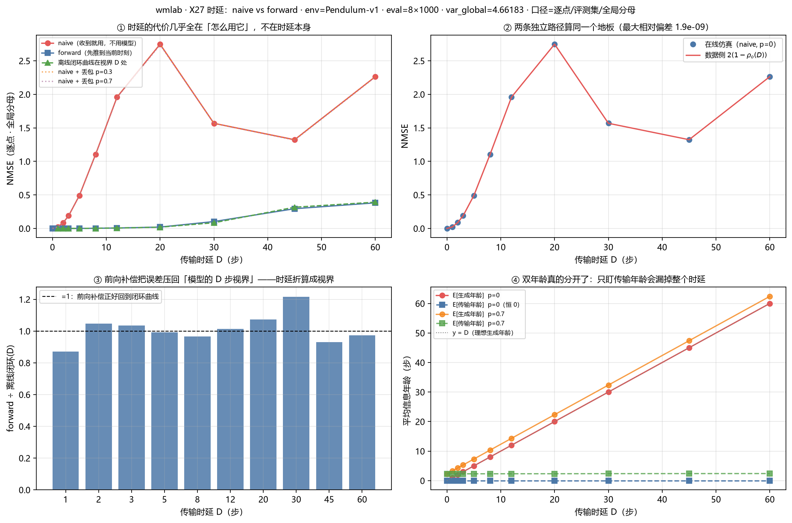

`delay` 在此之前是个**空参数** —— 它只参与 `age_gen = age_tx + delay` 这个加法，
**没有任何信息真的被延迟**（每步送达的都是**当步**观测）。所以讲座①那条
「任务级 AoI = 生成信息年龄 + 传输信息年龄」的分解**从未被验证**。
现在 `run_tracking` 用**在飞包 FIFO** 真正延迟到达，于是有四个可判定的问题：

| 问题 | 结果 |
|---|---|
| 收到**陈旧**观测就直接当当前状态用（`naive`），误差是多少？ | 它是**模型无关**的：`2(1 − ρ_o(D))`。在线仿真 vs 数据侧复算，11 个时延点最大相对偏差 **1.9e-9** |
| 先用动作把陈旧观测**向前推进**到当前时刻（`forward`）呢？ | 误差回到**模型的 D 步视界**：`forward ÷ 离线闭环(D)` ∈ **0.87–1.22**，无一个点偏离 1 超过 25% |
| 两者差多少？ | `forward/naive` 从 **0.0012**（D=3，**差 830 倍**）到 0.22（D=45） |
| 双年龄真的分开了吗？ | ✅ `p=0` 时 `E[传输年龄] ≡ 0` 而 `E[生成年龄] ≡ D` |

**三条结论**：

1. **时延的代价几乎全在"怎么用它"，不在时延本身。** 同一个 D=5，
   `naive` 误差 `0.491`、`forward` 误差 `0.00073` —— **差 674 倍**。
   ⇒ 对 `E[NMSE(age)]` 的正确拆法是 `f(时延的处理方式) + rollout(age)`，
   而不是把时延和丢包混进同一个 age 里。

2. **在 Pendulum 上，1 步时延比丢 70% 的包贵得多。** 纯丢包 p=0.7 → NMSE `3.9e-4`；
   纯时延 D=1 → `0.023`（**59.5 倍**）、D=2 → `0.087`（**224.7 倍**）。
   原因：短视界 rollout 很强（H\* ≈ 39），丢包几乎被模型补掉；时延注入的是"内容陈旧"。

3. **★ `forward` 有效的前提是模型够好 —— 这句话不能省。** 用随机初始化的模型跑，
   D=1 时 `forward ≈ 1.006` 而 `naive ≈ 0.021`（**糟 47 倍**）。
   把一个不会预测的模型顶上去，当然**不如直接用陈旧但真实的观测**。
   ⇒ 「世界模型对通信有用」必须带**模型质量**这个前置条件，否则是空话。

**两条独立路径的验证**（沿用 X26 的纪律）：`naive` 在线 ≡ `2(1−ρ_o(D))`（1.9e-9）；
`forward` 在线 ≡ 「全起点手工复算 D 步闭环 rollout」（**逐位一致**）。

**这次又踩到一个"数字与条件分离"的坑**：离线闭环曲线的 `n_samples=64` 时**它自己就不稳**，
D=30 处单次估计 0.0937、而全起点真值 0.1017 ⇒ 凭空造出一个 **5.4 倍的假缺口**；
给到 `2048` 才收敛。
**报"两条曲线的比值"之前，先确认两条曲线**各自**都收敛了。**

### ⑥ ★ H\* 到底有多可信：5 种子 × 5 阈值（2026-09-20，X3 / X4）

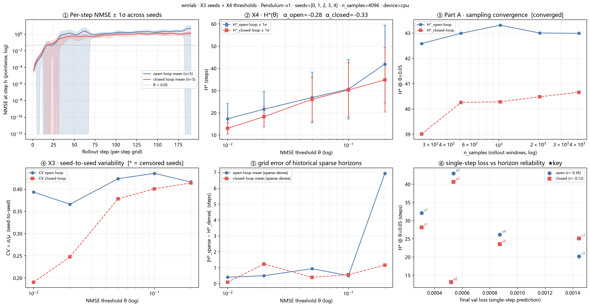

到 §⑤ 为止报出的每一个 H\* 都是**单次测量**。而 H\* 是"误差首次超阈"，
属于曲线的**极值泛函** —— 比曲线本身对噪声敏感得多。这一节补两块：
**X3**（种子重复）、**X4**（阈值敏感性）。
跑法：`python scripts/07_seeds_threshold.py`（CPU，约 13 min，含 5 次完整重训）。

**先做前置检验，否则后面全是假象**：窗口采样数 `n_samples` 不够时，
**同一个模型两次测出的 H\* 都不同**，那种子之间的"差异"里就混着采样噪声。
扫 `n_samples ∈ {256 … 4096}`：最后一档的相对变化 **0.45% < 2%** ⇒ 判为收敛，采用 **4096**。

#### X3 · 种子重复：单次 H\* 不能作为结论

| seed | val_loss（单步预测） | H\*(开环) | H\*(闭环) |
|---|---|---|---|
| 0 | 0.000537 | **42.99** | 40.66 |
| 1 | 0.000307 | 32.09 | 28.17 |
| 2 | 0.000520 | **13.13** | 13.16 |
| 3 | 0.001444 | 20.22 | 25.12 |
| 4 | 0.000872 | 26.20 | 23.54 |
| **汇总** | — | **26.93 ± 11.41**（CV **0.424**） | **26.13 ± 9.89**（CV 0.378） |

三个必须一起读的事实：

1. **最大值是最小值的 3.3 倍**（42.99 vs 13.13）。
   ⇒ 单点 H\* **不是**一个成立的结论形式，§③ 那个 42.99 属于"最好的那个种子"。

2. **★ 单步训练损失不能预报长视界可靠性。** seed=0 与 seed=2 的 val_loss 只差 **3.2%**
   （0.000537 vs 0.000520），H\* 却差 **3.1–3.3 倍**。
   Pearson r = **−0.359**、Spearman ρ = **−0.200**（n=5 —— 符号与强度都还不稳，只作定性）。
   ⇒ **"训练 loss 收敛"和"多步预测可靠"是两件事**，长视界可靠性必须**单独测量**。
   这正是这个世界模型值得被单独评测、而不是从训练曲线推断的理由。

3. **口径复现性交叉验证**：Part A 在 `n_samples=512` 处给出 **42.99209**、`n_samples=256` 处给出
   **39.01098** —— 与 §③ 记录的 **42.99 / 39.01** 逐位一致，**代码没有漂移**。
   （顺带暴露一个此前没注意的事实：§③ 那两条曲线其实是在**不同采样精度**下测的 —— 512 vs 256。）

#### X4 · 阈值敏感性：绝对值不可靠，但标度行为很稳

| θ | H\*(开环) | H\*(闭环) |
|---|---|---|
| 0.01 | 17.38 ± 6.84 | 13.04 ± 2.49 |
| 0.02 | 21.68 ± 7.94 | 18.31 ± 4.53 |
| **0.05**（主口径） | **26.93 ± 11.41** | **26.13 ± 9.89** |
| 0.10 | 30.67 ± 13.37 | 30.31 ± 12.15 |
| 0.20 | 41.98 ± 17.48 | 34.88 ± 14.45 |

- **H\*(θ) 服从干净的幂律**：开环 `62.19 · θ^(+0.277)`（R² = **0.981**）、
  闭环 `63.35 · θ^(+0.327)`（R² = **0.967**）。
  阈值**加倍**，H\* 只增加约 `2^0.28 ≈ 1.21` 倍 —— **次线性**。
  即便绝对值有 ±40% 的种子波动，**这个标度指数是稳的**，可以作为一个被引用的量。

  > ⚠️ **2026-09-21 更正**：此式原写作 `θ^(−0.277)`（**负号**），与本表方向
  > （θ↑ ⇒ H\*↑）相反。用 `outputs/07_seeds_threshold.csv` 独立复算：
  > α = **+0.2696 ± 0.0869**（`open_sparse`，5 seeds）；按原式代入实测阈值，
  > 相对偏差最大达 **+1290.8%**。**系数 62.19 与数量级本身是对的，错的只有指数符号。**
  > 详见 `2026-09-21-X22-与理论界对账.md` §4.4。

- **★ 开环 > 闭环的序在全部 5 个阈值下一致**（排序反转点：**无**）。
  这是本节唯一一条**不依赖阈值选择**的强结论 —— §③ 的"开环能推得更远"因此站得住。

- **CV 不随 θ 系统变化**（0.37–0.44）⇒ 方差**不是**阈值选择造成的，而是模型本身的。

#### 顺带量化出来的一个历史精度缺陷

config 的 `horizons` 在长视界段很稀（100 → 150 → 190）。在同一批曲线上比较
**稀疏网格插值**与**逐步（稠密）插值**得到的 H\*：最大差 **19.57 步**。
§③/§④/§⑤ 报的所有 H\* 都基于稀疏网格 ⇒ **长视界段的插值误差最多可达约 20 步**
（子图⑤ 显示这个误差主要来自开环曲线，闭环的小一个数量级）。

#### 结论：H\* 正确的报法

- ❌ 不要报 `H* = 42.99` —— 那是一个种子的运气
- ✅ 报 `H* = 26.9 ± 11.4（5 seeds，θ=0.05）`，或直接报**幂律标度** `α ≈ 0.28`
- ✅ 需要绝对长度时，报**中位数 / 范围**，不要报单点

**怎么读这张图**：③ 是采样收敛性证据（撑起整节的可靠性）；
⑥ 是本节最关键的散点（`s0` 与 `s2` 在横轴上几乎重合、纵轴上差 3 倍）；
① 是 5 个种子的逐点 NMSE 带 ±1σ；② 是 H\*(θ) 与幂律拟合；④ 是 CV(θ)；⑤ 是稀疏网格误差。

### ⑦ ★ 与理论界对账：**结论是"对不上"，而且原因是可证明的**（2026-09-21，X22）

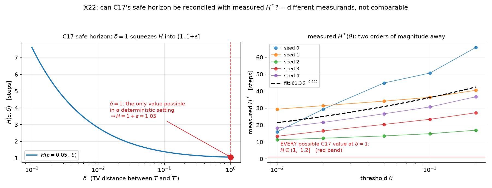

**动机**：C17（*Imperfect World Models are Exploitable*，arXiv:2605.15960）给出了 safe horizon 的
**紧界闭式解**，但**纯理论、零实验**，且原文明确限定 **finite MDP**。
原计划是"把实测 NMSE 当 δ 代进去，与实测 H\* 报出 gap"。

**结论：这个动作在数学上不成立**，理由有三条，全部可复现（`scripts/08_x22_theory_check.py`，12 项断言）：

| # | 断裂点 | 内容 |
|---|---|---|
| **①** | **measurand 不同** | C17 的 H 约束「**策略序反转幅度 ≤ ε**」（含回报 J 与折扣 γ）；本仓库的 H\* 是「**预测误差首次超阈的步数**」（不涉及策略、价值、γ） |
| **②** | **δ 取不到有分辨力的值** | δ 是两转移模型的 **TV 距离**。本仓库**环境确定性**（Pendulum/CartPole 的 `step()` 无噪声，实测同一 `(s,a)` 三次得到逐位相同的 `s'`）**且模型确定性**（`transition` 是 MLP 点估计，无方差头，实测同输入同输出）⇒ `T` 与 `T′` 都是**点质量** ⇒ `TV ∈ {0,1}`，取 `max` 后 **δ ≡ 1** |
| **③** | **空间不同** | 本仓库的转移在**潜空间**，δ 定义在**状态-动作空间**；原文亦限定 finite MDP，自陈不适用于连续 / 潜空间 |

**δ = 1 时代数化简（两条独立路径核对，最大绝对差 2.22e-16）**：

```
(1−ε)² + 4ε = (1+ε)²  ⇒  √(...) = 1+ε  ⇒  H(ε, 1) = 1 + ε
```

**定理条件于是退化为 `1/(1−γ) ≤ 1+ε ⟺ γ ≤ ε/(1+ε)`**：

| ε | 允许的最大 γ |
|---|---|
| 0.01 | 0.0099 |
| 0.05 | 0.0476 |
| 0.10 | 0.0909 |
| 0.20 | 0.1667 |

⇒ **对任何有实际意义的 γ（0.9 / 0.99）条件都不满足**。δ = 1 给出 H 的全局最小值，
而 H 在本场景里永远落在 `(1, 1+ε]` —— 右图那条红色窄带就是它的**全部**可能取值，
而实测 H\* 是 13–66 步。**不是"差多少倍"，而是两边不在同一个量上。**

> ★ **所以本仓库不报任何 "gap 数值"。** 若强行代入（δ 取实测 NMSE 0.05）会得到 `H = 1.63`
> 与实测 `42.99` 相差 **26 倍** —— 但那是**假缺口**，相除没有数学意义（对应 R13 的精神：
> 比值只有在两个量各自有定义时才可比）。

**这条负面结论反而加硬了所在位置**：调研把"测量理论界与实测的 gap"判为唯一确定还空着的环节。
本次给出更本质的原因 —— **这座桥没人走，不是没人想到，而是 C17 的 δ 是 TV 距离，
而 TV 距离在确定性动力学上不携带误差幅度信息，"保守多少"在现有定义下问不出来。**

**两条补救路径（都还没做）**：

| 路径 | 做法 | 归属 |
|---|---|---|
| **A** | 给环境**注入过程噪声**，让 `T` 变成真分布 ⇒ δ 才连续 | X14 换场景时顺带（玩具环境上不值得单独开一轮） |
| **B** | 换 **Wasserstein-1 / 潜空间距离** 替代 TV，**自己重推**对应的 safe horizon | 理论工作，阶段 3–4 |

**诚实边界**：① 本次**没有产生任何 gap 数值**；② δ ≡ 1 依赖"环境确定 + 模型确定"两个前提
（均以 assert 实测），**若模型换成随机版（B1 的 `H_t + Z_t` 因子化），前提失效，本文结论需重做**；
③ 只读了 C17 的定理与局限段，未逐页精读其证明，**没有独立验证该定理本身**；
④ 全程 CPU、0 元、无训练。

### ⑧ ★ 第三种曲线 = 纠错频率 K；δ 连续化；C17 对账闭合；UAV 场景（2026-09-22 凌晨，X11 / X28 / X29 / X14）

**X11（`scripts/11_latent_roundtrip.py`）** —— "第三种曲线"的正确形态不是再画一条，
而是把两条现有曲线的**唯一差异**（往返映射 R = encode∘decode 的施加频率）变成自变量：

- **端点恒等式被证明**（assert 逐位）：K=1 ≡ 闭环、K=∞ ≡ 开环（最大差 1.2e-11）；
- 150 epoch 下 **H\*(K) 平坦**（22.50±2.48 vs 23.53±6.18，效应 < 种子噪声）；
- **K 的效应随模型质量衰减**（ΔH\*：+6.1@5ep → +1.0@150ep；趋势成立、幅度不可引用）；
- "轨迹漂出训练分布"假说被**推翻**（Mahalanobis 距离几乎不随视界变化）。

**X28（`scripts/12_delta_continuity.py`）** —— 救活 §⑦ 的死路：注入过程噪声 +
概率模型（`GaussianWorldModel`，NLL 训练），δ 第一次可测：

- **δ 可分辨 ⇔ 模型均值误差 ≲ 潜空间分布宽度 ⇔ latent_dim=4**（D≥8 饱和回 1）；
- δ（mean/median）随 σ_env **单调下降**：1.00 → 0.84 → 0.59 → 0.34
  （★ 宽分布"兜住"均值误差 —— 与直觉相反，实测方向为准）；
- **δ_max 在 σ≤0.1 仍饱和 ⇒ C17 的 max 定义在实践中过强**
  （平均意义上很好的模型得到几乎为零的保证 —— 可写进论文的实证批评）；
- 方差头粗校准：σ_pred ≈ σ_true（系统性略偏大）—— B1 的第一块。

**X29（`scripts/13_x29_reconcile.py`）** —— δ 可测之后的 C17 对账（⑧ 环闭合）：

| σ_env | δ_med | H(ε,δ) 理论 | H\* 实测 | H\*/H |
|---|---|---|---|---|
| 0.1 | 0.61 | 1.08 | 18.85 | 17.5× |
| 0.3 | 0.31 | **1.15** | **9.76** | **8.5×** |

**gap ≈ 8.5–23.8×，数量级真实**；保守性来源可实证（max 定义 + measurand 双重过强）。
⚠️ measurand 断裂点仍在（序反转 vs 误差超阈）⇒ **gap 只能定性引用，不能当倍数宣称**。

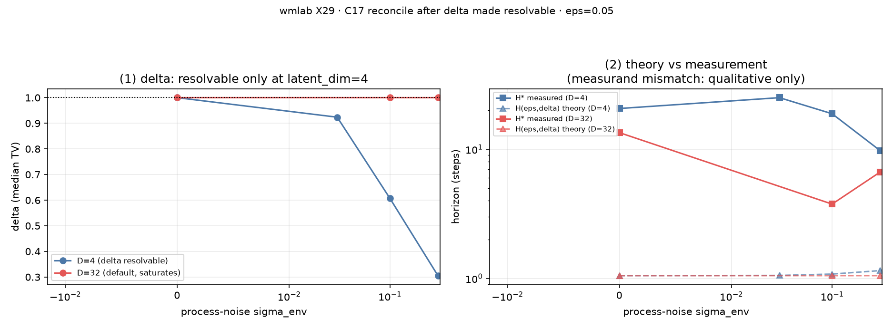

**X14 首跑（`configs/uav.yaml` + `envs/uav_track.py`）** —— 自建 2D UAV 跟踪场景
（双积分器 + 阻尼 + 风扰过程噪声）：

- **架构声明首次实测**：`02` 训练管线**零改动**跑通新场景（唯一例外 = env kwargs 透传 1 处）；
- **H\*（σ=0.15，3 种子，逐点口径）：开环 11.41 ± 4.10 / 闭环 9.00 ± 4.44**
  （CV 0.36 / 0.49，与 Pendulum 的 0.42/0.38 同量级；开环>闭环在 3/3 种子一致）；
- 闭环误差饱和于 NMSE≈1（噪声环境的理论特征）。
- **σ 敏感性（3 种子 × {0, 0.15, 0.5}）**：H\* 随噪声单调下降（开环 16.1→11.4→8.8）
  —— **通信压力在 UAV 上显出梯度**（Pendulum 上"调度全部差不多"的死寂不见了）；
  ★ σ=0 时**排序反转**（闭环 > 开环，2/3 种子；std≈均值，3 种子不足以下强结论，待确认）。

**X12-min（`scripts/15_sigma_calibration.py`）** —— σ 头校准检查（B1 第一块）：

- 逐维 std(r) = [1.06, 1.11, 1.01, 1.06]，**τ = 1.058**（仅 6% 过度自信）；
- 覆盖率：名义 95% → 实测 93.2%，**温度缩放后 94.5%**；
- 口径声明：这是**潜空间单步转移**的校准，obs 空间多步校准是 X12 完整版。

### ⑨ ★★ 任务锚定的 H\*：误差阈值 ≠ 任务边界（2026-09-22，X30）

`scripts/16_task_horizon.py` + `wmlab/control.py` + `configs/uav_task.yaml`。

**此前所有 H\* 都是 `NMSE > 0.05` 定义的 —— 这个阈值与任务无关。**
X30 第一次把「误差 → 任务」的映射测出来：UAV 跟踪场景 + 解析 PD 控制器，
控制器**只看得见估计状态**（丢包时世界模型 rollout 顶上）⇒ 模型误差会
**反过来改变真实轨迹**（compounding 第一次真正接上；此前 `run_tracking`
的动作来自离线数据，轨迹与模型无关）。

**核心数字（100 集/点，周期调度 T ∈ [1,128]）**

| 口径 | 定义 | H\* | / H\*_err |
|---|---|---|---|
| **H\*_err** | 离线闭环 NMSE 逐点 > 0.05（沿用 X2/X14） | **26.1** | 1.00 |
| H\*_escape | 逃逸率 ≤ 基线 +0.02 | 24 | 0.92 |
| **H\*_escape** | 逃逸率 ≤ 基线 **+0.05** | **32** | **1.22** |
| H\*_dist | 稳态距离 ≤ 基线 ×1.2 / ×2 / ×3 | 1 / 2 / 8 | 0.04–0.31 |

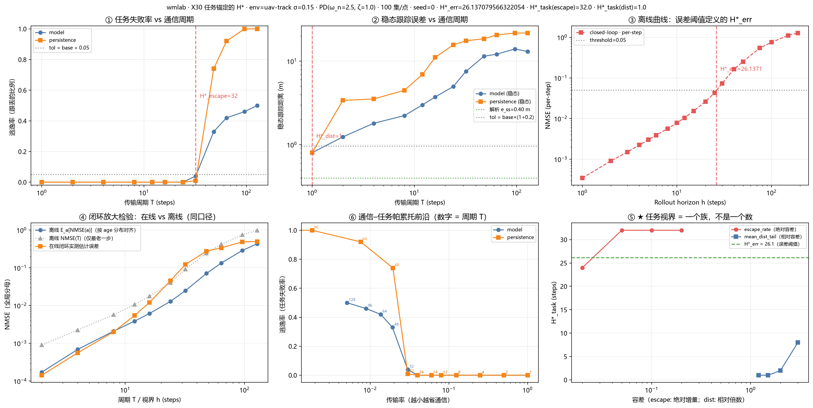

- **同一批数据上 H\*_task 跨 32 倍**（1–32 步），而 H\*_err 只有一个数 ⇒
  **换任务指标就会换结论**。0.05 这个阈值恰好处在"灾难性失败"一侧
  （H_escape/H_err=1.22），对"性能可感知退化"（距离口径）则**保守 30 倍**。
- **闭环放大**：同口径对账（在线估计误差按 age 分布平均 vs 离线曲线），
  中位数比值 **1.69**（max 4.9）⇒ **闭环控制放大了模型误差，离线 H\* 偏乐观**。
- **模型 vs persistence 基线**：T=64 时逃逸率 0.42 vs 0.92；T≥96 时 persistence
  全军覆没（1.00）而模型仍 0.46–0.50 ⇒ **世界模型顶上的价值随通信变差而放大**。

**★ 诚实交代（本实验的边界）**
1. 此时测到的视界是 **(模型, PD 控制器, 周期调度) 三元组**的属性，**不是模型单独的属性**；
2. PD 增益是闭式解（kp=ω_n²=6.25, kd=2ζω_n−κ=4.5），稳态误差解析值 **0.40 m**
   （旋转坐标系向量解；第一版标量式 0.58 m 是**错的**——把正交的向心项与阻尼项相加了），
   实测 0.89 m（含风扰，Jensen ⇒ 只会更高）；确定性环境下自检验证到 **1.4%**；
3. 加了 **250 步预热**隔离初始捕获瞬态：不加预热时 T=1 实测 2.86 m、|a| 全程饱和，
   看起来像"解析错了"，实际是 episode 只有 200 步、瞬态（~400 步）没走完。
   —— **第 11 次自我修正**，与前 10 次同根因：从图上"看出"数字就直接解释。

自检 ⑫–⑮（共 51 项）覆盖：增益闭式解、稳态=解析解、n_tx/E[age] 闭式解精确匹配、
T=1 估计误差恒为 0、NaN 闭环必须抛、estimator 开关接线。

### ⑩ ★ 自己写的 PPO，与「数据从哪来」的消融（2026-09-21，X5 / X6 / X7）

`wmlab/agents/ppo.py` + `scripts/09_train_ppo.py` + `scripts/10_behavior_ablation.py`。

**X5（`scripts/09_train_ppo.py`）** —— 不抄库，手写 PPO；文件头留完整推导
（策略梯度 → 重要性采样 → clip 为什么要双分支取 min → GAE → 三项 loss 的符号）：

- 确定性评估 **500.0 ± 0.0**（20 条全满），判据 PASS；
- ★ 踩坑：`Tanh` trunk 让 **79.6% 的激活饱和** ⇒ 梯度断流 ⇒ critic explained-variance 仅 **0.24**；
  换 `ReLU` 后 209 → **500**。同一份超参，差别只在激活函数。

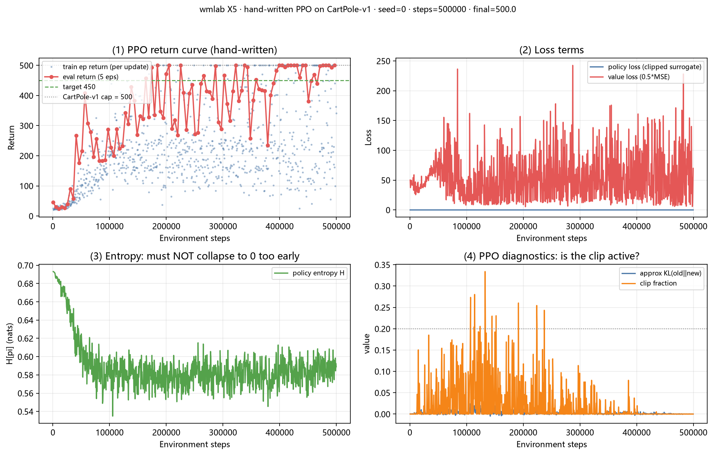

**X6 / X7（`scripts/10_behavior_ablation.py`）** —— 世界模型的**训练数据从哪来**，决定了它的可靠视界：

| 训练数据来自 | 在 PPO 策略分布上的回报 |
|---|---|
| 随机策略 | **1.20 ± 0.35** |
| PPO 策略（训练过的） | **47.84 ± 6.27** |

3 种子配对差 **+46.6 ± 6.1**，3/3 同向。★ 不对称性：**好策略的数据向下兼容差策略的分布，反之不成立**
—— 所以"用随机策略采数据训世界模型"不是省事，是**把模型上限压死**。

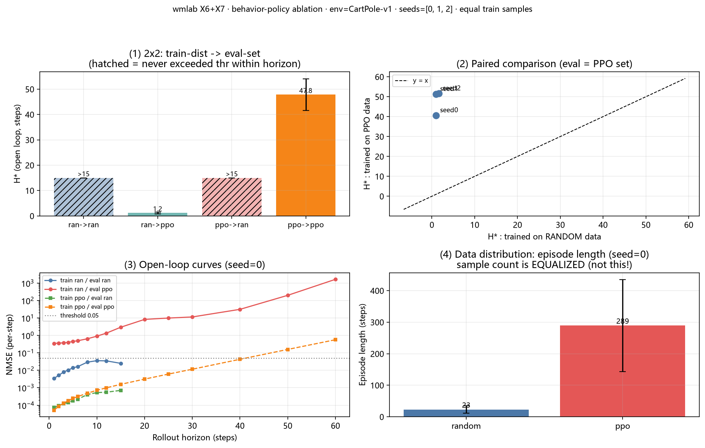

### ⑪ ★★ 突发信道：「突发」到底让误差变大还是变小？（2026-09-22，X31）

`scripts/17_burst_channel.py` + `wmlab/eval/tracking.py::GilbertElliottChannel` + `configs/uav_burst.yaml`

X24–X27 的信道是**无记忆伯努利丢包**；真实无线信道是**突发**的。X31 换成
Gilbert–Elliott 两状态模型，固定**平均丢包率 p̄=0.5**，只扫**平均突发长度 L**。

★ 第一个反直觉点：**L=1 不是 i.i.d.** —— 无记忆条件是 ρ₁ = 1−α−β = 0，
代入参数化得 **L_iid = 1/(1−p̄) = 2**。L=1 是"通/丢交替"（ρ₁=−1），L>2 才是真突发。
网格 1→32 **连续穿过「交替 → 无记忆 → 强突发」三种机制**。

**核心数字（p̄=0.5，60 集/点，稳态口径）**

| L | ρ₁ | E[age]=p̄·L | E[NMSE] | 相对 i.i.d. | 闭式偏差 | 一阶项占比 |
|---|---|---|---|---|---|---|
| 1 | −1.000 | 0.50 | 0.00035 | **0.25×** | −2.6% | 100% |
| **2** | **0.000** | 1.00 | 0.00145 | **1.03×** | +2.8% | 78% |
| 4 | +0.500 | 1.96 | 0.00480 | 3.4× | −8.9% | 67% |
| 8 | +0.750 | 3.94 | 0.01995 | 14.1× | −0.5% | 59% |
| 16 | +0.875 | 7.29 | 0.06888 | 48.9× | −4.1% | 59% |
| 32 | +0.938 | 14.57 | 0.20006 | **141.9×** | +1.4% | 84% |

- ★★ **平均丢包率完全相同（50%），跟踪误差跨 570 倍**（0.25× → 142×）。
- ★★ **闭式恒等式 `E[NMSE] = p̄·[f(L) + J(L)]` 成立，相对偏差中位 −1.5%**
  （f = 离线闭环 NMSE 曲线，J = Jensen 项；推导见 `GilbertElliottChannel` 类 docstring）。
  ⇒ **X26 的解析式从 i.i.d. 推广到任意突发信道**，而且不需要实测 age 直方图。
- ★ **一阶项 f(L) 平均占 74%** ⇒ 突发的影响主要是**一阶地拉长条件信息年龄**，
  **不是** Jensen 高阶效应（J 全部 ≥ 0：凸性只是"雪上加霜"，不是主因）。
- **L < L_iid（通/丢交替）反而更好** —— 条件年龄被压到 1 步。
- 锚点：L = L_iid = 2 时 GE 与 i.i.d. 基线的 E[NMSE] 比值 **1.029**（两个独立实现接上了）。

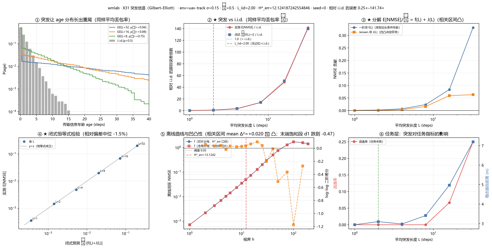

**★ 两个必须写下来的口径陷阱（都是"看着完全合理"的假结果）**

1. **离线曲线被自己的最大视界挤进瞬态区**：起点范围 `t0 ∈ [0, T−h_max−1)`，
   h_max=190、episode 451 步 ⇒ 起点只能落在前 260 步，而 UAV 捕获瞬态占前 ~250 步
   ⇒ **f(1) 高估 49%、f(6) 高估 11%**（偏差随 h 收敛，极易被误读成机制）。
   修法：离线加 `t0_min`、在线加 `warmup`，**两边都在稳态区**；episode 拉长到 700 步
   （否则稳态起点只剩 10 个）。对齐后在线实测 f_online(k) 与离线 f(k) 吻合到 5% 以内。
2. **`n_tx` 与 `n_steps` 不在同一区间**：`n_tx` 在预热期也累加、`n_steps` 只记预热之后
   ⇒ L=1 时算出丢包率 **0.222 而非 0.5**（差 23σ）。X26/X27 因 `warmup=0` 从未触发。

★ **第 13 次自我修正**：凹凸性诊断**必须局部化**。全区间 mean(Δ²) = −0.12 会判成
"凹 ⇒ 突发更好"，而相关区间（h ≤ L_max=32）内 Δ² 全为正（**凸**），实测 Jensen 项也全 ≥ 0。
原因是曲线末端进入饱和（幂指数跌到 −0.47），两个大负值把均值拉翻了，而 age 分布
根本取不到那么大的 h —— **用全区间均值判定，正是规范 R2 说的"看图下结论"**。

**任务层（闭环控制，60 集/点）**：逃逸率在 L≤8 时仍为 0，L=16 起 6.7%、L=32 达 25%
⇒ **任务对突发有明确容忍边界**；稳态跟踪距离 2.9 → 7.2 m。
与 A 层**同向**（与 X30 不同：X30 里误差阈值与任务边界差 32 倍，这里两者方向一致）。

自检 ⑯–⑳（共 51 项）覆盖：GE 解析量、无记忆点不是 L=1、条件年龄恒为 Geom(β)、
tx_rate 与 warmup 同区间、t0_min 真的抬高起点。

### ⑫ ★★ 丢包率 × 突发结构：两个因子是解耦的吗？（2026-09-23，X31-b）

`scripts/18_burst_sweep.py` + `configs/uav_burst_sweep.yaml`（p̄ ∈ {0.2,0.35,0.5,0.65} × L ∈ {2,4,8,16,32}）

X31 只在 **p̄=0.5 一个点**上验过 `E[NMSE] = p̄·[f(L)+J(L)]`。单点值不可引用
（X3/X4 的教训）⇒ 把 p̄ 也铺成网格。★ **模型与离线曲线各只算一次、全网格共享** ——
否则"模型质量"会混进 p̄ 的效应，检验直接失效。

**待验的强预言**：Gilbert 下条件年龄分布恒为 Geom(β)，**与 p̄ 无关**；p̄ 只决定
`P(age=0)=1−p̄`，又 f(0)=0 ⇒ **`E[NMSE] = p̄·G(L)`**，其中 G 只依赖 L。
⇒ C1 数据塌缩（不同 p̄ 的 `E[NMSE]/p̄ vs L` 曲线重合）、C2 线性于 p̄（过原点直线）。

| L | G(L)（4 个 p̄ 的平均） | 跨 p̄ 的 CV | **种子内噪声 CV** | 比值 |
|---|---|---|---|---|
| 2 | 0.00271 | 1.2% | 3.2% | **0.38** |
| 4 | 0.00995 | 8.0% | 4.7% | 1.68 |
| 8 | 0.03816 | 2.3% | 8.7% | **0.26** |
| 16 | 0.13997 | 12.9% | 7.5% | 1.71 |
| 32 | 0.38716 | 5.2% | 6.4% | **0.81** |

- ★ **5 个 L 里有 3 个的跨 p̄ 离散度低于噪声本身**（比值 <1）⇒ 差异**完全可由噪声解释**。
  最大比值 1.71 ⇒ **C1 弱成立**：解耦基本成立，残余依赖量级接近噪声。
- **G(L) 跨度**：L=2 → L=32 是 **143 倍**；而 p̄ 只贡献一个**线性因子**。
  ⇒ 通信上可分开设计：**丢包率由链路预算决定，突发长度由信道时变性/移动速度决定**。
- 闭式恒等式相对偏差**中位 −0.7%**（最大 31.5%，出现在长突发+高丢包处）。
- C2 线性：过原点直线的最大相对残差 29.4%（L=16）。

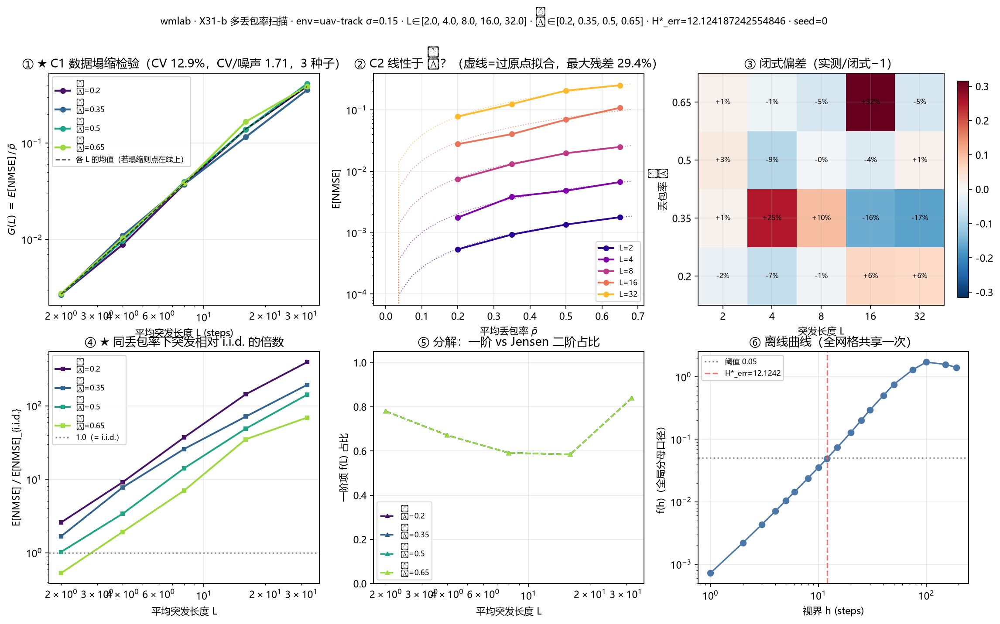

★ **第 14 次自我修正（一串，根因都是"统计检验的口径"）**

1. **TV 阈值不能用 3/√n**：TV 是多类别之和，噪声随分布支撑集增长 ——
   Geom(β) 的 `Σ√p_k = √β/(1−√(1−β))`，β=1/32 时 ≈ **11.2** ⇒ n=6076 时 E[TV]≈0.057，
   而 3/√n 只有 0.038 —— **阈值比纯噪声还小，必然误杀**。改用 KS。
2. **有效样本量不是 age 样本数**：游程内 age 是 1…n 的确定性序列，一个游程只有
   **1 个独立样本**，用 n_pos 会把检验功效高估 √L 倍。
3. **多重比较**：20 个网格点各做一次 α=0.05 检验 ⇒ 至少一个误报的概率 **64%**。
   实测正是第 13 个点 KS 判"显著"（只超 4%），而同一份数据均值检验 z=+2.3 正常。
   ⇒ 改 Bonferroni（临界值 1.36/√n → 1.83/√n）。
4. **没有噪声基准就不能下结论**：单种子版跑出 CV 16.7%，无从判断是机制还是噪声
   ⇒ 加 `--seeds` 重复，用「跨 p̄ 的 CV / 种子内噪声 CV」判定。

### ⑬ ★★ 物理层：量化精度 × 调制阶数的速率—可靠权衡（2026-09-23，X32）

`scripts/19_physical_layer.py` + `wmlab/eval/physical.py` + `configs/uav_physical.yaml`

★ **不是"SNR→丢包率"查表**（那对 X31 零增量）。本实验做的是真 tradeoff：
每时隙固定 `N_sym = d` 个符号，要传 `d·b` 比特 ⇒ 每符号必须承载 `m = b` 比特
⇒ **M = 2^b**，b=2/4/6/8 恰是 **4/16/64/256-QAM**。

    b ↑  量化更精细（误差 ∝ 2^(−2b)）   但 M ↑ ⇒ 星座更密 ⇒ BER ↑ ⇒ PER ↑ ⇒ 丢包更多
    b ↓  星座抗噪（PER 低）             但量化粗糙（**每次到达都注入**误差）

**核心结果一：b\* 随 SNR 单调增（每点 40 集）**

| SNR | 5dB | 10dB | 15dB | 20dB | 25dB | 30dB |
|---|---|---|---|---|---|---|
| b\* | 2 | 4 | 4 | 6 | 6 | **8** |

⇒ 链路越好，越该把比特花在**精度**上而不是**抗错**上。

**核心结果二（★ 这才是被数据支持的那个）：模型的价值随 PER 增长**

| SNR/b | PER | 量化占比 | model | persistence | 增益 |
|---|---|---|---|---|---|
| 30dB b=2 | ~0 | 100% | 0.05147 | 0.05147 | **×1.00** |
| 15dB b=4 | 0.10 | 98% | 0.00409 | 0.00438 | ×1.07 |
| 20dB b=6 | 0.26 | 42% | 0.00058 | 0.00131 | ×2.26 |
| 25dB b=8 | 0.46 | 1% | 0.00110 | 0.00387 | ×3.51 |
| 15dB b=6 | 0.91 | 2% | 0.06311 | 0.26673 | **×4.23** |

低 PER(<0.05) 平均 **×1.03**；高 PER(>0.3) 平均 **×3.10**。
且逐点看，增益不是由 PER 单独决定，而是由**丢包在总误差中的份额**决定
（15dB/b=4 量化占 98% ⇒ 仅 ×1.07；15dB/b=6 量化占 2% ⇒ ×4.23）。
⇒ **世界模型补的是丢包（时间上的空缺），不是量化精度（每次到达都存在的地板）。**

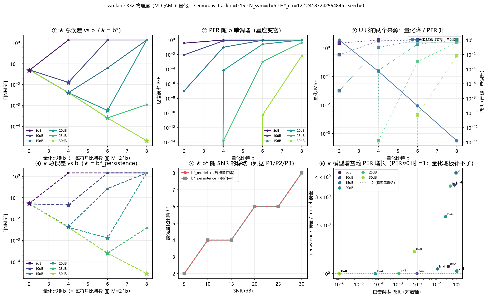

★ **预写判据的命运**：我跑前写的是 P1（`b*_model > b*_persistence`，理由"模型能扛
PER ⇒ 敢用更高阶调制"）。实测 **b\* 两者相等**（P2）。但数据支持的是更精确的版本：
模型**没有移动最优点**，而是把 U 形的右支（高 PER 区）整体压低 3–4 倍。
⇒ 推理方向对，但"移动 b\*"这个表述错了。

★ **第 15 次自我修正**：我最初以为"模型能补信息损失 ⇒ 可用更粗量化 ⇒ b\* 下移"。
错在没分清两种损失的性质：量化**每次到达都注入**，是硬地板；丢包**只在丢时出现**。

⚠ **待核**：M-QAM 误码率用的是教科书近似式（Proakis/Goldsmith），**绝对数值未与
标准表核对**。已自证的只有：M=4 退化为 QPSK 精确式 `Q(√γ_s)`、PER 单调性、SER 饱和在
1−1/M。⇒ 本实验的结论（b\* 的存在与增益趋势）只依赖定性结构；
**任何"在 SNR=X dB 时 PER=Y"的定量表述，核对前不得写进论文**。
★ 已发现的公式失效区：`BER ≈ SER/log2(M)` 在 SER 饱和时不再成立
（256-QAM 饱和时它给出 BER=0.124，而物理上应趋近 0.5），已显式标记 `formula_valid`。

### ⑭ ★★ 跨层预报：丢包 × 量化能不能闭式算出来（2026-09-24/25，X33）

`scripts/20_additivity.py` + `configs/uav_additivity.yaml` +
`wmlab/rollout/imagine.py`（新增 `payload_fn`）+ `wmlab/eval/tracking.py`

★ **这是把 X31/X32 两条支线合并的实验。** 前面每个实验都只动一个旋钮；真实链路是
「物理层出 PER ⇒ 链路层出年龄分布 ⇒ 应用层出跟踪误差」三层串起来。X33 问的是：
**能不能只量两条离线曲线，就把在线误差算出来？**（这是 X34 联合设计的前提）

**核心观测量：离线曲线 `g_b(h)`** —— 从**被量化过的**起始状态出发做闭环 rollout 的误差
（对比 X31 的 `f(h)`：从真实状态出发）。在线误差的闭式预报就是

    E[NMSE] = Σ_h P_age(h) · g_b(h)      只用离线曲线 + 信道参数 (p̄, L)，不碰该点的在线实测

**★ 网格必须"反解 SNR"，不能列 SNR**（第一版 20 个点里 19 个作废）：
4-QAM@25dB 的 BER≈1e−71 ⇒ PER 直接下溢成 0 ⇒ E[age]=0 ⇒ 判据全假。
⇒ 改成按**目标 PER** 二分反解 SNR（`snr_for_target_per`），PER ∈ {0.005…0.7}。

**主判据 W（闭式预报，72 个工作点）**

| 口径 | 中位 \|偏差\| | 90 分位 | 最大 |
|---|---|---|---|
| 解析年龄分布（真·闭式） | **5.0%** | 45.6% | 620% |
| 换成**实测**年龄直方图 | **3.4%** | 17.3% | 34.3% |
| 不带量化的 X31 旧结论 | 10.0% | — | — |

⇒ **W2：定性成立、定量不够。** 但换成实测直方图后最大值从 620% 掉到 34%
⇒ 那 620% **不是分解式错了，是"整段测量只撞见约 3 次突发"的采样问题**
（最差点全在 `PER=0.005, L=32` 与高 b 处，那里误差绝对值只有 1e−5 量级，分母极小）。
**引用时这两个数字必须成对出现：中位 5.0% 与 90 分位 45.6%。**

**★ 副判据 A：误差不可加（第 15 次自我修正）**

预写的是"量化误差会被 rollout 的雅可比**放大**"。实测 `Δ_b(h) = g_b(h) − f(h)`
随年龄**衰减**：`Δ_b(K)/Δ_b(0)` = −2.26 (b=2) / −6.45 (b=4) / −15.5 (b=6) / **−182** (b=8)。
⇒ **量化误差被 rollout 洗掉了，不是被放大。** 4/4 个 b 同向（A2 判据）。

放大倍数 `A = (N_full − N_drop)/N_quant` 的两个预写假设**都错了**，照报：

| 预写 | 实测 | 结论 |
|---|---|---|
| H1：`A > 1` 普遍成立且与 E[age] 正相关（ρ>0.5） | A_model 中位 **0.985**，>1 的点仅 22/72；**Spearman ρ = −0.04** | ✗ |
| H2：persistence 的 A 比 model **小**（零阶保持不传播 q） | A_persist 中位 **1.010** > A_model 0.985 | ✗（方向反了）|

⇒ 说明「量化误差在 rollout 里被传播/放大」这个直觉模型是错的：
**rollout 是个收缩映射，注入的扰动会被动力学本身衰减。**

★ **第 15 次自我修正（方法论）**：第一版判据用**在线做差**算 A，结果 b=2 给 0.52、
b=6 给 4.69（同一 PER/L，符号相反）⇒ 那是**噪声不是机制**。
⇒ 换成离线曲线 `g_b(h)`（统计量好 1–2 个数量级），在线 A 降级为"次级诊断，不得单独引用"。

★ **与 X32 的一致性**：`quant_share`（量化在总误差中的份额）从 b=2 的 99.99% 降到
b=8/PER=0.7 的 0.08% —— 与 X32「模型补的是丢包不是量化精度」同向，两条独立路径互证。

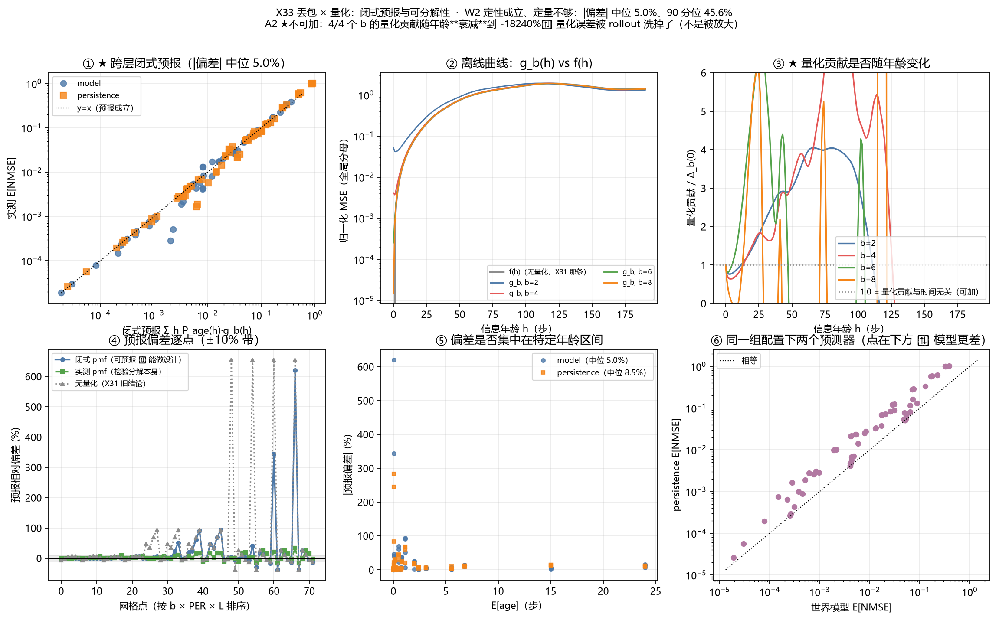

### ⑮ ★★ 联合设计：发送周期 T × 量化精度 b（2026-09-25，X34）

`scripts/21_period_design.py` + `configs/uav_period.yaml` +
`wmlab/eval/tracking.py`（新增 `periodic_age_pmf` / `periodic_mean_age` /
`periodic_age_tail` / `periodic_lossy_schedule`）

★ **X34 是 X33 的直接用途**：既然误差能闭式算出来，那"发送周期 + 量化精度"这对
设计变量就可以**不跑闭环仿真地扫**。物理约束是每时隙只有 `d` 个符号：

    T 步发一次 ⇒ 一个包摊到 T·d 个符号 ⇒ 每符号 m = b/T 比特 ⇒ M = 2^m

⇒ **周期和精度在同一份符号预算里互相挤**：想发得勤（T 小）就得每符号多扛比特
（m 大 ⇒ 高阶 QAM ⇒ PER 高）；想发得细（b 大）就得要么高阶调制、要么拉长周期。

**★ 周期发送的年龄分布（本实验的新闭式，② 类证据写在 `tracking.py` 里）**

    P(age = h) = (s/T)·q^⌊h/T⌋ ,   s = 1−q
    E[age]     = T·q/s + (T−1)/2

`T=1` 退化为 X31 的 i.i.d. 几何分布；`q=0` 退化为 `(T−1)/2`
—— **周期本身就是信息代价**：一个包都不丢，年龄也在 0…T−1 上循环。

**主判据（修正尾部判据后的全量，694 s，32 个 (SNR,b) 组见到周期真的起作用）**

| 判据 | 预写 | 实测 | 结论 |
|---|---|---|---|
| **D1** 闭式预报 \|偏差\| | 中位 < 15% | **中位 3.1%**，90 分位 7.0% | ★ 成立 |
| **D2** 闭式 argmin T\* vs 仿真 | 一致或相邻 | **54/54 一致**（相邻 54/54） | ★ 成立 |
| **D3** T\*_model ≥ T\*_persist | ≥75% 的配置 | **100%**（中位 2 vs 2 步） | ★ 成立（但中位数相等 ⇒ 只支持"不劣于"，不支持"更长"）|

⇒ **设计曲线可以不跑闭环仿真地算出来**，且选出来的点是真的最优点。
D1 的 90 分位 7.0% 集中在高 PER 档（最大单点偏差 +11.9%，26dB/b=16/T=4）。

**★ 反直觉的一点：`PER=0` 时 T=1 并不总是最优**

b=4 的候选只有 T∈{1,2}。在 10→30dB 全部 5 档里，PER 都是 0，但 **T\*=2**（0.00394）
一致地优于 T=1（0.00411）。差额只有 4%，但 5 档数字完全相同（不是采样噪声）。

机制：**多推一步会把量化噪声洗掉** —— 即 X33 的 A2 结论（`Δ_b(h)` 随 h 衰减）
在联合设计里的直接后果：闭环动力学是收缩的，注入的量化扰动会被动力学本身衰减，
而"每步都送"反而把这个免费的平滑机会浪费掉了。

★ **但这条必须限定在 b=4**：由 30dB（两条候选的 PER 都是 0）反解，
b=4 的 `g(1) = 2×0.00394 − 0.00411 = 0.00377 < g(0) = 0.00411`（洗掉的多于模型一步误差）；
而 b=6/8/16 在同档位都是 **T 越小越好**（`T*=1 / 1 / 2`）⇒ 量化地板一旦降下去，
"洗噪声"的收益就盖不过"多等一步"的代价。
⚠ 幅度只有 4%，且只在**最粗的量化档**出现 ⇒ **引用时必须标注这两条限定**，
不得写成"应该拉长周期"的一般结论。

★ **第 16 次自我修正（R12）**：第一版的"年龄分布截断判据"写成了
`1 − (1−q)^{K/T}`（"**至少一次**失败"的概率），而这里要的是 `q^{K/T}`（"**全部**失败"）。
两者都随丢包率增大，但量级差约 **160 个数量级**（`q=0.019, T=2, K=190`：错式 83.8%，
正确 ≈1e−160）⇒ 第一版把 **PER>0 的点全部误判为截断丢掉**，网格里只剩 PER≈0 的退化点，
于是 D2 只有 26 组、且看不到 U 形内点最优。
⇒ 现已抽出库函数 `periodic_age_tail`，并在自检 **㉛** 里与暴力求和逐点对齐、
同时钉死**方向**（随丢包率单调增）与**量级**（0.019/2/190 必须 < 1e−100）。
（我在写这条注释时一度把方向也写反了 —— 是 ㉛ 的单调性断言把它抓出来的。）

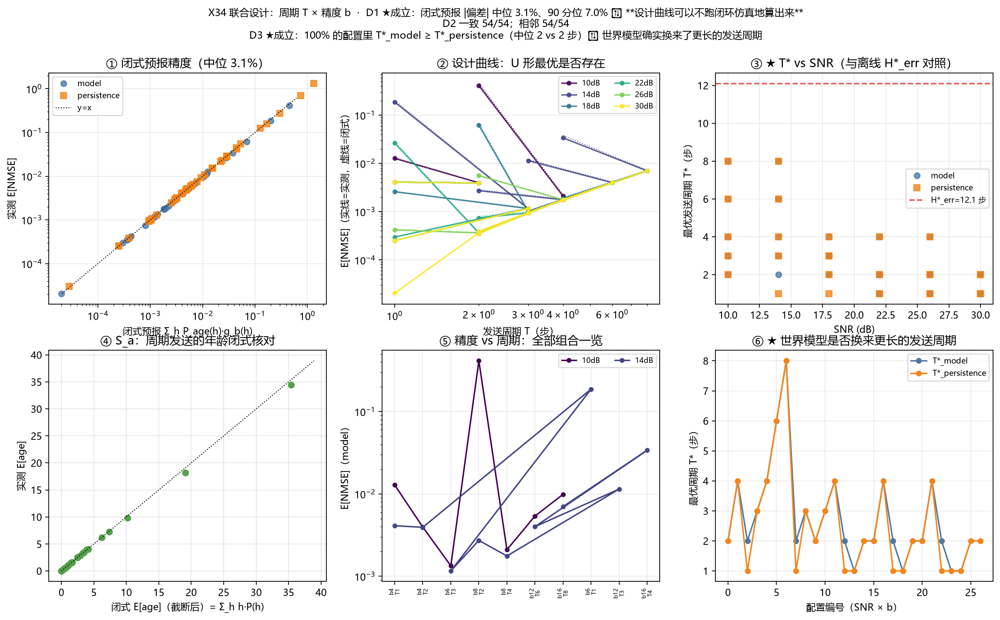

---

## ⑯ X35「任务锚定的联合设计」：闭式选的 (T, b) 还是不是任务最优的？（2026-09-25）

```bash
python scripts/22_task_design.py            # 全量（SNR 5 档 × 10 个 (b,T) ⇒ 46 个工作点）
python scripts/22_task_design.py --quick    # 冒烟
```

★ **与 X34 的唯一关键差别：真闭环。** X33/X34 的 `run_tracking` 是**开环回放**
（动作来自预先采好的 episode ⇒ 轨迹与模型无关）；X35 用 `control.run_closed_loop_control`，
动作来自 `controller(est)` ⇒ **模型误差会改真实轨迹**，量化器 `payload_fn` 第一次真正进入闭环。

### ★ 一句话答案：60% 一致，40% 不是

| 判据 | 预写 | 实测 | 结论 |
|---|---|---|---|
| **闭式 argmin T == 任务 argmin T** | — | **12/20（60%）** | ★ **按 NMSE 闭式设计，10 次里有 4 次选不到任务最优点** |
| **T2** Spearman(est_nmse, 跟踪距离) | ρ ≥ 0.8 | **+0.778** | ★ **未达标 ⇒ NMSE 不能当任务代理**（这正是本实验要的结论） |
| **T2** Spearman(est_nmse, 逃逸率) | ρ ≥ 0.8 | **+0.354** | ★ 更不能（且 44/46 点逃逸率恒为 0 ⇒ 该指标在本网格**无分辨率**） |
| **T1** 任务退化 / NMSE 退化 | ≥ 2× | **中位 0.07×**（≥2× 的点 6/20） | ★ **预写不成立**：任务指标对设计点比 NMSE **钝得多** |
| **T3** 任务差距 / NMSE 差距（距离） | ≥ 1.2× | **−0.18×** | ★ **预写不成立**（见下，这是本实验最硬的负面结论） |
| **T3** 任务差距 / NMSE 差距（逃逸率） | ≥ 1.2× | **1.70×** | ✅ 成立（但 n 有效点少，只可定性） |
| **T5** 闭式预报 → 闭环实测 \|偏差\| | 显著大于开环 | **中位 8.1%**（p90 23.0%） | ✅ 成立：X34 开环口径中位是 3.1% ⇒ **闭环把偏差放大约 2.6×** |

### ★★ T3 = −0.18×：模型把 NMSE 降到 1/2.3，却没换来跟踪距离

| 量化精度 b | NMSE 比（model/persist） | 尾段距离比（model/persist） | 模型反而更差的点 |
|---|---|---|---|
| 4 | 0.871 | **1.446** | 8/10 |
| 6 | 0.462 | 1.048 | 6/10 |
| 8 | 0.406 | 0.922 | 5/12 |
| 12 | 0.357 | 0.954 | 5/14 |

⇒ **趋势是单调的**：量化越粗（模型的相对优势越小）⇒ 模型在任务上**越可能反而更差**。
⚠️ **机制未查清，不得编解释。** 已排除的不是机制：① 不是窗口口径（`mean_dist` 全程 / 尾段 / p95
三个口径同向，`ep_len` 都是 300 ⇒ 不是删失）；② 不是两个 head 被搞混 —— **T=1 且 PER=0 时
两者逐位相同**（4.426 vs 4.426、4.681 vs 4.681，比值 1.000）⇒ 管线正确。
候选机制（**只是候选**）：PD 控制器的 D 项作用在估计值的变化率上，模型估计每步由 rollout 更新
⇒ 高频抖动比"保持上一帧"的 persistence 更大，粗量化下这份抖动放大成控制代价。**待查。**

### ⚠️ 引用 X35 必须同时带上的三条警告

1. **本网格里没有点真正收敛**：尾段距离中位 **3.9 m**（范围 2.6–19.3 m），而 X30 同场景的稳态是
   亚米级 ⇒ 距离指标主要反映"**追不上**"，不是"稳态偏移"。在这个区间上比较任务指标，
   结论的**强度弱于**"稳态工况下的比较"。
2. **逃逸率在本网格基本无分辨率**：44/46 点恒为 0 ⇒ T1/T2/T3 里所有基于逃逸率的数**只可定性**。
3. **删失 4/46 点**（episode 因逃逸提前结束，`ep_frac` 最低 0.42）⇒ 这些点的 E[age] 与 NMSE 都**偏低**。
   已做敏感性对照（未删失 44 点）：T2[距离] 0.778 → **0.746**、T5 仍 8.1%、argmin 一致 11/19 ⇒ 方向不变。

### ★ 第 17 次自我修正（容差不能拍百分比）

第一版 S_a 写「实测 E[age] vs 闭式相对差 ≤ 8%」，在 64-QAM@14dB（PER=0.9502, T=1）被打穿：
实测 17.51 vs 闭式 19.08（−8.2%）。**诊断（纯调度空跑 24 种子，不含控制与删失）显示闭式无偏**
（19.0067 ± 0.8935，偏差 −0.38%），错的是容差：该点 `E[age]=19.08` 而 `sqrt(Var(age))=19.6`
——**标准差与均值同量级**，40×450 步只有约 900 次到达 ⇒ 单次实测标准误就有 4.7%，
8% 只是 1.8σ 的噪声。
⇒ 现改为**容差 = 3 × 本点采样标准误**（SE 由纯调度 MC 估出，见 `Var(age) = T²q/s² + (T²−1)/12`、
自检 **㉜**）；删失点只做**单侧**断言（删失只会把均值拉低，偏高必是真 bug）。
修正后：46 点 \|偏差\| **中位 0.04σ、最大 2.08σ、超 3σ 的点 0 个**。

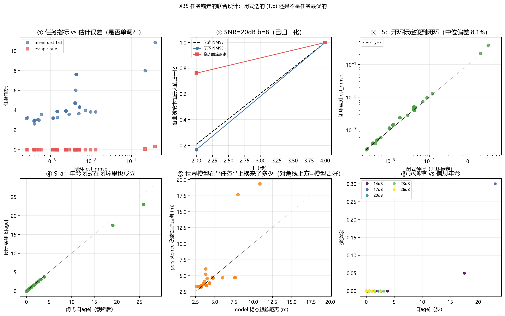

## 当前状态

- [x] 环境接口 + CartPole 适配器
- [x] 最小世界模型（MLP 版）
- [x] 多步 rollout 误差曲线 + 可靠视界指标
- [x] 长视界 H\* 测量（Pendulum，视界到 190）＋ 误差形态判定脚本（`scripts/03_`）
- [x] ★ **H\* 误差口径修正为逐点**（2026-09-20）：两个口径同时返回，累积口径发警告
- [x] ★ **通信接入层**（`envs/channel.py` + `eval/tracking.py` + `eval/aoi.py`，X24/X25/X26）
- [x] ★ **51 项自检测试**（不依赖 pytest；每个用例对应一次真实踩过的坑）
- [x] ★ **时延真的生效（X27）**：`delay` 从**空参数**改为**在飞包 FIFO**；
  「生成年龄 ≠ 传输年龄」首次被实测分开，误差地板 `2(1−ρ_o(D))` 由**两条独立路径**验证
- [x] ★ **多种子（5）× 阈值敏感性（5）（X3 / X4）**：
  H\*(开环) = **26.93 ± 11.41**（CV 0.42，范围 13.13–42.99）；
  `H*(θ) ≈ 62.19·θ^(+0.277)`（R² 0.98，**符号已更正**）；★ **单步 val_loss 不能预报 H\***
  （两个 val_loss 差 3.2% 的模型，H\* 差 3.3 倍）；开环>闭环的序在 5 个阈值下一致
- [x] ★ **NaN/Inf 不再被静默当成"已超阈"**（X3 期间发现）：`reliable_horizon` 遇到非有限值即 raise
  （`NaN <= 阈值` 恒为 False，旧行为会返回**虚假偏小**的 H\*）
- [x] ★ **X22「与理论界对账」已探明为死路**（2026-09-21，见 §⑦）：C17 的 δ 是两转移模型的
  **TV 距离**，而本仓库「环境确定 + 模型确定 ⇒ 两个点质量」使 **δ ≡ 1** ⇒ `H(ε,1) = 1+ε`，
  对任何有意义的 γ 都不满足其定理条件。**故不报任何 gap 数值**（强行代入会造出 26 倍的假缺口）。
  两条补救路径（注入过程噪声 / 换 Wasserstein 距离自己重推）已记录，留待 X14 与阶段 3–4。
  顺带更正了 §⑥ 里 `θ^(−0.277)` 的**指数符号**（应为 `+0.277`）。
- [x] ★ **X28/X29「δ 连续化 + 对账闭合」**（2026-09-22，见 §⑧）：过程噪声 + 高斯模型使 δ 可测
  （条件：latent_dim=4）；对账 gap ≈ 8.5–23.8×（定性）；C17 的 max 定义被实证为实践过强
- [x] ★ **X11 第三种曲线**（2026-09-22）：端点恒等式证明；纠错频率 K 对 H\* 的影响 = 模型质量的函数
- [x] ★ **X14 UAV 场景首跑**（2026-09-22）：架构声明实测通过；首个带过程噪声场景的 H\*
- [x] ★ **X12-min σ 头校准**（2026-09-22）：潜空间单步转移 τ=1.058；覆盖率 95%→94.5%（温度缩放后）
- [x] ★ **X30 任务锚定的 H\***（2026-09-22，见 §⑨）：闭环控制下 H\*_task 随任务指标在
  **1–32 步间漂移（32 倍）**，而 H\*_err 只有一个数（26.1）；误差阈值恰好落在"灾难性失败"
  一侧（H_escape/H_err = 1.22）；**闭环控制把估计误差放大 ~1.7×**（同口径对账）
- [x] ★ **X31 突发信道**（2026-09-22，见 §⑪）：Gilbert–Elliott 两状态信道；
  **平均丢包率相同（50%）时跟踪误差跨 570 倍**；闭式恒等式 `E[NMSE]=p̄[f(L)+J]`
  相对偏差中位 **−1.5%** ⇒ X26 的解析式推广到任意突发信道；★ 无记忆点是 **L=1/(1−p̄)** 不是 L=1
- [x] ★ **X31-b 多丢包率扫描**（2026-09-23，见 §⑫）：p̄×L 网格，模型一次训练全网格共享；
  **5 个 L 中 3 个的跨 p̄ 离散度低于噪声本身** ⇒ 丢包率 × 突发结构**基本解耦**；
  G(L) 跨 143 倍而 p̄ 只贡献线性因子
- [x] ★ **X32 物理层**（2026-09-23，见 §⑬）：M-QAM + 量化的速率—可靠权衡；
  **b\* 随 SNR 单调增 2→4→6→8**；模型增益从低 PER 的 ×1.03 升到高 PER 的 ×3.10
  ⇒ 模型补的是**丢包**不是**量化精度**
- [x] ★ **X33 跨层闭式预报**（2026-09-24，见 §⑭）：`E[NMSE]=Σ_h P_age(h)·g_b(h)` 只用
  离线曲线 + 信道参数 ⇒ \|偏差\| 中位 **5.0%**（换实测年龄直方图 3.4%，对照 X31 旧结论 10.0%）；
  ★ 误差**不可加**：量化贡献随年龄**衰减**到 −182×（不是被放大）⇒ 「量化误差被 rollout 传播」的
  直觉模型被推翻，A_model 中位 0.985、Spearman(A, E[age]) = −0.04（两个预写假设 H1/H2 全错，已照报）
- [x] ★ **X34 联合设计 T × b**（2026-09-25，见 §⑮）：周期发送的新年龄闭式
  `E[age] = T·q/s + (T−1)/2`；**周期本身是信息代价**（零丢包时年龄也在 0…T−1 循环）；
  闭式预报中位 **3.1%**、闭式选出的 T\* 与仿真 **54/54 一致**、T\*_model ≥ T\*_persist **100%**；
  ★ 反直觉：**PER=0 时 T=1 并不最优**（b=4 五档全选 T=2）—— 多推一步会洗掉量化噪声（X33 A2 的后果）
- [x] ★ **X35 任务锚定的联合设计**（2026-09-25，见 §⑯）：**真闭环**下同一张 (T,b) 网格同时记
  闭式 NMSE / 闭环 NMSE / 任务指标 ⇒ ★ **闭式 argmin T 与任务 argmin T 只一致 12/20（60%）**；
  Spearman(NMSE, 距离) = **0.778 < 0.8** ⇒ **NMSE 不能当任务代理**；
  ★★ 模型把 NMSE 降到 **1/2.3** 却没换来跟踪距离（尾段距离比中位 1.000，b=4 时反而 1.446）；
  闭式搬到闭环后偏差中位 3.1% → **8.1%**
- [ ] X14 续：**连续动作策略接入**（多种子 H\* 与 σ 敏感性已于 `47d6dd1` 完成；
  本仓库 PPO 仅支持离散动作 ⇒ X30 先用解析 PD 控制器顶上；SAC/连续 PPO 待做）
- [ ] 因子化潜空间（确定性 H_t + 随机 Z_t）与不确定性校准（X12；σ 头已就位）
- [ ] 扩散策略动作头（对齐 diffusion policy）

## 结果图索引（`assets/` 共 24 张，全部进了版本库）

> 判据：**不进版本库的图不算对外可验证的产出**（`outputs/` 已 gitignore）。
> 下表是「图 ↔ 实验编号 ↔ README 小节」的对照，防止图躺在库里却没人能对上出处。

| 图 | 实验 | 小节 |
|---|---|---|
| `01_random_baseline.png` | 随机策略 baseline | §① |
| `02_world_model.png` | X1 / X2（CartPole，短视界） | §② |
| `02_world_model_pendulum.png` | X2（Pendulum，视界到 190） | §③ |
| `04_channel.png` | X24 / X25 / X26 | §④ |
| `05_x26_gap_diagnosis.png` | X26 对账 | §④ |
| `06_delay_floor.png` | X27 时延地板 | §⑤ |
| `07_seeds_threshold.png` | X3 / X4 种子与阈值 | §⑥ |
| `08_x22_theory_check.png` | X22 理论界 | §⑦ |
| `11_latent_roundtrip.png` | X11 纠错频率 K | §⑧ |
| `12_delta_continuity.png` | X28 σ 扫描 | §⑧ |
| `12_delta_ldim4_full.png` | X28（latent_dim=4 = 可分辨区） | §⑧ |
| `13_x29_reconcile.png` | X29 C17 对账 | §⑧ |
| `14_uav_track.png` | X14 首跑 | §⑧ |
| `14_uav_sigma_scan.png` | X14 σ 敏感性 | §⑧ |
| `15_sigma_calibration.png` | X12-min σ 头校准 | §⑧ |
| `16_task_horizon.png` | X30 任务锚定 H\* | §⑨ |
| `09_ppo_cartpole.png` | X5 手写 PPO | §⑩ |
| `10_behavior_ablation.png` | X6 / X7 行为策略消融 | §⑩ |
| `17_burst_channel.png` | X31 突发信道 | §⑪ |
| `18_burst_sweep.png` | X31-b 多丢包率扫描（数据塌缩） | §⑫ |
| `19_physical_layer.png` | X32 物理层（M-QAM + 量化） | §⑬ |
| `20_additivity.png` | X33 跨层闭式预报 + 可分解性 | §⑭ |
| `21_period_design.png` | X34 联合设计（周期 T × 精度 b） | §⑮ |
| `22_task_design.png` | X35 任务锚定的联合设计（真闭环） | §⑯ |

## 参考

- 课题地图与选题：见父项目 `D:\workbuddy\researchproject`
- 方法来源：Dreamer 系（潜空间想象训练）、JEPA 系（联合嵌入预测）
- ★ **误差口径说明**：`wmlab/rollout/imagine.py` 的模块 docstring（逐点 vs 累积、
  以及"为什么『首次超阈』必须用逐点"）。所有 H\* 数字都被这张表约束。
- 通信接入的口径声明（R1/R2/R3 + 第四条）：`scripts/04_channel_tracking.py` 的模块 docstring
- ★ **时延语义与误差地板解析式**：`wmlab/eval/tracking.py` 的模块 docstring
  （"时延 `delay` 的语义"一节 + `2(1 − ρ_o(D))` 的推导与诚实边界）
- 误差增长形态的判定：`scripts/03_analyze_horizon_curve.py`
  （在**逐点**序列上算 `inc = ΔNMSE/Δhorizon`；峰值在末段 = 未饱和，峰值后回撤 ≥ 15% = 饱和）
- ★ **种子方差 / 阈值敏感性的全部口径**：`scripts/07_seeds_threshold.py` 的模块 docstring
  —— 含 **Part A 采样收敛性检验**（不先确认它，种子方差里就混着采样噪声）、
  **删失计数**（H\* 顶到量表边界时 σ=0 会被误读成"极其稳定"）、
  **稀疏 vs 稠密网格误差**、以及 `H*(θ) ≈ C·θ^(+α)` 的幂律拟合
  （★ 指数为**正**：阈值越松，可靠视界越长。2026-09-21 更正过符号）
