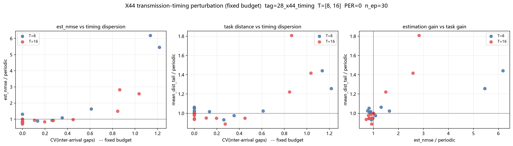

# world-model-lab

> 世界模型 + rollout + 可靠视界评测的最小可复现框架。
> 场景锚点：**UAV / 无线通信**（本框架先用 CartPole 级任务把训练循环跑通，再换场景，只动 `wmlab/envs/`）。

## 这个仓库解决什么问题

世界模型（world model）在 rollout 到第 N 步之后会失准，但**几乎没人明确回答"第几步开始不准、为什么"**。
本仓库的目标是把这件事做成**可测量、可复现、可对比**的：

- 统一的环境接口（`envs`），换场景不改模型与评测代码
- 最小的世界模型实现（`models`），编码器 + 潜空间转移 + 解码器
- 潜空间 rollout（`rollout`），支持任意视界
- **可靠视界（reliable horizon）**定义与测量（`eval`）——**第 h 步自身**的预测误差
  首次超过阈值的那一步（"逐点"口径；用累积口径会系统性抬高 H\*，见 §设计约定 7）
- **通信接入层**（`envs/channel.py`）——把世界模型接到丢包/时延信道 + AoI 记账；
  ★ **不要**把 H\* 直接当发送周期：X25 已证 H\* 与**最优传输间隔不是同一个数**（差 2.4 倍，
  按 H\* 传会**过度通信**）⇒ H\* 只给"误差容忍度"，决策量是帕累托拐点（见 §④）
- **时延地板**（`eval/tracking.py`）——时延**真的延迟**信息之后，误差多出一个
  **与模型无关的下界** `2(1 − ρ_o(D))`（X27）：这是"生成年龄 ≠ 传输年龄"的实测证据

## 快速开始

```bash
# 1) 环境（本机已建好 ai-lab，见项目文档）
conda activate D:\devtools\miniconda3\envs\ai-lab
# 或在 VSCode 里直接用任务：Terminal -> Run Task -> wmlab: 环境自检

# 2) 环境自检（15 项，含中文字体链路）
python scripts/00_check_env.py

# 3) 随机策略 baseline，产出第一张图
python scripts/01_random_baseline.py

# 4) 训练一个世界模型，产出 loss 曲线 + 多步预测误差曲线
python scripts/02_train_world_model.py

# 5) 分析误差增长的形态（饱和 / 线性累积 / 自我放大，三选一）
python scripts/03_analyze_horizon_curve.py outputs/02_world_model_pendulum.json

# 6) 通信接入：X24 等价性 + X25 调度帕累托 + X26 解析对账（约 3 min，全程 CPU）
python scripts/04_channel_tracking.py --config configs/channel.yaml
python scripts/04_channel_tracking.py --config configs/channel.yaml --quick   # 冒烟

# 7) X26 对账细节（离线曲线 vs 在线实测、插值敏感性、H* 两口径）—— 读 04 的产物，不重训
python scripts/05_diagnose_x26_gap.py

# 8) X27 时延地板（读 04 的 checkpoint，不重训；约 1–2 min）
python scripts/06_delay_floor.py --quick   # 冒烟：2 条 × 200 步
python scripts/06_delay_floor.py

# 9) X3/X4：种子重复 × 阈值敏感性（CPU，约 13 min；含 5 次完整重训）
python scripts/07_seeds_threshold.py --quick            # 冒烟：2 种子、小 epoch
python scripts/07_seeds_threshold.py --seeds 0 1 2 3 4

# 10) 自检（74 项，不依赖 pytest；每个用例对应一次真实踩过的坑；★ 圈码 1–50 用尽后改用 [nn]）
python tests/test_channel_and_aoi.py

# 11) X22：C17 的 safe horizon 在本场景**能不能实证**（12 项断言，秒级；不训练、不需 GPU）
python scripts/08_x22_theory_check.py

# 12) X30：任务锚定的 H*（UAV 闭环控制，约 2 min CPU；误差阈值 vs 任务失败的比值）
python scripts/16_task_horizon.py
```

换环境只换配置，代码不动（长视界那轮就是这么做控制变量的）：

```bash
python scripts/02_train_world_model.py --config configs/pendulum.yaml --tag 02_world_model_pendulum
```

所有结果图写入 `outputs/`（不进版本库）。

## 目录结构

```
wmlab/
  envs/     环境适配层。统一接口，换 UAV/信道场景只加 Adapter
  models/   世界模型。编码器 / 潜空间转移 / 解码器
  rollout/  潜空间多步 rollout，以及误差随视界增长的测量
  eval/     指标：NMSE、可靠视界、预测区间覆盖率
  utils/    设备选择（CPU/云 GPU 无痛切换）、随机种子、统一绘图样式
scripts/    可直接运行的入口脚本（编号即依赖顺序；00 = 环境自检）
configs/    YAML 配置（device: auto 时自动选 cuda 或 cpu）
outputs/    ★ 结果图与日志，已 gitignore
```

## 设计约定（为云 GPU 迁移服务）

1. **设备无关**：任何 `.to(...)` 都走 `wmlab.utils.device.get_device()`，代码里不出现硬编码 `.cuda()`。
   本机无独显（CPU 起步），云端租 GPU 后 `--device cuda` 即可，不改代码。
2. **种子固定**：`set_seed()` 统一设置 python / numpy / torch，保证曲线可复现。
3. **配置外置**：超参走 `configs/*.yaml`，不写死在脚本里，便于扫参。
4. **结果落盘**：所有图与指标写 `outputs/`，README 里引用的图都从它来。
5. **样式随代码走**：中文字体由 `wmlab.utils.plot.apply_style()` 显式设置（探测
   YaHei / PingFang / Noto CJK 等并逐个回退），**不依赖 `MPLCONFIGDIR` 等进程环境**——
   换机器、换终端、上云，图里中文都不会变方块；负号渲染同步修复。
6. **依赖锁定**：`requirements.lock.txt` 是**最小可复现锁**（6 个直接依赖 + 21 个传递依赖
   = 27 个包，由干净隔离 venv 实测导出，torch 为 +cpu 版）；上云时只替换 torch 那一行为
   对应 CUDA 版本即可，代码不动。
7. ★ **口径必须显式**（2026-09-20 立）：任何"误差"数字都要写清三件事 ——
   **逐点还是累积**、**在哪个评测集上**、**除以哪个方差**。原因不抽象：H\* 这一个指标，
   在同一个 Pendulum 模型上就出现过 `64.83 / 51.96 / 42.99 / 39.01 / 25.71 / 25.57`
   六个数，全部"正确"，只是口径不同。代码层面已做成默认安全：
   `multi_step_error_curve()` / `closed_loop_error_curve()` **同时返回两个口径**；
   `reliable_horizon(..., calibration="cumulative")` 会**发警告**；
   `NmseCurve` 在 lengths 不匹配时**直接抛错**（而不是静默截断）。
8. ★ **报 H\* 还要写第四件事：种子数与滑窗采样数**（2026-09-20 X3/X4 补）。
   H\* 是"首次穿越"，属于曲线的极值泛函，对**种子**和**采样量**都比曲线本身敏感得多：
   5 个种子的 H\* 落在 **13.13 – 42.99**（CV **0.42**）；`n_samples` 从 256 提到 4096
   又会系统性挪动它。所以 `reliable_horizon` 的输入是"一条曲线"，而**一条曲线本身也不够** ——
   ⇒ 正确形式是 `H* = 26.9 ± 11.4 (5 seeds, n_samples=4096, θ=0.05)`
   或直接报对 θ 的**幂律标度** `α`（那个在均值上是稳的）。
   ★ **`±` 的含义**：跨 5 个种子的**样本标准差（1σ）**，**不是**标准误、也不是置信区间。
   ★ 报 H\* 还须同时标**曲线定义**：本仓库默认是**开环** rollout 的"预测误差首次穿越"；
   **开环 / 观测闭环 / 潜闭环 三者不等价**（见 §③ 与 R1）—— 换定义，数值随即改变。
   ★ 推论：**`NaN`/`Inf` 不得静默通过** —— `NaN <= 阈值` 恒为 False，
   会被当成"已超阈"返回**虚假偏小**的 H\*（实测触发过：弱模型观测空间闭环第 131 步后爆到 3.9e34）。
   现在会直接 `raise ValueError`。

## 三张图看懂这个仓库

**① H\* 是什么，它长成什么样**（Pendulum，视界到 190）


实线 = 逐点口径（H\* 的定义口径），淡虚线 = 累积口径；两者的间距就是「口径选择」本身的影响力
（累积口径会系统性抬高 H\* +33–51%）。
★ **H\* 是「首次穿越」类极值泛函，单点值不可引用** —— 5 种子下 `H*(开环) = 26.9 ± 11.4`，极差 3.3 倍。

**② 误差阈值 ≠ 任务边界**（X30，UAV 闭环控制）


同一个模型：误差阈值只给出**一个数**（`H*_err = 26.1`），但任务失败阈值在
**1–32 步之间漂移（32 倍）**，而且误差阈值恰好落在「灾难性失败」一侧。
⇒ 「用 NMSE 代表任务表现」这件事，在本仓库已被**三个独立场景反复否定**。

**③ 估计质量与任务收益是强衰减耦合**（X44，固定预算、只动发送时刻）



估计误差最多 **+518%**，任务指标只动 **+44%**（衰减 2.3–12 倍）；预算轴上更极端：
`est_nmse` **×1119** 只换来距离 **×2.97**，而且**非单调**。
⇒ 在本场景里，**继续优化估计 / 换触发统计量不是瓶颈**（条件性结论，见完整文档）。

## 结论速览（最短版；每条都带条件）

> 这里只放**承重结论**，不放推导与数据。
> 每条的判据、计算口径与「⚠ 引用必带」在[完整实验史](docs/EXPERIMENTS.md)。

| # | 结论 | 关键数字 | 实验 |
|---|---|---|---|
| 1 | 世界模型的多步误差是**饱和**，不是自我放大 | 每步增量峰值在 h≈88，之后回撤 17%（开环）/ 63%（闭环） | X1 / X2 |
| 2 | 开环 / 观测闭环 / 潜闭环 **三者不等价**，H\* 随定义改变 | 两条曲线在 h≈100–150 交叉 | X1 / X2 |
| 3 | **H\* 不能当发送周期**：它只给「误差容忍度」，决策量是帕累托拐点 | 拐点间隔 62.5 步 vs H\*=25.6（差 **2.4 倍**）；按 H\* 传 = 过度通信 | X24 / X25 |
| 4 | **生成年龄 ≠ 传输年龄**：时延带来**与模型无关**的误差地板 | `2(1 − ρ_o(D))`，两条独立路径验证 | X27 |
| 5 | 平均丢包率相同（p̄=50%）时，**突发结构可使跟踪误差跨 570 倍** | 闭式 `E[NMSE]=p̄[f(L)+J]` 中位偏差 −1.5% | X31 |
| 6 | **NMSE 不能当任务代理**（跨 3 个独立场景复现） | Spearman(NMSE,距离)=0.778<0.8；argmin T 只一致 12/20；X44 差三个数量级 | X35 / X38 / X44 |
| 7 | 误差阈值 ≠ 任务边界；闭环控制会**把估计误差放大 ~1.7×** | H\*_task 在 1–32 步漂移（32 倍） | X30 |
| 8 | 模型自报不确定度 U **只是 age 的替身**（同方差环境） | 给定 age 后 ρ_cond=−0.029、AUC_cond=0.419；异方差 amp=4 时才 +0.347 | X38–X40 |
| 9 | 「**误差类**触发量」这一族**在本场景到顶也赢不了年龄阈值** | oracle 两臂距离比中位 0.9921 / 1.0023（零发散） | X43 |
| 10 | 估计收益 → 任务收益**强衰减**；瓶颈在任务侧而非触发量 | 估计 +518% / 任务 +44%；预算轴 ×1119 / ×2.97 | X44 |

★ 上表里**负面与收窄的结论一并报**：本仓库累计的 **29 次自证伪**全部保留在完整文档里
（包括被自己的实验推翻的跑前假设）。

## 诚实的限制（引用前必读）

1. **跨环境数字不可比**。CartPole 与 Pendulum 的 H\* 不能直接比（状态维度 / 动作空间 / 每集长度都不同）。
2. **模型很小、任务很低维**。模型是 MLP（参数约 6.7 万），环境是 Pendulum / CartPole / 一个简化 UAV 闭环。
   **本仓库没有多模态基础世界模型，也没有真机部署**。
3. **H\* 的数值同时依赖四个字段**：口径（逐点/累积）、曲线定义（开环/观测闭环/潜闭环）、
   评测集与归一化分母、种子数与采样量。**四个一起写才能引用**。
4. **「误差类触发量这条路到此为止」是条件性结论**：它只在**本场景 + 本任务指标 + 本预算口径**下成立
   （X43 / X44）。**oracle 是诊断用的特权信息基线，不主张为性能上界**；
   **未观察到可分辨的任务收益 ≠ 收益严格为零**。
5. **尚未回答「该不该预测」这个科研问题**。本仓库回答的是「第几步开始不准、为什么、值不值」。
6. **本机（工位机）无 NVIDIA 独显**，全部结果为 **CPU**。

## 文档地图

| 你想知道 | 去哪 |
|---|---|
| 完整实验史（§①–㉖）、当前状态清单、结果图索引、参考定义 | [`docs/EXPERIMENTS.md`](docs/EXPERIMENTS.md) |
| 每个编号的预写判据 / 结算 / 更正说明 | 父项目 `04-实验与代码/实验记录/` |
| 怎么跑起来（环境、自检、缓存复现） | [`docs/REPRODUCE.md`](docs/REPRODUCE.md) |
| 调度基线库的统一接口 | [`wmlab/eval/scheduling.py`](wmlab/eval/scheduling.py) |

★ 判据：**不进版本库的图不算对外可验证的产出**（`outputs/` 已 gitignore）。
