# 实验史与完整结果（X0–X45）

> 本文件是 [`README.md`](../README.md) 首页重构（2026-10-06）时从 README **原样搬移**而来的完整实验记录：
> 数字与正文**逐字未改**，只动了标题层级与一处指向路径。
>
> - **编号未变**：原 README §①–㉖ ⇒ 本文件 §①–㉖，全仓库里「§⑧」「§㉔」这类引用仍然有效。
> - **引用限定以本文件各节的「⚠ 引用必带」为准**；README 首页只放能站住的速览结论。
> - 图与结论的对应：见本文件末尾「结果图索引」。

---

## 结果（CPU，全部可复现；同种子重跑逐位一致）

### ① 随机策略 baseline

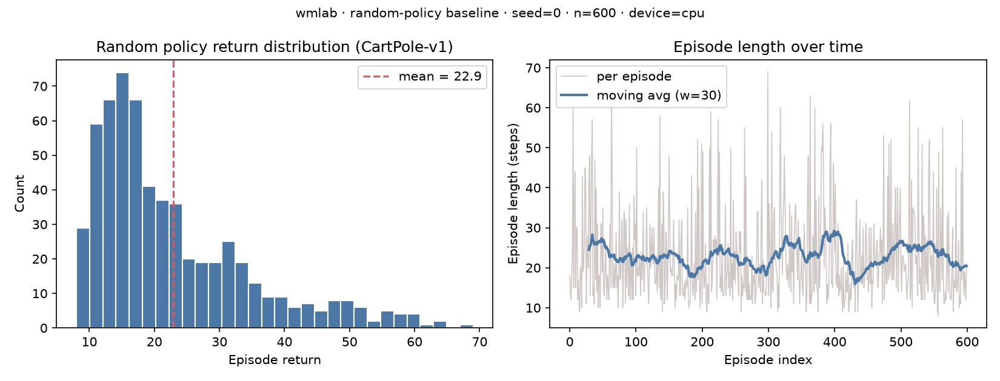

CartPole-v1，600 集随机策略：平均回报 **22.9**（std 11.9），最长 69 步，共 13733 步。
随机策略平均 20 步出头就倒 —— 这也是当下 `horizons` 上限取 15 的原因。

### ② 世界模型与可靠视界（第一轮：CartPole，短视界）

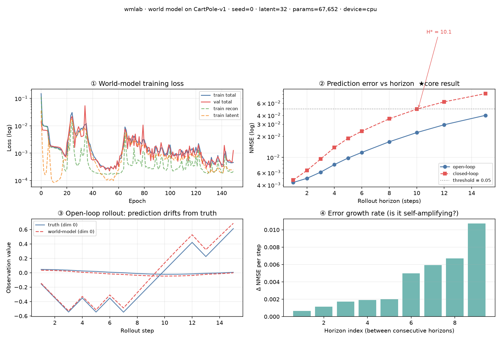

| 指标 | 值（逐点口径） | 累积口径（历史） |
|---|---|---|
| 环境 / 数据 | CartPole-v1，600 集随机策略，13,733 步 | 同 |
| 参数量 | 67,652 | 同 |
| train / val loss | 0.1502 → 0.0005 / 0.0013 | 同 |
| **可靠视界（开环）** | **12.95** ← 逐点口径才能测出 | `None`（视界上限 15 步内测不出） |
| **可靠视界（闭环）** | **6.96** | 10.1 |

**注意：这一轮的结论后来被修正了两次**（详见 ③ 与"误差口径"一节）。当时由图④ 得到
「误差在自我放大」，但有两个问题：

- **15 是数据上限，不是模型上限** —— 随机策略在 CartPole 上平均只活 22.9 步，
  `horizons` 物理上就设不到更大，所以「开环 > 15」什么也没测到；
- **图④ 的口径有缺陷** —— 当时写的是 `inc = np.diff(nmse)`，而 `horizons` 间隔不等
  （…2, 2, 3, 5, 5, 10…），**直接差分会把「采样间隔变大」混进「误差增长加速」**；
- **H\* 的误差口径也不对**（2026-09-20 发现）—— 当时用**累积平均** NMSE，
  它把前 h-1 步的误差摊成均值，穿越阈值更晚 ⇒ H\* 被抬高，开环甚至直接测不出。
  换成**逐点**口径后：开环从 `None` 变成 **12.95**，闭环从 10.1 变成 **6.96**。

### ③ ★ 核心结果：Pendulum 长视界（2026-09-18）

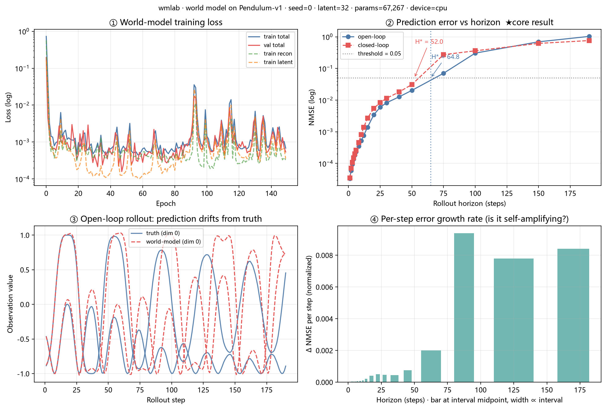

换到 `Pendulum-v1`（每集固定 200 步）把视界抬到 **190**。
**模型 / 损失 / 优化器 / 阈值全部不动，只换数据供给** —— 这是控制变量，不是调参：

| 指标 | 值（逐点口径 ★） | 累积口径（2026-09-18 首次报出） |
|---|---|---|
| 环境 / 数据 | Pendulum-v1，300 集随机策略，60,000 步（每集 200.0 步） | 同 |
| 参数量 | 67,267（obs_dim=3，连续动作） | 同 |
| train / val loss | 0.7298 → 0.0007 / 0.0005 | 同 |
| **可靠视界（开环）** | **42.99** | 64.83 |
| **可靠视界（闭环）** | **39.01** | 51.96 |
| 阈值 | NMSE > 0.05（`rel` 口径，与上一轮同口径，未改） | 同 |

> **为什么两个数字不一样**：累积口径算的是 `mse(pred[:, :h], tgt[:, :h])`（把前 h 步
> 一起平均），而 `reliable_horizon` 问的是"第 h 步**本身**首次超阈"。
> 前者是后者的**运行平均**，穿越阈值必然更晚 ⇒ **累积口径系统性抬高 H\***
> （开环 +50.8%、闭环 +33.2%）。**"开环 > 闭环"的方向不变，"误差饱和"的形态判定也不变。**

**三条结论**（每步增量表可用 `scripts/03_analyze_horizon_curve.py` 复现）：

1. **开环 H\* 第一次是个有限数字：42.99 步**（逐点口径）。上一轮那个「> 15」是区间下界。

2. **误差增长是「饱和」，不是「自我放大」。** 每步增量在 h≈88 处到达峰值
   （开环 9.4e-3、闭环 3.5e-3 每步），之后**掉头**：开环回撤 17%、闭环回撤 63%。
   上一轮之所以看到「自我放大」，是因为 CartPole 只测到 15 步，**整段都落在饱和曲线的上升段**
   —— 用短视界数据外推长视界行为，得到的是错觉。正确描述是：
   **每步误差增长率先升后降，最终饱和到目标方差（NMSE → 1，即「完全不可预测」的上界）**。

3. **两条曲线在 h ≈ 100–150 处交叉**：中期闭环更差，超长视界开环更差。

   | 视界 | 开环 NMSE | 闭环 NMSE | 谁更差 |
   |---|---|---|---|
   | 50 | 0.0203 | 0.0311 | 闭环 |
   | 75 | 0.0704 | **0.2728** | 闭环（差 3.9×） |
   | 100 | 0.3051 | 0.3612 | 闭环（略） |
   | 150 | 0.6951 | 0.6191 | 开环 |
   | 190 | **1.0313** | **0.7613** | 开环（差 1.4×） |

   机制解释 —— ★ **两者测的不是同一件事**（早在 CartPole 那轮读代码时就发现了，
   见 `D:\workbuddy\researchproject\04-实验与代码\实验记录\2026-09-17-...` §8）：

   | | 实现 | 误差在哪累积 |
   |---|---|---|
   | 开环 `multi_step_error_curve` | `encode` **一次** → 潜空间连推 H 步 → 最后统一 `decode` | **潜空间**，全程无纠错，误差无界 |
   | 闭环 `closed_loop_error_curve` | 每步 `encode → transition → decode`，输入是上一步的预测观测 | **观测空间**，每步自带一次隐式纠错 |

   所以：**中期闭环更差**，是因为每步多了一次 encode/decode 的**往返误差**在叠加；
   **超长视界开环更差**，是因为潜空间 rollout 没有任何机制把状态拉回编码器流形附近，
   误差无界增长（NMSE > 1 即**比「直接预测均值」还差**）。
   交叉现象本身可复现，但**机制归因仍属推测** —— 要坐实需补第三种曲线（潜空间闭环）。

**怎么读这张图**：子图② 是对数坐标的 NMSE 曲线 —— 实线是**逐点**口径（H\* 的定义口径），
淡色虚线是**累积**口径，两者的间距就是这个口径选择的影响力，不需要另开一张图解释。
子图③ 是一条真实轨迹的 190 步开环预测：前 30 步基本贴合，之后相位逐渐偏移。
子图④ 直接画**逐点**误差（`nmse_per_step`）—— 它本身就是"每一步有多准"，
不需要再对累积曲线做差分（那正是 2026-09-18 修掉的那处口径缺陷）。

**诚实的边界**：以上都是**随机策略**数据、**CPU**、MLP 世界模型。
**跨环境数字不可比** —— Pendulum 与 CartPole 的 H\* 不能直接比较（状态维度、动作空间、
每集长度都不同），这里只作「各测一次」。也**尚未回答**「该不该预测」这个科研问题（那是消融实验的事）。
**★ H\* 的数值同时依赖三个字段**：口径（逐点/累积）、评测集、归一化分母 ——
换任何一个都会变（同一个 Pendulum 模型：短 val 集上 42.99，held-out 长集 + global 分母上 25.71）。
引用 H\* 时必须三个一起写。

> ### ⚠️ 单种子限定（2026-09-20 补，见 §⑥）
>
> 上面这两个数（**42.99 / 39.01**）是 **seed = 0 一个种子**的结果。
> 补跑 5 个种子后：**H\*(开环) = 26.9 ± 11.4**，五个种子的原始值是
> **42.99 / 32.09 / 13.13 / 20.22 / 26.20** —— **最大值是最小值的 3.3 倍**。
>
> ⇒ **42.99 属于"最好的那个种子"**。本节的机制结论（饱和、开环>闭环、h≈100–150 交叉）
> 在 seed=0 上成立且被 §⑥ 证明**不依赖阈值选择**，但**任何一个 H\* 的具体数值都不可单独引用**。
> 这不是瑕疵，是这类"首次穿越"指标的固有性质 —— 详见 §⑥。

### ④ ★ 通信接入：H\* 与"多久必须传一次"的关系（2026-09-20，X24 / X25 / X26）
> ⚠ **不要**把 H\* 直接读成发送周期 —— 本节的 X25 正是为了否掉这个直觉（两者差 2.4 倍）。

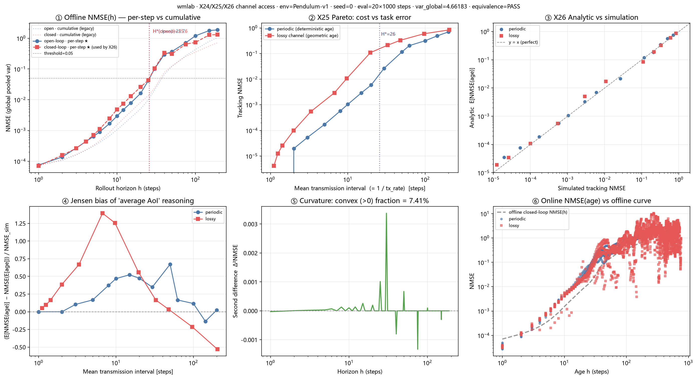

在 `wmlab/envs/channel.py` 加一层**薄信道适配器**（Bernoulli 丢包 + 时延），
把世界模型接到一个 AoI（信息年龄）记账器上，问三个问题：

| 编号 | 问题 | 结果 |
|---|---|---|
| **X24** | 信道层**有没有偷偷改动力学**？ | ✅ 三层等价性全过：E1 动力学 bit-exact（`max\|diff\| = 0.0`）、E2 裸 env 与 p=0 信道的 H\* 逐位一致、E3 实测 E[age] 收敛到理论 `p/(1-p)`（p=0.9 时 8.924 vs 9.000） |
| **X25** | 把 H\* 当"多久必须传一次"，它值不值？ | 传输率–NMSE 帕累托前沿画出来了；Kneedle 拐点在**间隔 62.5 步**（NMSE 0.205），而 H\*(闭环)=**25.6** 落在拐点**左侧** ⇒ **按 H\* 传输是保守的**（多花通信换误差）。容忍丢包率 **p\*(H=25.6, δ=1%) = 0.8408** ⇒ **在 Pendulum 上通信不是瓶颈** |
| **X26** | 离线测的 NMSE(h) 曲线**能不能预测在线跟踪误差**？ | ✅ 能。改用同口径后，解析 vs 仿真的中位相对偏差 **9.9%**（修正前是 56%，但那是口径造成的假缺口） |

**★ X24 为什么必须先做**：信道层一旦污染了动力学，所有历史结论作废。E1 的判据写死为
**逐位相等**（`np.array_equal`，不是 `allclose`），且信道用自己的 RNG（seed + 7919 偏移），
只有 `loss_prob > 0` 时才消耗随机数 —— 所以"加一层信道"不会顺带换掉被采样的轨迹。

**★ X25 的可复用结论**：`H*` 与"最优传输间隔"**不是同一个数**，两者差 2.4 倍。
把 H\* 直接当发送周期用会**过度通信**。真正的决策量是帕累托拐点，H\* 只给出"误差容忍度"。

**★ X26 的价值在方法**：`E[NMSE(age)] = Σ pmf(age)·NMSE(age)` 需要对曲线插值，
所以"离线曲线 ↔ 在线跟踪"的**口径必须严格一致**。下面这张图就是这次对账：

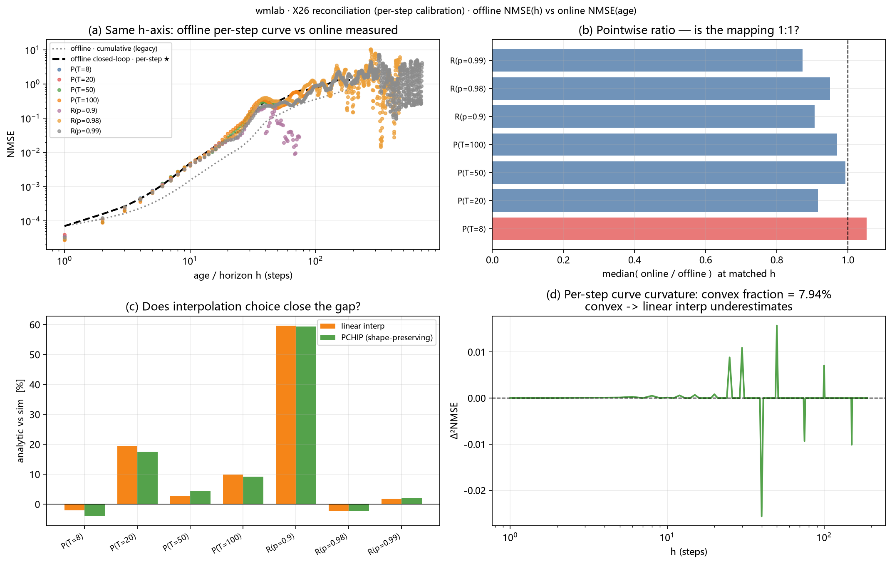

四联图说明：**(a)** 离线逐点曲线与在线实测（按 age 分组）落在同一量级；
**(b)** 在线/离线 中位比值：P(T=8)=1.05、P(T=50)=0.99、P(T=100)=0.97、R(p=0.99)=0.87 —— **映射成立**；
**(c)** 线性插值 vs 保形插值（PCHIP）对结论影响不大（大间隔处相差 ~1%），
所以**不需要为插值引入 scipy**；**(d)** 曲线在大视界段是凹的（饱和），
这正是 Jensen gap 变号的区间 —— 也是下面这条结论的依据。

**★ 一条可以直接写进论文的结论（Jensen 效应）**：在**相同平均 AoI** 下，
**age 方差更大的调度族（随机丢包）误差更高** —— 40/40 个匹配点上成立，中位比值 **20.8×**。
这是"只优化平均 AoI 不够，必须管尾部"的直接证据，也是本课题与
"任务级 AoI 拆成生成年龄 + 传输年龄"（讲座①）的接口。

**这次对账还揪出了两个 bug，都是"数字记下来了但条件没记下来"的同一类**：

1. **累积 vs 逐点口径**（见上面的 H\* 更正表）；
2. **`NmseCurve` 静默截断**：把**稠密**的逐点数组（长度 190）配给**稀疏**的 `horizons`（19 个）
   时，`np.asarray(nmse)[order]` 不报错、直接截断，于是把"第 1..19 步的值"当成了
   "视界 1..190 的值"，大间隔调度的解析值离谱地小（T=200：解析/仿真 = 0.016/0.703）。
   现在 `NmseCurve` 直接抛错，并有回归测试锁住。

### ⑤ ★ 时延：**不用模型** vs **用模型**，差在哪（2026-09-20，X27）

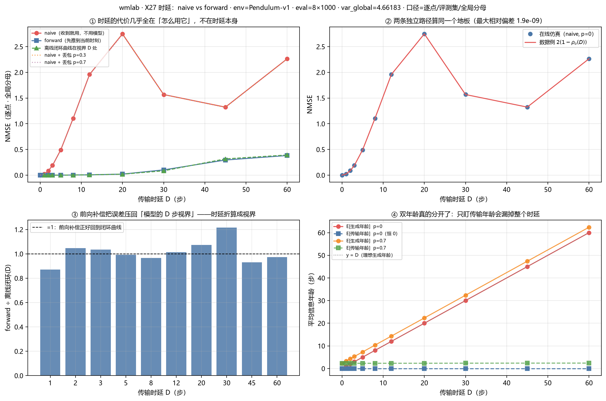

`delay` 在此之前是个**空参数** —— 它只参与 `age_gen = age_tx + delay` 这个加法，
**没有任何信息真的被延迟**（每步送达的都是**当步**观测）。所以讲座①那条
「任务级 AoI = 生成信息年龄 + 传输信息年龄」的分解**从未被验证**。
现在 `run_tracking` 用**在飞包 FIFO** 真正延迟到达，于是有四个可判定的问题：

| 问题 | 结果 |
|---|---|
| 收到**陈旧**观测就直接当当前状态用（`naive`），误差是多少？ | 它是**模型无关**的：`2(1 − ρ_o(D))`。在线仿真 vs 数据侧复算，11 个时延点最大相对偏差 **1.9e-9** |
| 先用动作把陈旧观测**向前推进**到当前时刻（`forward`）呢？ | 误差回到**模型的 D 步视界**：`forward ÷ 离线闭环(D)` ∈ **0.87–1.22**，无一个点偏离 1 超过 25% |
| 两者差多少？ | `forward/naive` 从 **0.0012**（D=3，**差 830 倍**）到 0.22（D=45） |
| 双年龄真的分开了吗？ | ✅ `p=0` 时 `E[传输年龄] ≡ 0` 而 `E[生成年龄] ≡ D` |

**三条结论**：

1. **时延的代价几乎全在"怎么用它"，不在时延本身。** 同一个 D=5，
   `naive` 误差 `0.491`、`forward` 误差 `0.00073` —— **差 674 倍**。
   ⇒ 对 `E[NMSE(age)]` 的正确拆法是 `f(时延的处理方式) + rollout(age)`，
   而不是把时延和丢包混进同一个 age 里。

2. **在 Pendulum 上，1 步时延比丢 70% 的包贵得多。** 纯丢包 p=0.7 → NMSE `3.9e-4`；
   纯时延 D=1 → `0.023`（**59.5 倍**）、D=2 → `0.087`（**224.7 倍**）。
   原因：短视界 rollout 很强（H\* ≈ 39），丢包几乎被模型补掉；时延注入的是"内容陈旧"。

3. **★ `forward` 有效的前提是模型够好 —— 这句话不能省。** 用随机初始化的模型跑，
   D=1 时 `forward ≈ 1.006` 而 `naive ≈ 0.021`（**糟 47 倍**）。
   把一个不会预测的模型顶上去，当然**不如直接用陈旧但真实的观测**。
   ⇒ 「世界模型对通信有用」必须带**模型质量**这个前置条件，否则是空话。

**两条独立路径的验证**（沿用 X26 的纪律）：`naive` 在线 ≡ `2(1−ρ_o(D))`（1.9e-9）；
`forward` 在线 ≡ 「全起点手工复算 D 步闭环 rollout」（**逐位一致**）。

**这次又踩到一个"数字与条件分离"的坑**：离线闭环曲线的 `n_samples=64` 时**它自己就不稳**，
D=30 处单次估计 0.0937、而全起点真值 0.1017 ⇒ 凭空造出一个 **5.4 倍的假缺口**；
给到 `2048` 才收敛。
**报"两条曲线的比值"之前，先确认两条曲线**各自**都收敛了。**

### ⑥ ★ H\* 到底有多可信：5 种子 × 5 阈值（2026-09-20，X3 / X4）

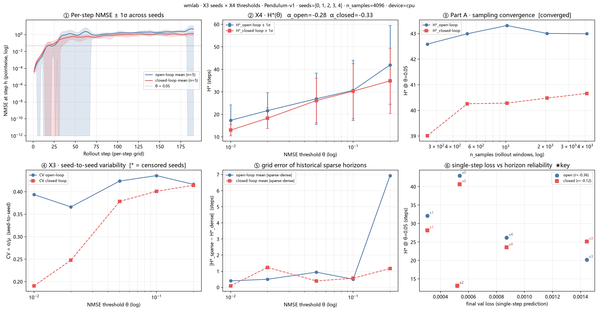

到 §⑤ 为止报出的每一个 H\* 都是**单次测量**。而 H\* 是"误差首次超阈"，
属于曲线的**极值泛函** —— 比曲线本身对噪声敏感得多。这一节补两块：
**X3**（种子重复）、**X4**（阈值敏感性）。
跑法：`python scripts/07_seeds_threshold.py`（CPU，约 13 min，含 5 次完整重训）。

**先做前置检验，否则后面全是假象**：窗口采样数 `n_samples` 不够时，
**同一个模型两次测出的 H\* 都不同**，那种子之间的"差异"里就混着采样噪声。
扫 `n_samples ∈ {256 … 4096}`：最后一档的相对变化 **0.45% < 2%** ⇒ 判为收敛，采用 **4096**。

#### X3 · 种子重复：单次 H\* 不能作为结论

| seed | val_loss（单步预测） | H\*(开环) | H\*(闭环) |
|---|---|---|---|
| 0 | 0.000537 | **42.99** | 40.66 |
| 1 | 0.000307 | 32.09 | 28.17 |
| 2 | 0.000520 | **13.13** | 13.16 |
| 3 | 0.001444 | 20.22 | 25.12 |
| 4 | 0.000872 | 26.20 | 23.54 |
| **汇总** | — | **26.93 ± 11.41**（CV **0.424**） | **26.13 ± 9.89**（CV 0.378） |

三个必须一起读的事实：

1. **最大值是最小值的 3.3 倍**（42.99 vs 13.13）。
   ⇒ 单点 H\* **不是**一个成立的结论形式，§③ 那个 42.99 属于"最好的那个种子"。

2. **★ 单步训练损失不能预报长视界可靠性。** seed=0 与 seed=2 的 val_loss 只差 **3.2%**
   （0.000537 vs 0.000520），H\* 却差 **3.1–3.3 倍**。
   Pearson r = **−0.359**、Spearman ρ = **−0.200**（n=5 —— 符号与强度都还不稳，只作定性）。
   ⇒ **"训练 loss 收敛"和"多步预测可靠"是两件事**，长视界可靠性必须**单独测量**。
   这正是这个世界模型值得被单独评测、而不是从训练曲线推断的理由。

3. **口径复现性交叉验证**：Part A 在 `n_samples=512` 处给出 **42.99209**、`n_samples=256` 处给出
   **39.01098** —— 与 §③ 记录的 **42.99 / 39.01** 逐位一致，**代码没有漂移**。
   （顺带暴露一个此前没注意的事实：§③ 那两条曲线其实是在**不同采样精度**下测的 —— 512 vs 256。）

#### X4 · 阈值敏感性：绝对值不可靠，但标度行为很稳

| θ | H\*(开环) | H\*(闭环) |
|---|---|---|
| 0.01 | 17.38 ± 6.84 | 13.04 ± 2.49 |
| 0.02 | 21.68 ± 7.94 | 18.31 ± 4.53 |
| **0.05**（主口径） | **26.93 ± 11.41** | **26.13 ± 9.89** |
| 0.10 | 30.67 ± 13.37 | 30.31 ± 12.15 |
| 0.20 | 41.98 ± 17.48 | 34.88 ± 14.45 |

- **H\*(θ) 服从干净的幂律**：开环 `62.19 · θ^(+0.277)`（R² = **0.981**）、
  闭环 `63.35 · θ^(+0.327)`（R² = **0.967**）。
  阈值**加倍**，H\* 只增加约 `2^0.28 ≈ 1.21` 倍 —— **次线性**。
  即便绝对值有 ±40% 的种子波动，**这个标度指数是稳的**，可以作为一个被引用的量。

  > ⚠️ **2026-09-21 更正**：此式原写作 `θ^(−0.277)`（**负号**），与本表方向
  > （θ↑ ⇒ H\*↑）相反。用 `outputs/07_seeds_threshold.csv` 独立复算：
  > α = **+0.2696 ± 0.0869**（`open_sparse`，5 seeds）；按原式代入实测阈值，
  > 相对偏差最大达 **+1290.8%**。**系数 62.19 与数量级本身是对的，错的只有指数符号。**
  > 详见 `2026-09-21-X22-与理论界对账.md` §4.4。

- **★ 开环 > 闭环的序在全部 5 个阈值下一致**（排序反转点：**无**）。
  这是本节唯一一条**不依赖阈值选择**的强结论 —— §③ 的"开环能推得更远"因此站得住。

- **CV 不随 θ 系统变化**（0.37–0.44）⇒ 方差**不是**阈值选择造成的，而是模型本身的。

#### 顺带量化出来的一个历史精度缺陷

config 的 `horizons` 在长视界段很稀（100 → 150 → 190）。在同一批曲线上比较
**稀疏网格插值**与**逐步（稠密）插值**得到的 H\*：最大差 **19.57 步**。
§③/§④/§⑤ 报的所有 H\* 都基于稀疏网格 ⇒ **长视界段的插值误差最多可达约 20 步**
（子图⑤ 显示这个误差主要来自开环曲线，闭环的小一个数量级）。

#### 结论：H\* 正确的报法

- ❌ 不要报 `H* = 42.99` —— 那是一个种子的运气
- ✅ 报 `H* = 26.9 ± 11.4（5 seeds，θ=0.05）`，或直接报**幂律标度** `α ≈ 0.28`
- ✅ **必须同时写明：曲线定义（开环 / 观测闭环 / 潜闭环）、阈值 θ、评测集、采样量**（R1 + §设计约定 7–8）
- ✅ 需要绝对长度时，报**中位数 / 范围**，不要报单点

**怎么读这张图**：③ 是采样收敛性证据（撑起整节的可靠性）；
⑥ 是本节最关键的散点（`s0` 与 `s2` 在横轴上几乎重合、纵轴上差 3 倍）；
① 是 5 个种子的逐点 NMSE 带 ±1σ；② 是 H\*(θ) 与幂律拟合；④ 是 CV(θ)；⑤ 是稀疏网格误差。

### ⑦ ★ 与理论界对账：**结论是"对不上"，而且原因是可证明的**（2026-09-21，X22）

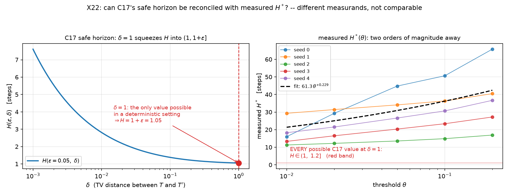

**动机**：C17（*Imperfect World Models are Exploitable*，arXiv:2605.15960）给出了 safe horizon 的
**紧界闭式解**，但**纯理论、零实验**，且原文明确限定 **finite MDP**。
原计划是"把实测 NMSE 当 δ 代进去，与实测 H\* 报出 gap"。

**结论：这个动作在数学上不成立**，理由有三条，全部可复现（`scripts/08_x22_theory_check.py`，12 项断言）：

| # | 断裂点 | 内容 |
|---|---|---|
| **①** | **measurand 不同** | C17 的 H 约束「**策略序反转幅度 ≤ ε**」（含回报 J 与折扣 γ）；本仓库的 H\* 是「**预测误差首次超阈的步数**」（不涉及策略、价值、γ） |
| **②** | **δ 取不到有分辨力的值** | δ 是两转移模型的 **TV 距离**。本仓库**环境确定性**（Pendulum/CartPole 的 `step()` 无噪声，实测同一 `(s,a)` 三次得到逐位相同的 `s'`）**且模型确定性**（`transition` 是 MLP 点估计，无方差头，实测同输入同输出）⇒ `T` 与 `T′` 都是**点质量** ⇒ `TV ∈ {0,1}`，取 `max` 后 **δ ≡ 1** |
| **③** | **空间不同** | 本仓库的转移在**潜空间**，δ 定义在**状态-动作空间**；原文亦限定 finite MDP，自陈不适用于连续 / 潜空间 |

**δ = 1 时代数化简（两条独立路径核对，最大绝对差 2.22e-16）**：

```
(1−ε)² + 4ε = (1+ε)²  ⇒  √(...) = 1+ε  ⇒  H(ε, 1) = 1 + ε
```

**定理条件于是退化为 `1/(1−γ) ≤ 1+ε ⟺ γ ≤ ε/(1+ε)`**：

| ε | 允许的最大 γ |
|---|---|
| 0.01 | 0.0099 |
| 0.05 | 0.0476 |
| 0.10 | 0.0909 |
| 0.20 | 0.1667 |

⇒ **对任何有实际意义的 γ（0.9 / 0.99）条件都不满足**。δ = 1 给出 H 的全局最小值，
而 H 在本场景里永远落在 `(1, 1+ε]` —— 右图那条红色窄带就是它的**全部**可能取值，
而实测 H\* 是 13–66 步。**不是"差多少倍"，而是两边不在同一个量上。**

> ★ **所以本仓库不报任何 "gap 数值"。** 若强行代入（δ 取实测 NMSE 0.05）会得到 `H = 1.63`
> 与实测 `42.99` 相差 **26 倍** —— 但那是**假缺口**，相除没有数学意义（对应 R13 的精神：
> 比值只有在两个量各自有定义时才可比）。

**这条负面结论反而加硬了所在位置**：调研把"测量理论界与实测的 gap"判为唯一确定还空着的环节。
本次给出更本质的原因 —— **这座桥没人走，不是没人想到，而是 C17 的 δ 是 TV 距离，
而 TV 距离在确定性动力学上不携带误差幅度信息，"保守多少"在现有定义下问不出来。**

**两条补救路径（都还没做）**：

| 路径 | 做法 | 归属 |
|---|---|---|
| **A** | 给环境**注入过程噪声**，让 `T` 变成真分布 ⇒ δ 才连续 | X14 换场景时顺带（玩具环境上不值得单独开一轮） |
| **B** | 换 **Wasserstein-1 / 潜空间距离** 替代 TV，**自己重推**对应的 safe horizon | 理论工作，阶段 3–4 |

**诚实边界**：① 本次**没有产生任何 gap 数值**；② δ ≡ 1 依赖"环境确定 + 模型确定"两个前提
（均以 assert 实测），**若模型换成随机版（B1 的 `H_t + Z_t` 因子化），前提失效，本文结论需重做**；
③ 只读了 C17 的定理与局限段，未逐页精读其证明，**没有独立验证该定理本身**；
④ 全程 CPU、0 元、无训练。

### ⑧ ★ 第三种曲线 = 纠错频率 K；δ 连续化；C17 对账闭合；UAV 场景（2026-09-22 凌晨，X11 / X28 / X29 / X14）

**X11（`scripts/11_latent_roundtrip.py`）** —— "第三种曲线"的正确形态不是再画一条，
而是把两条现有曲线的**唯一差异**（往返映射 R = encode∘decode 的施加频率）变成自变量：

- **端点恒等式被证明**（assert 逐位）：K=1 ≡ 闭环、K=∞ ≡ 开环（最大差 1.2e-11）；
- 150 epoch 下 **H\*(K) 平坦**（22.50±2.48 vs 23.53±6.18，效应 < 种子噪声）；
- **K 的效应随模型质量衰减**（ΔH\*：+6.1@5ep → +1.0@150ep；趋势成立、幅度不可引用）；
- "轨迹漂出训练分布"假说被**推翻**（Mahalanobis 距离几乎不随视界变化）。

**X28（`scripts/12_delta_continuity.py`）** —— 救活 §⑦ 的死路：注入过程噪声 +
概率模型（`GaussianWorldModel`，NLL 训练），δ 第一次可测：

- **δ 可分辨 ⇔ 模型均值误差 ≲ 潜空间分布宽度 ⇔ latent_dim=4**（D≥8 饱和回 1）；
- δ（mean/median）随 σ_env **单调下降**：1.00 → 0.84 → 0.59 → 0.34
  （★ 宽分布"兜住"均值误差 —— 与直觉相反，实测方向为准）；
- **δ_max 在 σ≤0.1 仍饱和 ⇒ C17 的 max 定义在实践中过强**
  （平均意义上很好的模型得到几乎为零的保证 —— 可写进论文的实证批评）；
- 方差头粗校准：σ_pred ≈ σ_true（系统性略偏大）—— B1 的第一块。

**X29（`scripts/13_x29_reconcile.py`）** —— δ 可测之后的 C17 对账（⑧ 环闭合）：

| σ_env | δ_med | H(ε,δ) 理论 | H\* 实测 | H\*/H |
|---|---|---|---|---|
| 0.1 | 0.61 | 1.08 | 18.85 | 17.5× |
| 0.3 | 0.31 | **1.15** | **9.76** | **8.5×** |

**gap ≈ 8.5–23.8×，数量级真实**；保守性来源可实证（max 定义 + measurand 双重过强）。
⚠️ measurand 断裂点仍在（序反转 vs 误差超阈）⇒ **gap 只能定性引用，不能当倍数宣称**。

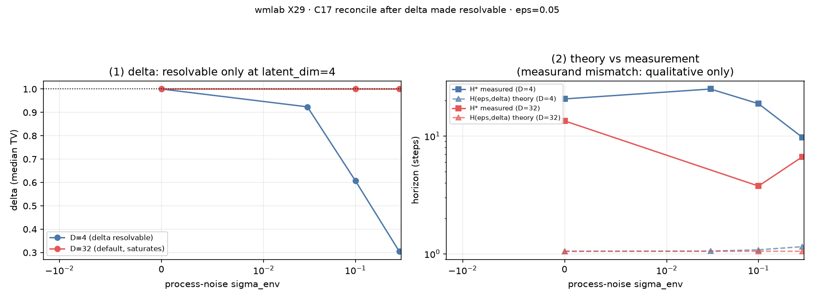

**X14 首跑（`configs/uav.yaml` + `envs/uav_track.py`）** —— 自建 2D UAV 跟踪场景
（双积分器 + 阻尼 + 风扰过程噪声）：

- **架构声明首次实测**：`02` 训练管线**零改动**跑通新场景（唯一例外 = env kwargs 透传 1 处）；
- **H\*（σ=0.15，3 种子，逐点口径）：开环 11.41 ± 4.10 / 闭环 9.00 ± 4.44**
  （CV 0.36 / 0.49，与 Pendulum 的 0.42/0.38 同量级；开环>闭环在 3/3 种子一致）；
- 闭环误差饱和于 NMSE≈1（噪声环境的理论特征）。
- **σ 敏感性（3 种子 × {0, 0.15, 0.5}）**：H\* 随噪声单调下降（开环 16.1→11.4→8.8）
  —— **通信压力在 UAV 上显出梯度**（Pendulum 上"调度全部差不多"的死寂不见了）；
  ★ σ=0 时**排序反转**（闭环 > 开环，2/3 种子；std≈均值，3 种子不足以下强结论，待确认）。

**X12-min（`scripts/15_sigma_calibration.py`）** —— σ 头校准检查（B1 第一块）：

- 逐维 std(r) = [1.06, 1.11, 1.01, 1.06]，**τ = 1.058**（仅 6% 过度自信）；
- 覆盖率：名义 95% → 实测 93.2%，**温度缩放后 94.5%**；
- 口径声明：这是**潜空间单步转移**的校准，obs 空间多步校准是 X12 完整版。

### ⑨ ★★ 任务锚定的 H\*：误差阈值 ≠ 任务边界（2026-09-22，X30）

`scripts/16_task_horizon.py` + `wmlab/control.py` + `configs/uav_task.yaml`。

**此前所有 H\* 都是 `NMSE > 0.05` 定义的 —— 这个阈值与任务无关。**
X30 第一次把「误差 → 任务」的映射测出来：UAV 跟踪场景 + 解析 PD 控制器，
控制器**只看得见估计状态**（丢包时世界模型 rollout 顶上）⇒ 模型误差会
**反过来改变真实轨迹**（compounding 第一次真正接上；此前 `run_tracking`
的动作来自离线数据，轨迹与模型无关）。

**核心数字（100 集/点，周期调度 T ∈ [1,128]）**

| 口径 | 定义 | H\* | / H\*_err |
|---|---|---|---|
| **H\*_err** | 离线闭环 NMSE 逐点 > 0.05（沿用 X2/X14） | **26.1** | 1.00 |
| H\*_escape | 逃逸率 ≤ 基线 +0.02 | 24 | 0.92 |
| **H\*_escape** | 逃逸率 ≤ 基线 **+0.05** | **32** | **1.22** |
| H\*_dist | 稳态距离 ≤ 基线 ×1.2 / ×2 / ×3 | 1 / 2 / 8 | 0.04–0.31 |

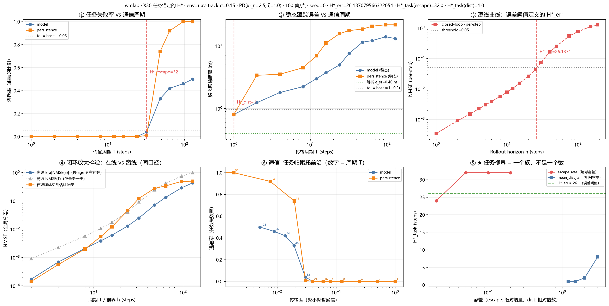

- **同一批数据上 H\*_task 跨 32 倍**（1–32 步），而 H\*_err 只有一个数 ⇒
  **换任务指标就会换结论**。0.05 这个阈值恰好处在"灾难性失败"一侧
  （H_escape/H_err=1.22），对"性能可感知退化"（距离口径）则**保守 30 倍**。
- **闭环放大**：同口径对账（在线估计误差按 age 分布平均 vs 离线曲线），
  中位数比值 **1.69**（max 4.9）⇒ **闭环控制放大了模型误差，离线 H\* 偏乐观**。
- **模型 vs persistence 基线**：T=64 时逃逸率 0.42 vs 0.92；T≥96 时 persistence
  全军覆没（1.00）而模型仍 0.46–0.50 ⇒ **世界模型顶上的价值随通信变差而放大**。

**★ 诚实交代（本实验的边界）**
1. 此时测到的视界是 **(模型, PD 控制器, 周期调度) 三元组**的属性，**不是模型单独的属性**；
2. PD 增益是闭式解（kp=ω_n²=6.25, kd=2ζω_n−κ=4.5），稳态误差解析值 **0.40 m**
   （旋转坐标系向量解；第一版标量式 0.58 m 是**错的**——把正交的向心项与阻尼项相加了），
   实测 0.89 m（含风扰，Jensen ⇒ 只会更高）；确定性环境下自检验证到 **1.4%**；
3. 加了 **250 步预热**隔离初始捕获瞬态：不加预热时 T=1 实测 2.86 m、|a| 全程饱和，
   看起来像"解析错了"，实际是 episode 只有 200 步、瞬态（~400 步）没走完。
   —— **第 11 次自我修正**，与前 10 次同根因：从图上"看出"数字就直接解释。

自检 ⑫–⑮（共 53 项）覆盖：增益闭式解、稳态=解析解、n_tx/E[age] 闭式解精确匹配、
T=1 估计误差恒为 0、NaN 闭环必须抛、estimator 开关接线。

### ⑩ ★ 自己写的 PPO，与「数据从哪来」的消融（2026-09-21，X5 / X6 / X7）

`wmlab/agents/ppo.py` + `scripts/09_train_ppo.py` + `scripts/10_behavior_ablation.py`。

**X5（`scripts/09_train_ppo.py`）** —— 不抄库，手写 PPO；文件头留完整推导
（策略梯度 → 重要性采样 → clip 为什么要双分支取 min → GAE → 三项 loss 的符号）：

- 确定性评估 **500.0 ± 0.0**（20 条全满），判据 PASS；
- ★ 踩坑：`Tanh` trunk 让 **79.6% 的激活饱和** ⇒ 梯度断流 ⇒ critic explained-variance 仅 **0.24**；
  换 `ReLU` 后 209 → **500**。同一份超参，差别只在激活函数。

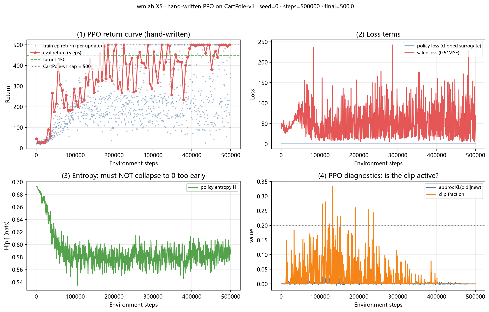

**X6 / X7（`scripts/10_behavior_ablation.py`）** —— 世界模型的**训练数据从哪来**，决定了它的可靠视界：

| 训练数据来自 | 在 PPO 策略分布上的回报 |
|---|---|
| 随机策略 | **1.20 ± 0.35** |
| PPO 策略（训练过的） | **47.84 ± 6.27** |

3 种子配对差 **+46.6 ± 6.1**，3/3 同向。★ 不对称性：**好策略的数据向下兼容差策略的分布，反之不成立**
—— 所以"用随机策略采数据训世界模型"不是省事，是**把模型上限压死**。

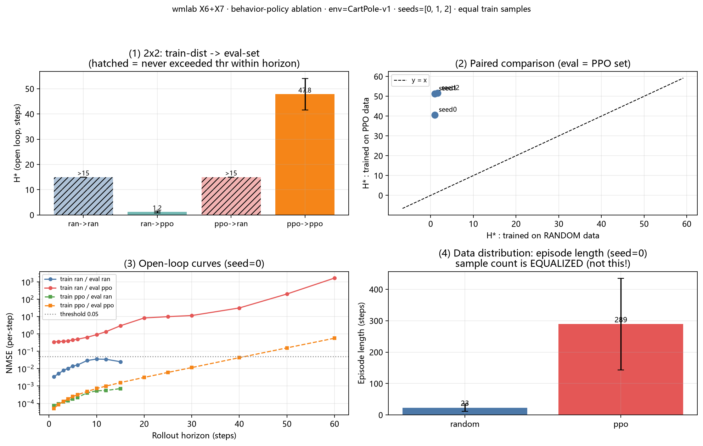

### ⑪ ★★ 突发信道：「突发」到底让误差变大还是变小？（2026-09-22，X31）

`scripts/17_burst_channel.py` + `wmlab/eval/tracking.py::GilbertElliottChannel` + `configs/uav_burst.yaml`

X24–X27 的信道是**无记忆伯努利丢包**；真实无线信道是**突发**的。X31 换成
Gilbert–Elliott 两状态模型，固定**平均丢包率 p̄=0.5**，只扫**平均突发长度 L**。

★ 第一个反直觉点：**L=1 不是 i.i.d.** —— 无记忆条件是 ρ₁ = 1−α−β = 0，
代入参数化得 **L_iid = 1/(1−p̄) = 2**。L=1 是"通/丢交替"（ρ₁=−1），L>2 才是真突发。
网格 1→32 **连续穿过「交替 → 无记忆 → 强突发」三种机制**。

**核心数字（p̄=0.5，60 集/点，稳态口径）**

| L | ρ₁ | E[age]=p̄·L | E[NMSE] | 相对 i.i.d. | 闭式偏差 | 一阶项占比 |
|---|---|---|---|---|---|---|
| 1 | −1.000 | 0.50 | 0.00035 | **0.25×** | −2.6% | 100% |
| **2** | **0.000** | 1.00 | 0.00145 | **1.03×** | +2.8% | 78% |
| 4 | +0.500 | 1.96 | 0.00480 | 3.4× | −8.9% | 67% |
| 8 | +0.750 | 3.94 | 0.01995 | 14.1× | −0.5% | 59% |
| 16 | +0.875 | 7.29 | 0.06888 | 48.9× | −4.1% | 59% |
| 32 | +0.938 | 14.57 | 0.20006 | **141.9×** | +1.4% | 84% |

- ★★ **平均丢包率完全相同（50%），跟踪误差跨 570 倍**（0.25× → 142×）。
- ★★ **闭式恒等式 `E[NMSE] = p̄·[f(L) + J(L)]` 成立，相对偏差中位 −1.5%**
  （f = 离线闭环 NMSE 曲线，J = Jensen 项；推导见 `GilbertElliottChannel` 类 docstring）。
  ⇒ **X26 的解析式从 i.i.d. 推广到任意突发信道**，而且不需要实测 age 直方图。
- ★ **一阶项 f(L) 平均占 74%** ⇒ 突发的影响主要是**一阶地拉长条件信息年龄**，
  **不是** Jensen 高阶效应（J 全部 ≥ 0：凸性只是"雪上加霜"，不是主因）。
- **L < L_iid（通/丢交替）反而更好** —— 条件年龄被压到 1 步。
- 锚点：L = L_iid = 2 时 GE 与 i.i.d. 基线的 E[NMSE] 比值 **1.029**（两个独立实现接上了）。

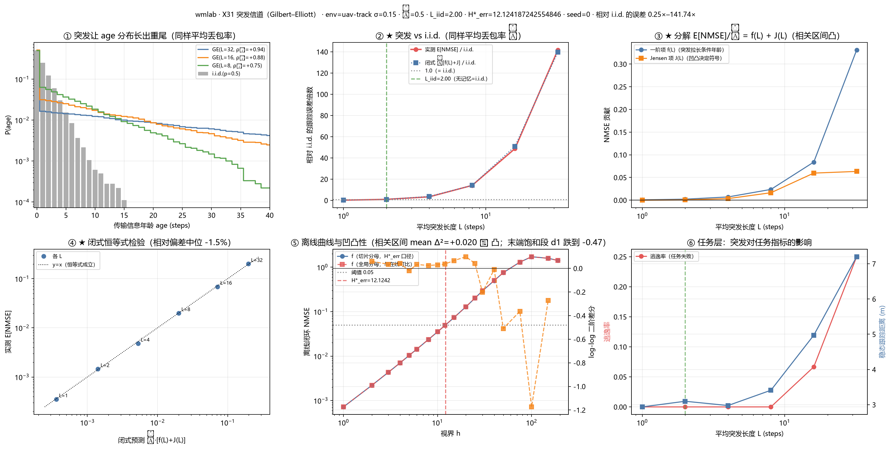

**★ 两个必须写下来的口径陷阱（都是"看着完全合理"的假结果）**

1. **离线曲线被自己的最大视界挤进瞬态区**：起点范围 `t0 ∈ [0, T−h_max−1)`，
   h_max=190、episode 451 步 ⇒ 起点只能落在前 260 步，而 UAV 捕获瞬态占前 ~250 步
   ⇒ **f(1) 高估 49%、f(6) 高估 11%**（偏差随 h 收敛，极易被误读成机制）。
   修法：离线加 `t0_min`、在线加 `warmup`，**两边都在稳态区**；episode 拉长到 700 步
   （否则稳态起点只剩 10 个）。对齐后在线实测 f_online(k) 与离线 f(k) 吻合到 5% 以内。
2. **`n_tx` 与 `n_steps` 不在同一区间**：`n_tx` 在预热期也累加、`n_steps` 只记预热之后
   ⇒ L=1 时算出丢包率 **0.222 而非 0.5**（差 23σ）。X26/X27 因 `warmup=0` 从未触发。

★ **第 13 次自我修正**：凹凸性诊断**必须局部化**。全区间 mean(Δ²) = −0.12 会判成
"凹 ⇒ 突发更好"，而相关区间（h ≤ L_max=32）内 Δ² 全为正（**凸**），实测 Jensen 项也全 ≥ 0。
原因是曲线末端进入饱和（幂指数跌到 −0.47），两个大负值把均值拉翻了，而 age 分布
根本取不到那么大的 h —— **用全区间均值判定，正是规范 R2 说的"看图下结论"**。

**任务层（闭环控制，60 集/点）**：逃逸率在 L≤8 时仍为 0，L=16 起 6.7%、L=32 达 25%
⇒ **任务对突发有明确容忍边界**；稳态跟踪距离 2.9 → 7.2 m。
与 A 层**同向**（与 X30 不同：X30 里误差阈值与任务边界差 32 倍，这里两者方向一致）。

自检 ⑯–⑳（共 53 项）覆盖：GE 解析量、无记忆点不是 L=1、条件年龄恒为 Geom(β)、
tx_rate 与 warmup 同区间、t0_min 真的抬高起点。

### ⑫ ★★ 丢包率 × 突发结构：两个因子是解耦的吗？（2026-09-23，X31-b）

`scripts/18_burst_sweep.py` + `configs/uav_burst_sweep.yaml`（p̄ ∈ {0.2,0.35,0.5,0.65} × L ∈ {2,4,8,16,32}）

X31 只在 **p̄=0.5 一个点**上验过 `E[NMSE] = p̄·[f(L)+J(L)]`。单点值不可引用
（X3/X4 的教训）⇒ 把 p̄ 也铺成网格。★ **模型与离线曲线各只算一次、全网格共享** ——
否则"模型质量"会混进 p̄ 的效应，检验直接失效。

**待验的强预言**：Gilbert 下条件年龄分布恒为 Geom(β)，**与 p̄ 无关**；p̄ 只决定
`P(age=0)=1−p̄`，又 f(0)=0 ⇒ **`E[NMSE] = p̄·G(L)`**，其中 G 只依赖 L。
⇒ C1 数据塌缩（不同 p̄ 的 `E[NMSE]/p̄ vs L` 曲线重合）、C2 线性于 p̄（过原点直线）。

| L | G(L)（4 个 p̄ 的平均） | 跨 p̄ 的 CV | **种子内噪声 CV** | 比值 |
|---|---|---|---|---|
| 2 | 0.00271 | 1.2% | 3.2% | **0.38** |
| 4 | 0.00995 | 8.0% | 4.7% | 1.68 |
| 8 | 0.03816 | 2.3% | 8.7% | **0.26** |
| 16 | 0.13997 | 12.9% | 7.5% | 1.71 |
| 32 | 0.38716 | 5.2% | 6.4% | **0.81** |

- ★ **5 个 L 里有 3 个的跨 p̄ 离散度低于噪声本身**（比值 <1）⇒ 差异**完全可由噪声解释**。
  最大比值 1.71 ⇒ **C1 弱成立**：解耦基本成立，残余依赖量级接近噪声。
- **G(L) 跨度**：L=2 → L=32 是 **143 倍**；而 p̄ 只贡献一个**线性因子**。
  ⇒ 通信上可分开设计：**丢包率由链路预算决定，突发长度由信道时变性/移动速度决定**。
- 闭式恒等式相对偏差**中位 −0.7%**（最大 31.5%，出现在长突发+高丢包处）。
- C2 线性：过原点直线的最大相对残差 29.4%（L=16）。

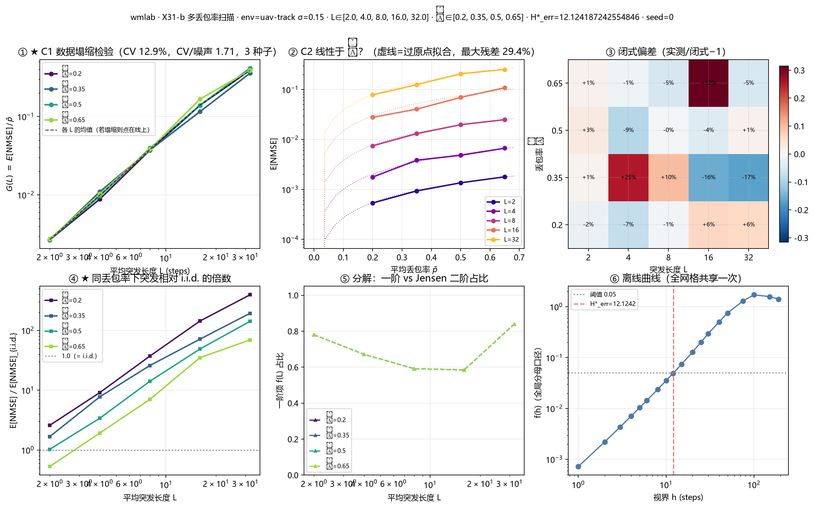

★ **第 14 次自我修正（一串，根因都是"统计检验的口径"）**

1. **TV 阈值不能用 3/√n**：TV 是多类别之和，噪声随分布支撑集增长 ——
   Geom(β) 的 `Σ√p_k = √β/(1−√(1−β))`，β=1/32 时 ≈ **11.2** ⇒ n=6076 时 E[TV]≈0.057，
   而 3/√n 只有 0.038 —— **阈值比纯噪声还小，必然误杀**。改用 KS。
2. **有效样本量不是 age 样本数**：游程内 age 是 1…n 的确定性序列，一个游程只有
   **1 个独立样本**，用 n_pos 会把检验功效高估 √L 倍。
3. **多重比较**：20 个网格点各做一次 α=0.05 检验 ⇒ 至少一个误报的概率 **64%**。
   实测正是第 13 个点 KS 判"显著"（只超 4%），而同一份数据均值检验 z=+2.3 正常。
   ⇒ 改 Bonferroni（临界值 1.36/√n → 1.83/√n）。
4. **没有噪声基准就不能下结论**：单种子版跑出 CV 16.7%，无从判断是机制还是噪声
   ⇒ 加 `--seeds` 重复，用「跨 p̄ 的 CV / 种子内噪声 CV」判定。

### ⑬ ★★ 物理层：量化精度 × 调制阶数的速率—可靠权衡（2026-09-23，X32）

`scripts/19_physical_layer.py` + `wmlab/eval/physical.py` + `configs/uav_physical.yaml`

★ **不是"SNR→丢包率"查表**（那对 X31 零增量）。本实验做的是真 tradeoff：
每时隙固定 `N_sym = d` 个符号，要传 `d·b` 比特 ⇒ 每符号必须承载 `m = b` 比特
⇒ **M = 2^b**，b=2/4/6/8 恰是 **4/16/64/256-QAM**。

    b ↑  量化更精细（误差 ∝ 2^(−2b)）   但 M ↑ ⇒ 星座更密 ⇒ BER ↑ ⇒ PER ↑ ⇒ 丢包更多
    b ↓  星座抗噪（PER 低）             但量化粗糙（**每次到达都注入**误差）

**核心结果一：b\* 随 SNR 单调增（每点 40 集）**

| SNR | 5dB | 10dB | 15dB | 20dB | 25dB | 30dB |
|---|---|---|---|---|---|---|
| b\* | 2 | 4 | 4 | 6 | 6 | **8** |

⇒ 链路越好，越该把比特花在**精度**上而不是**抗错**上。

**核心结果二（★ 这才是被数据支持的那个）：模型的价值随 PER 增长**

| SNR/b | PER | 量化占比 | model | persistence | 增益 |
|---|---|---|---|---|---|
| 30dB b=2 | ~0 | 100% | 0.05147 | 0.05147 | **×1.00** |
| 15dB b=4 | 0.10 | 98% | 0.00409 | 0.00438 | ×1.07 |
| 20dB b=6 | 0.26 | 42% | 0.00058 | 0.00131 | ×2.26 |
| 25dB b=8 | 0.46 | 1% | 0.00110 | 0.00387 | ×3.51 |
| 15dB b=6 | 0.91 | 2% | 0.06311 | 0.26673 | **×4.23** |

低 PER(<0.05) 平均 **×1.03**；高 PER(>0.3) 平均 **×3.10**。
且逐点看，增益不是由 PER 单独决定，而是由**丢包在总误差中的份额**决定
（15dB/b=4 量化占 98% ⇒ 仅 ×1.07；15dB/b=6 量化占 2% ⇒ ×4.23）。
⇒ **世界模型补的是丢包（时间上的空缺），不是量化精度（每次到达都存在的地板）。**

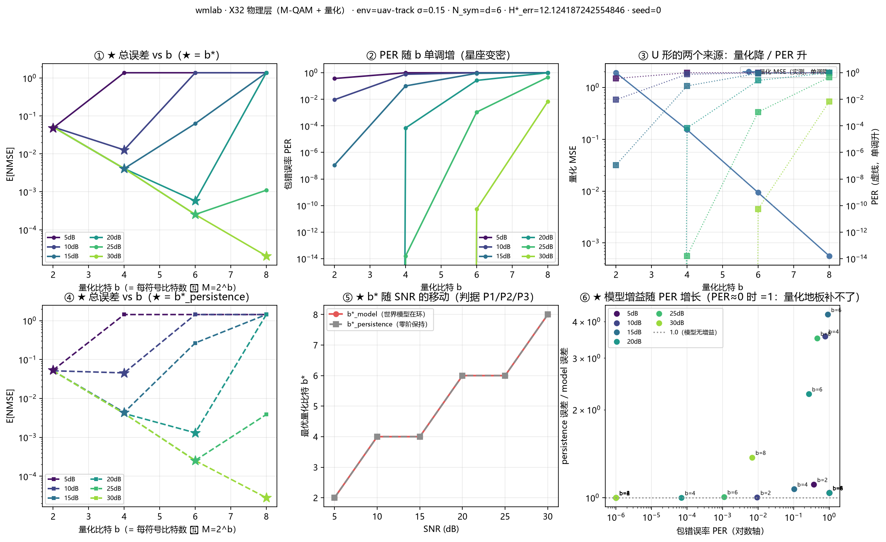

★ **预写判据的命运**：我跑前写的是 P1（`b*_model > b*_persistence`，理由"模型能扛
PER ⇒ 敢用更高阶调制"）。实测 **b\* 两者相等**（P2）。但数据支持的是更精确的版本：
模型**没有移动最优点**，而是把 U 形的右支（高 PER 区）整体压低 3–4 倍。
⇒ 推理方向对，但"移动 b\*"这个表述错了。

★ **第 15 次自我修正**：我最初以为"模型能补信息损失 ⇒ 可用更粗量化 ⇒ b\* 下移"。
错在没分清两种损失的性质：量化**每次到达都注入**，是硬地板；丢包**只在丢时出现**。

⚠ **待核**：M-QAM 误码率用的是教科书近似式（Proakis/Goldsmith），**绝对数值未与
标准表核对**。已自证的只有：M=4 退化为 QPSK 精确式 `Q(√γ_s)`、PER 单调性、SER 饱和在
1−1/M。⇒ 本实验的结论（b\* 的存在与增益趋势）只依赖定性结构；
**任何"在 SNR=X dB 时 PER=Y"的定量表述，核对前不得写进论文**。
★ 已发现的公式失效区：`BER ≈ SER/log2(M)` 在 SER 饱和时不再成立
（256-QAM 饱和时它给出 BER=0.124，而物理上应趋近 0.5），已显式标记 `formula_valid`。

### ⑭ ★★ 跨层预报：丢包 × 量化能不能闭式算出来（2026-09-24/25，X33）

`scripts/20_additivity.py` + `configs/uav_additivity.yaml` +
`wmlab/rollout/imagine.py`（新增 `payload_fn`）+ `wmlab/eval/tracking.py`

★ **这是把 X31/X32 两条支线合并的实验。** 前面每个实验都只动一个旋钮；真实链路是
「物理层出 PER ⇒ 链路层出年龄分布 ⇒ 应用层出跟踪误差」三层串起来。X33 问的是：
**能不能只量两条离线曲线，就把在线误差算出来？**（这是 X34 联合设计的前提）

**核心观测量：离线曲线 `g_b(h)`** —— 从**被量化过的**起始状态出发做闭环 rollout 的误差
（对比 X31 的 `f(h)`：从真实状态出发）。在线误差的闭式预报就是

    E[NMSE] = Σ_h P_age(h) · g_b(h)      只用离线曲线 + 信道参数 (p̄, L)，不碰该点的在线实测

**★ 网格必须"反解 SNR"，不能列 SNR**（第一版 20 个点里 19 个作废）：
4-QAM@25dB 的 BER≈1e−71 ⇒ PER 直接下溢成 0 ⇒ E[age]=0 ⇒ 判据全假。
⇒ 改成按**目标 PER** 二分反解 SNR（`snr_for_target_per`），PER ∈ {0.005…0.7}。

**主判据 W（闭式预报，72 个工作点）**

| 口径 | 中位 \|偏差\| | 90 分位 | 最大 |
|---|---|---|---|
| 解析年龄分布（真·闭式） | **5.0%** | 45.6% | 620% |
| 换成**实测**年龄直方图 | **3.4%** | 17.3% | 34.3% |
| 不带量化的 X31 旧结论 | 10.0% | — | — |

⇒ **W2：定性成立、定量不够。** 但换成实测直方图后最大值从 620% 掉到 34%
⇒ 那 620% **不是分解式错了，是"整段测量只撞见约 3 次突发"的采样问题**
（最差点全在 `PER=0.005, L=32` 与高 b 处，那里误差绝对值只有 1e−5 量级，分母极小）。
**引用时这两个数字必须成对出现：中位 5.0% 与 90 分位 45.6%。**

**★ 副判据 A：误差不可加（第 15 次自我修正）**

预写的是"量化误差会被 rollout 的雅可比**放大**"。实测 `Δ_b(h) = g_b(h) − f(h)`
随年龄**衰减**：`Δ_b(K)/Δ_b(0)` = −2.26 (b=2) / −6.45 (b=4) / −15.5 (b=6) / **−182** (b=8)。
⇒ **量化误差被 rollout 洗掉了，不是被放大。** 4/4 个 b 同向（A2 判据）。

放大倍数 `A = (N_full − N_drop)/N_quant` 的两个预写假设**都错了**，照报：

| 预写 | 实测 | 结论 |
|---|---|---|
| H1：`A > 1` 普遍成立且与 E[age] 正相关（ρ>0.5） | A_model 中位 **0.985**，>1 的点仅 22/72；**Spearman ρ = −0.04** | ✗ |
| H2：persistence 的 A 比 model **小**（零阶保持不传播 q） | A_persist 中位 **1.010** > A_model 0.985 | ✗（方向反了）|

⇒ 说明「量化误差在 rollout 里被传播/放大」这个直觉模型是错的：
**rollout 是个收缩映射，注入的扰动会被动力学本身衰减。**

★ **第 15 次自我修正（方法论）**：第一版判据用**在线做差**算 A，结果 b=2 给 0.52、
b=6 给 4.69（同一 PER/L，符号相反）⇒ 那是**噪声不是机制**。
⇒ 换成离线曲线 `g_b(h)`（统计量好 1–2 个数量级），在线 A 降级为"次级诊断，不得单独引用"。

★ **与 X32 的一致性**：`quant_share`（量化在总误差中的份额）从 b=2 的 99.99% 降到
b=8/PER=0.7 的 0.08% —— 与 X32「模型补的是丢包不是量化精度」同向，两条独立路径互证。

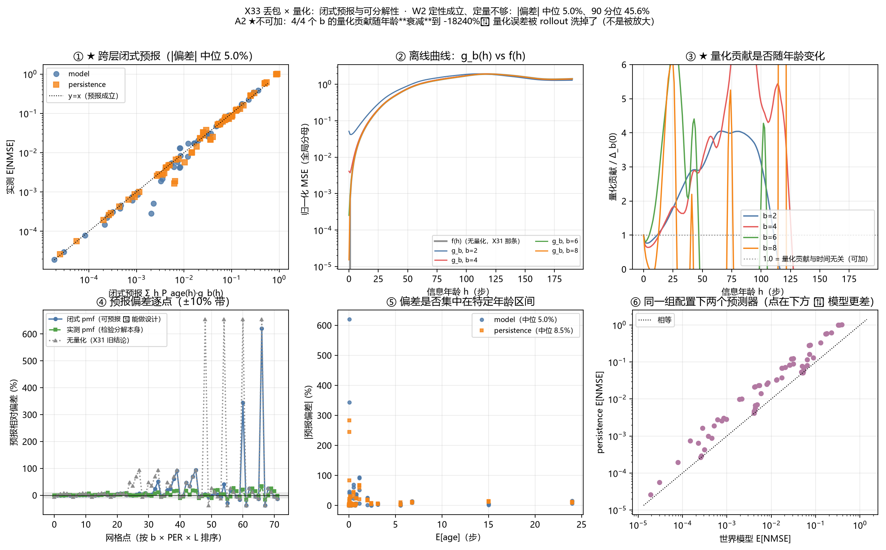

### ⑮ ★★ 联合设计：发送周期 T × 量化精度 b（2026-09-25，X34）

`scripts/21_period_design.py` + `configs/uav_period.yaml` +
`wmlab/eval/tracking.py`（新增 `periodic_age_pmf` / `periodic_mean_age` /
`periodic_age_tail` / `periodic_lossy_schedule`）

★ **X34 是 X33 的直接用途**：既然误差能闭式算出来，那"发送周期 + 量化精度"这对
设计变量就可以**不跑闭环仿真地扫**。物理约束是每时隙只有 `d` 个符号：

    T 步发一次 ⇒ 一个包摊到 T·d 个符号 ⇒ 每符号 m = b/T 比特 ⇒ M = 2^m

⇒ **周期和精度在同一份符号预算里互相挤**：想发得勤（T 小）就得每符号多扛比特
（m 大 ⇒ 高阶 QAM ⇒ PER 高）；想发得细（b 大）就得要么高阶调制、要么拉长周期。

**★ 周期发送的年龄分布（本实验的新闭式，② 类证据写在 `tracking.py` 里）**

    P(age = h) = (s/T)·q^⌊h/T⌋ ,   s = 1−q
    E[age]     = T·q/s + (T−1)/2

`T=1` 退化为 X31 的 i.i.d. 几何分布；`q=0` 退化为 `(T−1)/2`
—— **周期本身就是信息代价**：一个包都不丢，年龄也在 0…T−1 上循环。

**主判据（修正尾部判据后的全量，694 s，32 个 (SNR,b) 组见到周期真的起作用）**

| 判据 | 预写 | 实测 | 结论 |
|---|---|---|---|
| **D1** 闭式预报 \|偏差\| | 中位 < 15% | **中位 3.1%**，90 分位 7.0% | ★ 成立 |
| **D2** 闭式 argmin T\* vs 仿真 | 一致或相邻 | **54/54 一致**（相邻 54/54） | ★ 成立 |
| **D3** T\*_model ≥ T\*_persist | ≥75% 的配置 | **100%**（中位 2 vs 2 步） | ★ 成立（但中位数相等 ⇒ 只支持"不劣于"，不支持"更长"）|

⇒ **设计曲线可以不跑闭环仿真地算出来**，且选出来的点是真的最优点。
D1 的 90 分位 7.0% 集中在高 PER 档（最大单点偏差 +11.9%，26dB/b=16/T=4）。

**★ 反直觉的一点：`PER=0` 时 T=1 并不总是最优**

b=4 的候选只有 T∈{1,2}。在 10→30dB 全部 5 档里，PER 都是 0，但 **T\*=2**（0.00394）
一致地优于 T=1（0.00411）。差额只有 4%，但 5 档数字完全相同（不是采样噪声）。

机制：**多推一步会把量化噪声洗掉** —— 即 X33 的 A2 结论（`Δ_b(h)` 随 h 衰减）
在联合设计里的直接后果：闭环动力学是收缩的，注入的量化扰动会被动力学本身衰减，
而"每步都送"反而把这个免费的平滑机会浪费掉了。

★ **但这条必须限定在 b=4**：由 30dB（两条候选的 PER 都是 0）反解，
b=4 的 `g(1) = 2×0.00394 − 0.00411 = 0.00377 < g(0) = 0.00411`（洗掉的多于模型一步误差）；
而 b=6/8/16 在同档位都是 **T 越小越好**（`T*=1 / 1 / 2`）⇒ 量化地板一旦降下去，
"洗噪声"的收益就盖不过"多等一步"的代价。
⚠ 幅度只有 4%，且只在**最粗的量化档**出现 ⇒ **引用时必须标注这两条限定**，
不得写成"应该拉长周期"的一般结论。

★ **第 16 次自我修正（R12）**：第一版的"年龄分布截断判据"写成了
`1 − (1−q)^{K/T}`（"**至少一次**失败"的概率），而这里要的是 `q^{K/T}`（"**全部**失败"）。
两者都随丢包率增大，但量级差约 **160 个数量级**（`q=0.019, T=2, K=190`：错式 83.8%，
正确 ≈1e−160）⇒ 第一版把 **PER>0 的点全部误判为截断丢掉**，网格里只剩 PER≈0 的退化点，
于是 D2 只有 26 组、且看不到 U 形内点最优。
⇒ 现已抽出库函数 `periodic_age_tail`，并在自检 **㉛** 里与暴力求和逐点对齐、
同时钉死**方向**（随丢包率单调增）与**量级**（0.019/2/190 必须 < 1e−100）。
（我在写这条注释时一度把方向也写反了 —— 是 ㉛ 的单调性断言把它抓出来的。）

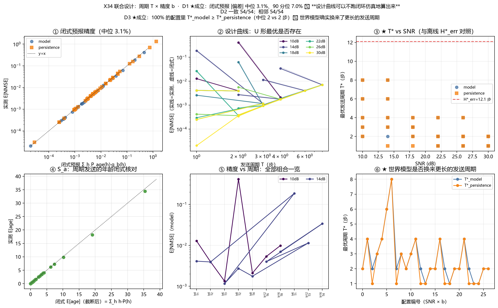

---

## ⑯ X35「任务锚定的联合设计」：闭式选的 (T, b) 还是不是任务最优的？（2026-09-25）

```bash
python scripts/22_task_design.py            # 全量（SNR 5 档 × 10 个 (b,T) ⇒ 46 个工作点）
python scripts/22_task_design.py --quick    # 冒烟
```

★ **与 X34 的唯一关键差别：真闭环。** X33/X34 的 `run_tracking` 是**开环回放**
（动作来自预先采好的 episode ⇒ 轨迹与模型无关）；X35 用 `control.run_closed_loop_control`，
动作来自 `controller(est)` ⇒ **模型误差会改真实轨迹**，量化器 `payload_fn` 第一次真正进入闭环。

### ★ 一句话答案：60% 一致，40% 不是

| 判据 | 预写 | 实测 | 结论 |
|---|---|---|---|
| **闭式 argmin T == 任务 argmin T** | — | **12/20（60%）** | ★ **按 NMSE 闭式设计，10 次里有 4 次选不到任务最优点** |
| **T2** Spearman(est_nmse, 跟踪距离) | ρ ≥ 0.8 | **+0.778** | ★ **未达标 ⇒ NMSE 不能当任务代理**（这正是本实验要的结论） |
| **T2** Spearman(est_nmse, 逃逸率) | ρ ≥ 0.8 | **+0.354** | ★ 更不能（且 44/46 点逃逸率恒为 0 ⇒ 该指标在本网格**无分辨率**） |
| **T1** 任务退化 / NMSE 退化 | ≥ 2× | **中位 0.07×**（≥2× 的点 6/20） | ★ **预写不成立**：任务指标对设计点比 NMSE **钝得多** |
| **T3** 任务差距 / NMSE 差距（距离） | ≥ 1.2× | **−0.18×** | ★ **预写不成立**（见下，这是本实验最硬的负面结论） |
| **T3** 任务差距 / NMSE 差距（逃逸率） | ≥ 1.2× | **1.70×** | ✅ 成立（但 n 有效点少，只可定性） |
| **T5** 闭式预报 → 闭环实测 \|偏差\| | 显著大于开环 | **中位 8.1%**（p90 23.0%） | ✅ 成立：X34 开环口径中位是 3.1% ⇒ **闭环把偏差放大约 2.6×** |

### ★★ T3 = −0.18×：模型把 NMSE 降到 1/2.3，却没换来跟踪距离

| 量化精度 b | NMSE 比（model/persist） | 尾段距离比（model/persist） | 模型反而更差的点 |
|---|---|---|---|
| 4 | 0.871 | **1.446** | 8/10 |
| 6 | 0.462 | 1.048 | 6/10 |
| 8 | 0.406 | 0.922 | 5/12 |
| 12 | 0.357 | 0.954 | 5/14 |

⇒ **趋势是单调的**：量化越粗（模型的相对优势越小）⇒ 模型在任务上**越可能反而更差**。
⚠️ **机制未查清，不得编解释。** 已排除的不是机制：① 不是窗口口径（`mean_dist` 全程 / 尾段 / p95
三个口径同向，`ep_len` 都是 300 ⇒ 不是删失）；② 不是两个 head 被搞混 —— **T=1 且 PER=0 时
两者逐位相同**（4.426 vs 4.426、4.681 vs 4.681，比值 1.000）⇒ 管线正确。
候选机制（**只是候选**）：PD 控制器的 D 项作用在估计值的变化率上，模型估计每步由 rollout 更新
⇒ 高频抖动比"保持上一帧"的 persistence 更大，粗量化下这份抖动放大成控制代价。**待查。**

### ⚠️ 引用 X35 必须同时带上的三条警告

1. **本网格里没有点真正收敛**：尾段距离中位 **3.9 m**（范围 2.6–19.3 m），而 X30 同场景的稳态是
   亚米级 ⇒ 距离指标主要反映"**追不上**"，不是"稳态偏移"。在这个区间上比较任务指标，
   结论的**强度弱于**"稳态工况下的比较"。
2. **逃逸率在本网格基本无分辨率**：44/46 点恒为 0 ⇒ T1/T2/T3 里所有基于逃逸率的数**只可定性**。
3. **删失 4/46 点**（episode 因逃逸提前结束，`ep_frac` 最低 0.42）⇒ 这些点的 E[age] 与 NMSE 都**偏低**。
   已做敏感性对照（未删失 44 点）：T2[距离] 0.778 → **0.746**、T5 仍 8.1%、argmin 一致 11/19 ⇒ 方向不变。

### ★ 第 17 次自我修正（容差不能拍百分比）

第一版 S_a 写「实测 E[age] vs 闭式相对差 ≤ 8%」，在 64-QAM@14dB（PER=0.9502, T=1）被打穿：
实测 17.51 vs 闭式 19.08（−8.2%）。**诊断（纯调度空跑 24 种子，不含控制与删失）显示闭式无偏**
（19.0067 ± 0.8935，偏差 −0.38%），错的是容差：该点 `E[age]=19.08` 而 `sqrt(Var(age))=19.6`
——**标准差与均值同量级**，40×450 步只有约 900 次到达 ⇒ 单次实测标准误就有 4.7%，
8% 只是 1.8σ 的噪声。
⇒ 现改为**容差 = 3 × 本点采样标准误**（SE 由纯调度 MC 估出，见 `Var(age) = T²q/s² + (T²−1)/12`、
自检 **㉜**）；删失点只做**单侧**断言（删失只会把均值拉低，偏高必是真 bug）。
修正后：46 点 \|偏差\| **中位 0.04σ、最大 2.08σ、超 3σ 的点 0 个**。

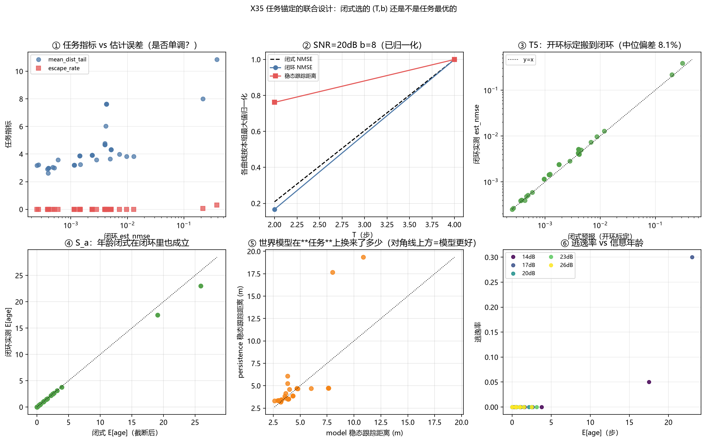

---

## ⑰ X36「突发信道下的联合设计」：只知道丢包率，够不够做设计？（2026-09-25）

```bash
python scripts/23_burst_design.py            # 全量（3 SNR × 5 (b,T) × 6 信道档 ⇒ 75 点）
python scripts/23_burst_design.py --quick    # 冒烟
```

★ **由来**：X31 实测"同丢包率下突发让误差跨 570 倍"，但 X34/X35 的设计闭式里信道只压缩成一个数 `PER`。
⇒ 本实验问：**做 (T,b) 设计时，总丢包率够不够用？**

★ **物理模型（三条假设，跑前定死）**
1. 链路层阻塞 = Gilbert–Elliott 两状态链，**按「尝试」演化**（每 T 步走一步链）；Good 全通、Bad 全丢（X31 同口径）。
2. 非阻塞期叠加物理层逐包噪声丢包 `PER(b,m,SNR)`（X32/X34 同口径）。
3. 一次尝试成功 ⇔ (Good) 且 (无噪声错包) ⇒ `s = (1−p̄)(1−PER)`。p̄ 是**环境参数**、PER 是**设计参数**。

★ **新闭式**（精确 2×2 矩阵，不靠仿真）：以「尝试次数」为单位的到达间隔
`P(D_a=d) = v0·F^{d−1}·s`，再由更新过程的**平稳年龄公式**
`P(age=h) = P(D_a ≥ ⌊h/T⌋+1)/(T·E[D_a])`、`E[age] = T·(E[D_a²]−E[D_a])/(2E[D_a]) + (T−1)/2`。
四条退化已验（自检 ㉝/㉞）：`L=L_iid` ⇒ 与无记忆口径**逐点相等**（2.6e-12）；
`T=1, PER=0` ⇒ `p̄·L`（X31 闭式，1e-10）；pmf 自洽（1e-9）；调度仿真 TV ≈ 0.003。

### ★★ 一句话答案：**不带突发结构，预报会系统性低估误差（中位 −86.6%，49/49 同向）**

| 口径 | 全部 75 点 | 无记忆档 k=1（26 点） | **突发档 k>1（49 点）** |
|---|---|---|---|
| **突发感知** \|偏差\| 中位 | 8.1% | 3.4% | **16.1%** |
| **无记忆** \|偏差\| 中位 | 73.3% | 3.4% | **86.6%** |
| **无记忆** 带符号中位 | −73.3% | +0.8% | **−86.6%（负值占 100%）** |
| E[age]：突发 / 无记忆 | 2.23 / 1.01（1.92×） | 1.19 / 1.19（1.00×） | **3.93 / 1.01（4.00×）** |

⇒ **E2 ✅ 成立且很强**：倍数 **9.10×**；且**符号完全一致地指向低估** ——
"把突发当无记忆"会画出一条乐观得多的曲线，据此选出的工作点在实际里达不到。

### ★ E1 **未达标（1/12 = 8%）—— 但必须连同机制一起读**

预写"≥50% 的组 T\* 会随突发长度偏移"，实测只有 1 组移动（14dB/b=8/p̄=0.1：T\* 4→2）。
**机制不是"突发不影响设计"，而是设计空间饱和**：
`E[age] = (T−1)/2 + T·p̄·L` 对 T **单调递增**（PER≈0 的档位）⇒ 最优 T 永远想更小；
而 b=4 的候选 T 只有 {1,2}、**6/6 组 T\* 已经顶在 T=1**，没有更小的档可去。
⇒ 更精确的表述是：**在 (T,b) 这两个旋钮上，突发改变的是「能做到多好」（误差从 0.006 涨到
0.19，约 **30 倍**），不是「该怎么做」。** 想让设计点真的随突发移动，必须引入别的自由度
（功率、重传、自适应速率），T 这个旋钮不够用。

### 其余判据

| 判据 | 预写 | 实测 | 结论 |
|---|---|---|---|
| **E3** T\* 随 L 单调不增 | ≥70% | **1/1 = 100%** | ✅ 方向一致，但**只有 1 组发生了变化 ⇒ 不足以支撑一般结论** |
| **E4/S_d** R12：改 L 必须改变实测 | ≥1 组 | **26 组** | ✅ 突发真的接进调度了 |
| **S_iid** L=L_iid 时两口径一致 | <0.5% | **0.00%（26 点）** | ✅ 新闭式退化成立 |

⚠️ **引用必带**：① 突发档的预报 \|偏差\| 中位 16.1%、90 分位 34.8% ⇒ **定量不够，只可定性**；
② 阻塞（GE）与物理层噪声是**两个叠加的独立机制**，本实验**没有**把 SNR 映射进 GE 状态转移
（即没有做"阴影衰落 ⇒ SNR 下降 ⇒ PER 上升"的联合物理模型）⇒ 结论讲的是**结构**不是绝对数值。

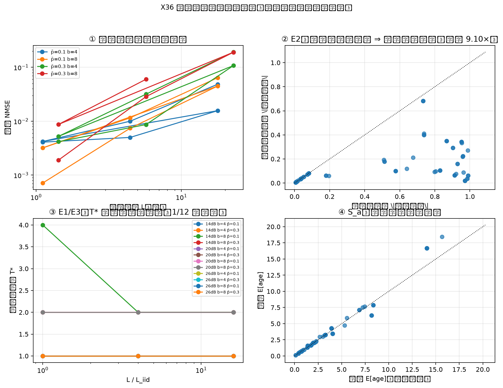

## ⑱ X38「触发式调度」：等传输预算下，周期 / 年龄阈值 / 不确定性触发谁更好？（2026-09-27）

```bash
python scripts/24_triggered_scheduling.py            # 全量（6 PER × (10 T + 11 K + 8 U阈值) 闭环点）
python scripts/24_triggered_scheduling.py --quick    # 冒烟
```

★ **由来**：X34 / X35 / X36 都隐含同一个假设 —— **发送是周期的**（每 T 步发一次）。
而母论文那句话是 *"schedules sensing updates based on task urgency and
**predictive uncertainty**"*，说的是**调度策略本身**，不是"周期取多少"。
⇒ 周期只是**基线**。本号把周期换成"按年龄 / 按不确定性触发"，在**同样的传输预算**下比。

★ **文献归属（跑前钉死，不许抢功）**：「采样率约束下最优采样是**阈值策略**、且显式优于
uniform（周期）」已由 Sun–Polyanskiy–Uysal-Biyikoglu 解决（arXiv:1701.06734、1707.02531）。
⇒ **P1 / P2 不是新贡献**，定位是「复现 + 移到 *闭环控制 + 学习得到的世界模型* 这个场景」。
真正的新问题在他们自己划的那条线上：**signal-independent（周期 / 年龄阈值）vs
signal-dependent（世界模型自报的累积不确定度 U）** ⇒ **P3 才是本号的贡献点**。

### Part A · P1（解析，等预算）：✅ 阈值 ≤ 周期；✅ **U 形也成立**（但我差点因为网格截断判它不成立）

| PER | 最优 K | 等预算 T = sK+1 | 阈值 E[age] | 周期 E[age] | 比值 |
|---|---|---|---|---|---|
| 0 | 1 | 2.00 | 0.500 | 0.500 | **1.000** |
| 0.1 | 1 | 1.90 | 0.585 | 0.661 | 0.885 |
| 0.3 | 4 | 3.80 | 2.271 | 3.029 | 0.750 |
| 0.5 | 8 | 5.00 | 4.600 | 7.000 | 0.657 |
| 0.7 | 32 | 10.60 | 17.277 | 29.533 | 0.585 |
| 0.9 | 32 | 4.20 | 21.571 | 39.400 | **0.547** |

> ⚠️ 表中 PER≥0.7 两行的 `K=32` **就是网格上界**，不是解析最优（解析在 PER=0.9 上要 K≈128 才到 0.527）
> ⇒ 这张表给的是"**在 K≤32 的可行集里**能拿到多少"，不含"最优 K 是多少"的结论。

- ✅ `PER=0` 恒等（阈值 K ≡ 周期 T=K+1）与 `K=0` ≡ i.i.d. 几何，由自检 **㉟** 逐位钉死（<1e-12）；
  等预算下"阈值 ≤ 周期"由 **㊱** 在 65×PER 网格上钉死；阈值 schedule 的有状态/可 reset 由 **㊲** 锁住。
- ✅ 预写「比值随 PER 呈 **U 形**、存在内部最大增益点」**成立** —— 但**不是从上表看出来的**。
  ★★ 闭环网格只有 6 档 PER（最右 0.9）且 K ≤ 32，在该网格上比值看起来"单调下降"，
  我一度据此写下"不是 U 形、最优在边界"。**这是第 19 次自证伪**：解析细网格（PER 0.02–0.98 × 49 档，
  已并入脚本 Part A）显示**拐点就在 PER≈0.88–0.96**，我的网格**恰好卡在拐点左边**：

  | K 上限 | 最小比值 | @PER | 两端（PER=0.02 / 0.98） |
  |---|---|---|---|
  | 32（= 实验网格） | 0.5459 | 0.88 | 0.9716 / 0.6871 |
  | 64 | 0.5304 | 0.92 | 0.9716 / 0.5985 |
  | 200 | 0.5152 | 0.96 | 0.9716 / 0.5239 |

  ⇒ **形状这类结论必须在解析式上扫细网格（免费），不许从 6 个闭环点的趋势推。**
  更丢人的是：自检 **㊱ 里本来就写了 U 形断言并通过**，我却让 README 与自检互相矛盾并存 ——
  **预写判据的结论必须回头与实验输出对账**。

### Part B · P2（真闭环）：★ **NMSE 上阈值完胜，任务距离上几乎打平**（第二次撞上 X35）

| PER | 阈值/周期 `est_nmse` 中位（更优率） | 阈值/周期 `mean_dist_tail` 中位（更优率） |
|---|---|---|
| 0 | 1.032（0/9） | 1.000（3/9） |
| 0.1 | 0.843（6/9） | 1.000（4/9） |
| 0.3 | **0.567**（8/9） | 0.955（5/9） |
| 0.5 | **0.481**（8/9） | 0.988（5/9） |
| 0.7 | **0.339**（9/9） | 0.967（6/9） |

⇒ ★★ 这是 **X35 之外第二个独立场景**复现同一件事：`est_nmse` 最多降到 **1/2.95**，
而任务距离中位始终在 **0.955–1.000**、更优率只有 3/9–6/9 ⇒ **NMSE 的收益在闭环里没换成任务收益**。
配合 X35 的 Spearman(NMSE, 距离) = 0.778 < 0.8 ⇒ 现在可以说：本课题里
「**NMSE 不能当任务代理**」**不是一次性的噪声，而是结构性的**。

### Part C · P3 ★★ 核心（负面结论，照报）：**U 只是 age 的替身**

不条件看 `ρ(U, err) = +0.365` 像是"σ 有用"；**给定 age = h 之后**：

| 量 | 值 | 含义 |
|---|---|---|
| 条件 ρ 中位 | **−0.029** | 几乎为 0 |
| 条件 AUC 中位 | **0.419** | **比随机（0.5）还差** |
| `ρ(U, h)` | **+0.966** | U 几乎只由 h 决定 |
| CV(U) 不条件 / 条件 | **0.337 / 0.062** | 条件后只保留 **18%** |
| 单步 σ 的 CV | 0.071 | ≈ 上面那个 18% ⇒ **σ 头学到的就是个近乎同方差的常数** |

⇒ 判为 **(a)「U 只是 age 的替身」**，而不是 (b)「U 有方差但没校准」——
因为条件后残余的变异量级**正好等于单步 σ 自身的抖动**，即 U 里根本没有状态依赖成分。

⚠️ **边界（不许过度推广）**：这是**本场景**的结论。本环境（解析 PD 控制器 + 小过程噪声）
本身近乎同方差 ⇒ σ 头 CV 只有 7.1%，**既可能是"没训出来"也可能是"没什么可训"**。
要区分必须做 **X38-b：注入状态依赖噪声**（风速随位置/高度变化），看 σ 头 CV 是否上升。
**在 X38-b 做完之前，只能说"在这个场景下 σ 触发没有超出年龄的价值"**，不许推广成
"世界模型的不确定性对调度无用"。

### Part D · P4：U 触发 ≈ 年龄阈值（与 P3 一致 ⇒ 这是**证伪保护**，不是新发现）

`U触发 / 年龄阈值` 中位：`est_nmse` 0.945–1.053、`mean_dist_tail` 0.976–1.018 ⇒ **基本恒等**。
**S_g（R12）**：6/6 个 PER 档上改 U 阈值使发送率变化 >5% ⇒ **不确定性触发确实接线了**，不是空跑。
⇒ P3 说"U ≈ f(h)"、P4 说"换触发量没差别"，**两者互相印证**。P4 的价值在于：
若 P3 得 0 而 P4 有收益，那就说明我的测法有问题；现在两者一致 ⇒ 可以放心报负面结论。

### 预写判据结算

| 判据 | 预写 | 实测 | 结论 |
|---|---|---|---|
| **P1** 等预算阈值 E[age] ≤ 周期 | ≤1（PER=0 恒等） | 0.547–1.000 全部 ≤1 | ✅（恒等式也 ✅） |
| **P1(b)** 比值随 PER 呈 U 形 | 存在内部最小点 | 解析细网格：拐点 @PER 0.88–0.96（三档 K 上限全部内部） | ✅（**但闭环 6 档网格看不到 ⇒ 差点误判，第 19 次自证伪**） |
| **P2** 闭环同 tx_rate 阈值更优 | NMSE 与任务同向 | NMSE ✅（最低 0.339）／距离 ❌（≈1.0） | ⚠️ **不同向**（X35 复现） |
| **P3** ρ_cond ≥ 0.3 且 AUC_cond ≥ 0.6 | U 有独立信息 | ρ_cond **−0.029**、AUC **0.419** | ❌ **负面结论成立** |
| **P4** U 触发 ≤ 年龄阈值 | 有收益 | 中位 0.945–1.053（≈1） | ❌ 无差别（与 P3 一致） |
| **S_e** R12：σ 头真有变化 | CV > 1% | CV 7.1%（单步）/ 33.7%（累积） | ✅ 不是"没训出来"导致的 0 |
| **S_f** 年龄闭式在闭环里成立 | 全部 ≤3×SE | **96/96 通过**（中位 0.36σ、最大 1.99σ） | ✅ |

⚠️ **引用必带**：① 任务距离**中位数 3.9–5.2 m，没有任何点真正收敛**（与 X35 同口径）；
② PER=0.9 档因三方 tx_rate 区间无重叠，**P4 缺该档**；③ 删失点 1/96，只做单侧断言。

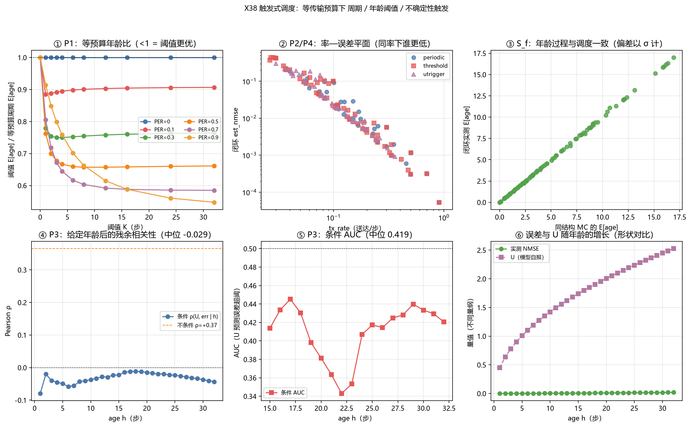

## ⑲ X38-b「σ 头到底学没学出来？」：把 X38 的负面结论关进笼子（2026-09-27）

```bash
python scripts/24_triggered_scheduling.py --p3-only --wind-amp 0    # 同方差（X38 原档）
python scripts/24_triggered_scheduling.py --p3-only --wind-amp 4    # 强异方差
```

★ **由来（必须做，否则 X38 的结论站不住）**：X38 的 P3 说"U 只是 age 的替身"，
但机制量显示 σ 头学到的单步 σ **跨样本 CV 只有 7.1%** ⇒ 这件事有两种完全不同的解释：

- **(a) 环境本身同方差** ⇒ 根本没什么可学（那结论**只是本场景的**）；
- **(b) σ 头没学会状态依赖** ⇒ 那是训练/模型的问题。

X38 自己**无法区分这两者**。X38-b 引入**状态依赖的阵风场** `σ(p) = σ₀·(1 + amp·g(p))`
（`g` 是光滑的静态正弦场，只看位置；`amp=0` 时**逐位退化**为原环境，自检 **㊳** 钉死），
造出真异方差，看 σ 头能不能学出来 —— 学出来了才谈得上"U 有没有独立信息"。

### ★★ 结果：**σ 头学得出来**（是环境同方差，不是头不行）

| wind_amp | 真实 σ 的 CV | 模型预测 σ 的 CV | **ρ(σ_pred, σ_true)** | 条件 ρ 中位 | 条件 AUC 中位 |
|---|---|---|---|---|---|
| **0**（X38 原档） | 0.0000 | 0.0709 | NaN（真实 σ 为常数 ⇒ 无定义） | **−0.029** | 0.419 |
| 1 | 0.1828 | 0.2345 | **+0.665** | −0.148 | 0.423 |
| 2 | 0.2678 | 0.2696 | **+0.883** | −0.018 | 0.448 |
| **4** | 0.3354 | 0.3589 | **+0.851** | **+0.347** | **0.601** |

⇒ **σ 头一旦有东西可学，就能学到 ρ ≈ 0.67–0.88**（预报真实 σ）。
⇒ X38 那 7.1% 是 **(a) 环境同方差**，不是 (b) σ 头不行 —— **X38 的负面结论必须加"本场景"限定。**

### ★ 剂量—反应：U 的独立信息是**涌现**的，不是线性的

`ρ_cond` 随异方差强度的走向是 **−0.029 → −0.148 → −0.018 → +0.347**：

- amp ≤ 2 时 U 仍然**没有**超出年龄的信息（ρ_cond ≈ 0、AUC ≈ 0.42–0.45）；
- 只有 **amp=4**（真实 σ 跨 1×–5×）才跨过预写门槛 **ρ_cond ≥ 0.3 且 AUC_cond ≥ 0.6**
  （实测 **+0.347 / 0.601**，AUC 刚好压线）。

⇒ **"世界模型的不确定度对调度有没有用"不是一个是/否问题，而是取决于环境的异方差强度。**
弱异方差下它确实只是年龄的替身；强异方差下它开始携带年龄以外的信息。
⚠️ **AUC=0.601 只比随机高 0.1 ⇒ 这条"达成"是压线的，不许当成强结论引用。**

### ★ 第 20 次自证伪（判据里的拍系数）

诊断消息原本用「`CV_cond > 0.5 × CV(U)` ⇒ U 没退化」这个**拍出来的 0.5** 判退化。
U 是 h 步累积量 ⇒ `CV(U)` 被 h 那一维撑大 ⇒ 在 amp=4 档这个判据把
`CV_cond = 0.539` 也判成了"接近常数"（实际并不）。
⇒ 改成拿**单步 σ 的 CV** 作参照（0.539 / 0.359 = **1.50×** ⇒ 没退化），
且**最终判定交给直接校准量 ρ(σ_pred, σ_true)**，不再让启发式下结论。
（同一个共因的第 20 次：**拍一个"看起来合理"的系数当阈值，没先算它的量级**。）

### 其余

- **S_e**：σ 头 CV 从 7.1%（amp=0）升到 **35.9%**（amp=4）⇒ 不是"没训出来"。
- 产物：`outputs/24_triggered_scheduling_wind{0,1,2,4}.json`
  （★ 第一版文件名只按 homo/hetero 分 ⇒ 4 个剂量档互相覆盖只剩最后一个，已修）。
- 自检 **㊳**：`wind_amp=0` 逐位等于 `noise_std`；CV(真实 σ) 随 amp 单调增；
  同一位置的 σ 必须相同（场是**静态**函数，不是随机项）；不同位置必须不同。

## ⑳ X39「阵风场下的**闭环**触发式调度」：把离线信息量搬到闭环（2026-09-29）

> 承接 §⑲。X38-b 只跑了 `--p3-only`（**离线信息量**）：U 有独立信息（ρ_cond 0.347 / AUC 0.601 压线）。
> 但「**离线有信息**」≠「**闭环有收益**」—— 缺的正是最后一跳。本号把 X38 的**完整流程**
> （Part A 解析 / Part B 闭环 P2 / Part C P3 / Part D P4）搬到 **`wind_amp=4`（强异方差）**重跑。
> 产物：`outputs/24_x39_final_wind4.{json,png}`；图：`assets/25_x39_triggered_wind4.png`。

### ★ 一句话答案：**P2'/P4' 双双不成立；而且 P4' 这条判据本身与实现自相矛盾**

| PER | 阈值/周期 NMSE 中位 | 阈值/周期 距离中位 | U触发/年龄阈值 距离中位 | U触发/年龄阈值 NMSE 中位 |
|---|---|---|---|---|
| 0.1 | **0.813**（8/9） | 0.993 | **1.020** | 1.334 |
| 0.3 | **0.642**（8/9） | 0.982 | **1.018** | 1.338 |
| 0.5 | **0.481**（8/9） | 0.950 | **1.031** | 1.172 |
| 0.7 / 0.9 | — **不可评估** | — | — | — |

预写 **P4'** 要求 U触发/年龄阈值 距离中位比 **< 0.98** ⇒ 实测 **1.018–1.041**，**方向反了**。

### ★★ 机制：闭环 ρ(U, age) = 0.9941 ⇒ 全局阈值 ≡ 年龄阈值

utrigger 的阈值就是 `thr = median(U[:, h*−1])`（**按名义触发年龄标定**），而闭环里
U 几乎是 age 的确定性单调函数（**0.994**）⇒ `U ≥ thr` 与 `age ≥ h*` **是同一件事**。
⇒ 我一边用 P3 证明「U ≈ age 的替身」，一边预写「U 触发应优于年龄阈值」——**两条不可能同时成立**。
⇒ **本号只能证明「全局阈值不行」，不能证明「U 无用」** ⇒ 直接催生 §㉑。

### ⚠️ 引用必带

- **PER=0.7/0.9 不可评估**：原因是 **`periodic` 族可比点塌缩**（2 个 / 1 个），**不是窗口太窄**
  ⇒ **强衰落区（PER ≥ 0.7）在本场景做不了等预算比较**（脚本会**打印原因**，不静默跳过）。
- `diverged`（`NMSE>1` 或 `E[age]>max_age_K`）**对三族统一施加**（2026-09-29 修：原先只作用于 utrigger）。
  离线重算：X38 三族 0/0/0（**零影响**）、X39 结论不变 ⇒ **负面结论稳健**。
- 前置检查全过：S_f 年龄闭式 **96/96**；σ 校准 ρ(σ_pred,σ_true)=**0.851**；
  P3 条件信息 **ρ_cond 0.347 / AUC 0.601**（与 X38-b 一致）；S_g 接线 **6/6**。

## ㉑ X40「条件化触发」：U 的**边际任务价值**是不是 0（2026-09-29）

> 承接 §⑳。把「U 的边际价值」与「安全网」**分开**：**残差只准加速，安全网 K 不动**。
> 产物：`outputs/24_x40_final_wind4.{json,png}`；图：`assets/26_x40_conditional_wind4.png`。

### ★★ 一句话答案：**H1 ❌ / H0 ✅ —— U 的任务边际价值 = 0，且该结论与实现无关**

| 版本 | 触发规则 | 检验什么 | 结果 |
|---|---|---|---|
| X39 `utrigger` | `U ≥ thr`（按名义年龄标定） | 全局阈值 | ❌ 与年龄阈值**数学等价**（ρ(U,age)=0.9941）⇒ 判据作废 |
| X40 ① `resid` | `z ≥ τ`，`z=(U−Û(age))/Ŝ(age)` | 撤掉安全网的纯残差 | ❌ **净有害**：同率下 E[age] **7.9–14.6 vs 年龄阈值 4.0** |
| X40 ② `hybrid` | `age ≥ K 或 z ≥ τ` | ★ **干净的边际价值** | ❌ H1 在**全部可评估档位**不成立 |

| PER | hybrid/年龄阈值 距离中位 | （更优） | hybrid/年龄阈值 NMSE 中位 |
|---|---|---|---|
| 0 | **1.147** | 0/9 | 4.107 |
| 0.1 | **1.094** | 0/9 | 1.820 |
| 0.3 | **1.023** | 2/9 | 1.907 |
| 0.5 | **1.035** | 1/9 | 2.276 |
| 0.7 / 0.9 | — **不可评估** | — | — |

⇒ **预写 H1（< 0.98）❌；H0（边际价值 = 0）✅**，且实测**系统性 > 1**：
把「模型自报的额外不确定度」用来加速发送，**比单纯把年龄阈值调小更差**。
**机制**：U 的残差**不是误差的预报器**（条件 AUC 仅 **0.601**，只比随机高 0.10）
⇒ 加速发生的时刻**不是**真正需要的时刻 ⇒ 等预算下"用错地方的通信"换掉了"用对地方的通信"。

### 退化钉死（S_h，三条全过）

`τ=+∞` ⇒ E[age] **1.0000** vs 纯阈值闭式 1.0000（相对差 **0.00%**）；`K=1` / `τ=−∞` ⇒ **0.0000**，与 T=1 一致
⇒ **「只准加速」确实只加速**（没有偷偷改掉安全网）。

### ★ 本轮修掉的三个 bug（全都在本节的代码路径上，都有回归测试）

- **㉒** `diverged` **口径不对称**（原只在 utrigger 分支算）⇒ 判定上移到 `_mkrow`，**三族统一**。
- **㉔** 残差 τ 用**原始残差**的全局分位 ⇒ 尺度随 age 变 ⇒ 假结果（中位 4.77×、0/9）
  ⇒ 改 **z 分数**（`Ŝ = 1.4826×MAD`）。
- **㉕** 配对**窗口守卫太松**（`hi > lo×1.0001`）⇒ 用 5% 跨度的窗口造出「9/9 更优」的**假头条**
  ⇒ 抽出 `wmlab/eval/pairing.py`（`hi ≥ lo×1.5` + 每族 ≥3 点 + 不可评估**必须打印原因**），自检 **㊵**。
- 另修一处**图形缺陷**：图 suptitle 原先**硬编码 "X38 触发式调度"** ⇒ X39/X40 的产物图全顶着 X38 的名字
  （`payload["experiment"]` 早已派生，**图漏了**）⇒ 现改为从 `args` 派生（含 `trigger` 与 `wind_amp`）。

### ⚠️ 引用必带
- PER=0.7/0.9 **不可评估**（`periodic` 族点塌缩，非窗口问题）⇒ **强衰落区做不了等预算比较**。
- hybrid **14/90** 个点发散，已按**统一口径**剔除；任务距离中位仍 6–12 m、**没有点真正收敛**（承 §⑯ X35）。

## ㉒ X41「U 边际任务价值的剂量—反应」：信息涨 12%，价值还是 0（2026-09-29）

> 承接 §㉑。**审前提**：X40 的「边际价值 = 0」只在 `wind_amp=4` 一档成立，而该档离线判别力
> `AUC_cond = 0.601` **只比随机高 0.10** ⇒ **不能排除**"信息更强一点、价值就会涌现"。
> 产物：`outputs/24_x41_dose_wind{8,16,32}.json`（离线补扫 3 档）+ `24_x41_hybrid16_wind16.{json,png}`（闭环）；
> 图：`assets/27_x41_dose_response.png`；脚本：`scripts/25_x41_dose_response.py`（只读产物、秒级可复算）。

### ★★ 一句话答案：**离线信息涨了 12%（0.601 → 0.674），任务边际价值仍然是 0**

| amp | CV(σ_true) | AUC_cond | ρ_calib | **距离比中位** | NMSE 比中位 | diverged |
|---|---|---|---|---|---|---|
| 4（§㉑） | 0.335 | 0.601 | 0.851 | **1.0648**（n=4） | 2.0915 | 14/90 |
| **16** | 0.454 | **0.674** | 0.819 | **1.0122**（n=5） | 1.3133 | **0/186** |

⇒ **B1 判据（距离中位比 < 0.98 才算"价值涌现"）不成立**；5 个 PER 档里只有 1 档低于 1，
中位**系统性 > 1** ⇒ **X40 的负面结论在"信息最强档"上加固**，替代解释「信息不够强」被排除。
⇒ ★ amp=16 的证据**比 amp=4 更硬**：**零发散**（0/186）、5 档全部可评估（窗口跨度 2.11×–8.38×）、
σ 校准**逐位复现**（`ρ(σ_pred,σ_true)=0.8188`，与同档 `--p3-only` 完全相同 ⇒ 两边是同一个模型）。

### ★ 七档离线剂量：**AUC 非单调** ⇒「信息随异方差单调增强」这个直觉是错的

`0.419 / 0.423 / 0.448 / 0.601 / 0.600 / **0.674** / 0.520`（对应 amp = 0/1/2/4/8/16/32）

- amp=4 与 amp=8 **几乎相同**（0.601 / 0.600）；峰值在 **amp=16**；**amp=32 崩塌到 0.520**。
- ★ **崩塌的根因是 σ 头学不动**：`ρ(σ_pred,σ_true)` 在 amp≤16 稳定在 **0.815–0.883**，
  **amp=32 断崖到 0.448** ⇒ 这是**模型能力上限**，**不是环境没信息**。
- ★ `ρ_cond` 与 `AUC` **不同步**（amp=4 的 ρ_cond 最高 +0.347，但 AUC 只有 0.601）⇒ 两者不能互换。

### ★ 剂量轴的"上限"是**场景级**的（`outputs/_temp/_x41_gust_scan.py`，env 直接采样）

解析式 `CV = amp·std(g)/(1+amp·mean(g))` 在 **amp≤16 吻合 ≤2.2%**；且
`std(g)/mean(g)` 在 7 档里稳定在 **0.50–0.57** ⇒ **本 env 的异方差强度上限 ≈0.55**
⇒ **要更强必须改环境设计（`wind_period` / 轨迹覆盖），不是把 `wind_amp` 调大。**
⚠️ amp=32 处解析比实测低 **13.8%**，且方向与"分布漂移"相反（实测 `std(g)` 反而下降）
⇒ **来源未查清，照实标注**（自证伪 **㉖**）。

### ⚠️ ★★ 引用必带 —— 三条 2026 新作让结论**收窄**（不写这段就是抢功）

- **C29**（arXiv:2609.15801，2026-09-14）已经把「**预测信息量本身不决定下游损失**」**一般化地提出**，
  并给出构造性反例（两个转移律可有相同的 occurrence 信息**与条件方差**、却需要**相反**决策）⇒
  **"信息与价值脱钩"不是本课题的发现**。
- **C30**（arXiv:2607.01537）用 **calibrated rollout-drift envelope** 在 **matched sensing budget** 下
  **赢过了** expected-belief 调度 ⇒ 差异在「**校准**」⇒ 本课题的结论**只能写成**
  「**未经校准的**自报不确定度 U 没有边际任务价值」。
- **C31**（arXiv:2609.10954）的 **fork ledger**（预注册决策点 + 共同随机数）配对协议
  **比本课题的等预算插值严**；其"总是更新 ⇒ 三个任务全部降回报"与 X40「纯残差触发净有害」同构。

⇒ **我方剩余增量**：① 闭环通信调度的等预算**实测倍数**；② **机制**（U 与 age 闭环共线 ρ=0.994、
条件判别力**非单调且封顶 0.674**）；③ **剂量—反应**把"信息涌现"与"价值涌现"画在同一条轴上。
⇒ ★ **下一步（明确）**：把"自报 σ"换成 **conformal 校准后的量**（对齐 C30），
再看边际价值是否从 0 变正 —— 这是从"证伪"走向"方法"的一步。

## ㉓ X42「共形（conformal）校准的误差信封触发」：校准把"更差"变成"持平"，但没变出正价值（2026-09-29）

> 承接 §㉒ 的"下一步"。**规则结构逐字沿用 X40 的 hybrid**（`age ≥ K 或 触发`，安全网 K 不动、
> 触发只准加速）⇒ **只换统计量**、不换结构（消融封死混淆变量）。
> **唯一差别**：X40 卡 `z=(U−Û(age))/Ŝ(age) ≥ τ`（τ = **z 池分位点**，尺度锚在**调度**上）；
> X42 卡 `Ê_α(h,U) ≥ tol`，其中 `Ê_α(h,U)=ĝ(h,U)+Ŝ(h)·Q_α`
> （ĝ = 逐年龄 PAVA 单调拟合、Q_α = 分数 `(e−ĝ)/Ŝ` 的 ⌈(n+1)(1−α)⌉ 阶统计量），
> tol = **能容忍多大误差**（尺度锚在**任务**上）。

### ★★ 一句话答案：**H0 成立 —— 换成有覆盖保证的校准量后，边际任务价值仍为 0**

| 臂（`--conf-target`） | 跨 PER **任务距离比**中位 | 跨 PER **NMSE 比**中位 | 配对符号检验（vs 同档自报 z） |
|---|---|---|---|
| **pos**（位置维误差 = 控制器吃进去的量，任务对齐） | **0.9969**（n=5 档，0 发散） | 0.9897 | 4/5 档同向，p=0.188 ⇒ **不可分辨** |
| **nmse**（全维误差，与 X38/X40 同口径） | **0.9962**（n=5 档，0 发散） | 0.9932 | 5/5 档同向，p=0.031 |
| —— 对照：**X41-B 自报 z**（同档 amp=16） | **1.0122** | **1.3133** | — |
| —— 对照：X40 自报 z（amp=4） | 1.0648 | 2.0915 | — |

⇒ **读法（必须这么读）**：
1. **主结论**：与**纯年龄阈值**比，距离比 ∈ [0.98, 1.02] ⇒ **校准没有把价值从 0 变正**（H0）。
2. **副结论（这条是真增量）**：NMSE 比从自报量的 **1.31 → 0.99** ——
   **校准把"比年龄阈值差"变成了"与年龄阈值持平"**。自报 σ 的方向性是**坏的**（越信它越差），
   校准把方向性修掉了，但**没有造出方向性**。
3. **不许说的**：「共形校准带来了任务价值」——效应量 ≤2%、两臂可分辨性不一致（4/5 vs 5/5）、
   且**任务距离本身无点真正收敛**（承 X35/X41）。C30 自己也写明其短视界档
   *"empirical conformal horizons **match** the deployed clock"* ⇒ **朴素共形并没有赢**。

### ★★ 跑前先纠正了一处前提（本轮最有价值的一步，不花算力）
X41 §12.5 写的是「C30 用校准壳在等预算下**赢过** expected-belief 调度 ⇒ 下一步 = 换 conformal」。
**核原文（arXiv:2607.01537）后发现这是过度转述**：C30 的正面结果来自 **drift-aware 的
certified clock**（谱项 + 校准信封），而它**自己声明**朴素共形在短视界档只**打平**。
⇒ 「换成 conformal 就有价值」是**没有根据的预期**，本轮 H0 是**先验上完全可能**的结果，
**照实预注册**（S_c1 硬门 + H1/H0/H2 三条判据跑前写死）。

### 四道自检（全部通过）
- **S_c1 覆盖性（硬门）**：独立 episode 的**留出集**上边缘覆盖率 **0.9157**（目标 0.90，
  3σ 容差 ±0.0035）⇒ 校准兑现；逐年龄覆盖率中位 0.9207 / 最小 0.8853。
- **S_c2 形状**：ĝ 随年龄单调，违约 **0/31** 段；ĝ 中位 0.0014→0.5300（pos）/0.0155→0.7354（nmse）。
- **S_h' 退化**：tol=+∞ ⇒ ≡纯年龄阈值（相对差 **0.00%**）；K=1 / tol=−∞ ⇒ ≡T=1。
- **S_c4 接线（R12）**：**0.67**（nmse 臂）/ **0.46**（pos 臂）的工作点上信封真的比安全网
  K 更早触发；**其余点等价于纯年龄阈值，对 H1 不构成证据**（已在 JSON 里逐点记录）。

### ★★ 本轮踩掉的三个坑（都有回归测试 / 离线复算）
1. **标定集为空（真事故）**：第一版直接 `collect(n)` 再 `// 2` 切分 ⇒ amp=16 时
   `_sample_windows` 抛「没有可用窗口」。**根因**：PD 控制器在 amp=16 阵风下大量跟丢，
   seed=3000 的 8 条里**只有 1 条**长度 > 417（中位长度 169）。
   ⇒ 改成**跨多个种子批次收集、先筛"熬过预热"的 episode、再切分**。
   ★ 这顺带暴露了一条**幸存者偏差**：凡是 `t0_min=WARMUP` 的探针（X38-b/X39/X41 的 P3）
   都在"熬过 400 步"的子集上算 —— 已在引用限定里登记。
2. **跨臂变量复用（真 bug）**：汇报脚本在**逐臂判定循环**里误用了上一轮循环残留的
   `rows` ⇒ **两臂的配对符号检验都在用最后一臂的数据**，而输出完全正常
   （数值合理、结论都印出来）。⇒ 加**自洽守卫**：这一臂的逐档中位必须等于这一臂的聚合值。
3. **预写判据太松（自证伪 ㉗）**：H2 原判「中位差 ≥0.01 且 >2×档间散布」在 n=5 下判出"有增量"，
   补**逐 PER 配对符号检验**后 pos 臂 p=0.188 ⇒ **不可分辨**。
   "2×散布"这种拍系数判据会把倾向性读成结论 —— 已固化为 `sign_test`。

### 产物
`scripts/26_x42_conformal_report.py`（分块合并 + 覆盖守卫 + 符号检验 + 图）；
`wmlab/eval/conformal.py`（PAVA / 共形分位数 / 信封 / 覆盖性复核）；
自检 **㊷㊸㊹** ⇒ **62/62**；图 `assets/28_x42_conformal.png`、`assets/29_x42_conformal_envelope.png`。
★ **分块跑的原因**：完整网格单次跑不完（本机后台任务 **10 min 硬上限**，实测两臂都在 10m01s
被终止、连日志都没写出）⇒ 按 PER 分块（配对逐档独立 ⇒ 分块**数值等价**），
合并时**覆盖守卫**强制每个 PER 档都在场（缺档 raise）。

### ⚠️ 引用必带
- **PER=0.9 不可评估**（`periodic` 族可比点塌缩到 1 点 ⇒ 强衰落区做不了等预算比较，
  **场景限制不是方法限制**，承 X40/X41）；n=5 档、零发散（0/306）。
- 归属：**C29**（arXiv:2609.15801）已提出"校准单元上的 bounded-loss 增益 + 置信下界"；
  **C30**（arXiv:2607.01537）已提出"calibrated rollout-drift envelope 当重采样时钟"。
  ⇒ 本号**不宣称方法新颖**，只贡献：**闭环通信调度的等预算实测**（校准量 vs 自报量 vs 年龄阈值
  的三方对照）+ **"校准修方向性、不造方向性"这个机制区分**。
- tol 阶梯 {0.05, 0.1, 0.2, 0.4} 锚在配置既有的 `err_threshold=0.05`（×2，跑前登记）；
  它是**任务量纲**、与环境尺度绑定 ⇒ 跨场景必须重标。
- 「**边际任务价值不可分辨（≈0）**」（**不写成"严格为零"**）只在本 env / 本任务指标 / 本预算口径下成立。

## ㉔ X43「oracle 特权信息基线」：**在本场景/本任务口径下，连「完美知道当前估计误差」都不可分辨** —— 触发量不是瓶颈（2026-09-29）

> **承接 §㉓ 的「下一步」第 1 条**（也就是看板「下一步」第 2 项）。X38 → X39 → X40 → X41 → X42
> 一路在换**触发统计量**，「边际任务价值 = 0」已经五连。剩下的唯一问题是：
> **是不是「统计量还不够好」？**
> ⇒ **规则结构逐字沿用 X40/X42** 的 `age ≥ K 或 触发`（安全网 K 不动、触发只准加速）——
> **只换信息来源、不换结构**（消融封死混淆变量）。
> **唯一差别**：X43 卡 `z_or = (e − m(h)) / Ŝ(h) ≥ τ`，其中
> `e = ‖est − 真值‖² / var_g` 是**仿真器内部的 ground-truth 误差**
> （`control.py` 写入 `u_state["oracle_err"]` / `["oracle_pos"]`）。

### ★★ 一句话答案：**O0 成立 —— 在本场景 / 本任务指标 / 本预算口径下，连「完美知道当前估计误差」都不可分辨**

| 臂（`--oracle-target`） | 跨 PER **任务距离比**中位 | 跨 PER **NMSE 比**中位 | 口径核对（闭环 ÷ 离线 `m(h)`） |
|---|---|---|---|
| **res**（全维 6/6，与 X38/X40/X41/X42-nmse 同口径） | **0.9921**（n=5 档，0 发散） | 0.9311 | 中位 **0.874**（0.63–1.14）✓ 可迁移 |
| **pos**（位置维 2/6 = 控制器吃进去的量） | **1.0023**（n=5 档，0 发散） | 1.1675 | 中位 **0.799**（0.56–1.18）✓ 可迁移 |
| —— 对照：**X42 共形校准**（amp=16） | 0.9969 / 0.9962 | — | — |
| —— 对照：**X41-B 自报 z**（同档 amp=16） | **1.0122** | 1.3133 | — |
| —— 对照：X40 自报 z（amp=4，**不同档**，旁证） | 1.0648 | 2.0915 | — |

⇒ **读法（必须这么读）**：
1. **主结论**：两臂都落在 [0.98, 1.02] ⇒ 把触发量换成**真值误差**后，**未观察到可分辨的任务收益**
   （**不是**"收益严格为零" —— n=5 档下比值落在 1 附近，只能说**不显著**）。
   ⇒ 在当前**模型 / 控制器 / 任务 / 预算 / 评测口径**下，**触发量的信息量不是瓶颈**
   （**条件性判断**；不写成"瓶颈在任务侧"的普适结论）。
2. **这不是「又换了一次统计量」**：前五号的统计量互为**信息子集**（`U ⊃ 残差 ⊃ 共形信封`），
   而 oracle 的**信息严格多于**它们全部（它直接知道真值）⇒ 它是这一族「**误差类触发量**」的
   **特权信息基线**（**信息层面**）。⚠ **本号未证明它是该族的性能上界**（没做最优性证明，也不主张）——
   只能说"连它在**本场景下**都不可分辨" ⇒ 继续换统计量的路到此为止。
3. **不许说的**：「误差类触发量无用」「一切预测性调度都没用」—— 只能说
   **在本场景 / 本任务指标 / 本预算口径下，连 oracle 都不可分辨**。
4. **O_c 自洽铁门**：两臂都不 >1.02（0.9921 / 1.0023）⇒ 与「信息更多不该更差」相容 ⇒ 实现检查通过。

### ★★ 概念边界（决定本号能说什么）

oracle 用 **ground truth** ⇒ **不可部署**，只作**诊断用的特权信息基线**。
在**信息层面**它是「**误差类触发量**」这一族的**充分参照** —— 任何「从当前估计误差出发」的调度器，
**可用信息**都不超过「直接知道当前误差」。
⚠ **但本号没有证明、也不主张它是该族的「性能上界」**（未做最优性证明；一个信息更多的调度器
**未必**有更好的任务性能，"打平"恰恰是这一点的实证）。
⚠️ 它也**不**覆盖「用**别的可观测量**做**预测性**触发」（例如知道真值阵风场 ⇒ 提前知道哪一段误差会长得快）
—— 那一类需要**另一个** oracle，本号**没有测**。⇒ 引用时不得把结论外推到「一切预测性调度」。

### ★★ 跑前先纠正了一处前提（0 算力，本轮最值钱的一步）

看板原文是「用环境真值的**逐年龄误差分布**当完美触发量」。**字面实现是同义反复**：
`Ê^or(h)` 只依赖 `h` ⇒ `Ê^or(h) ≥ tol ⟺ h ≥ h*` ⇒ **恒等于年龄阈值**（比值 ≡ 1.000），
拿到的会是「年龄阈值 = 年龄阈值」——**看着像个结论，其实是定义**。
⇒ 改用**已实现误差**（realized error，即"这一次的估计到底错了多少"）的逐年龄 z 分数，即上面的非退化版本。
★ 与 §㉓ 的「跑前核 C30 原文」是同一类动作：**先确认这个实验在语义上不是空的，再花算力。**

### 三道自检（全部通过 ⇒ 自检 **62 → 66/66**）

- **S_o1 接线（R12，自检 ㊺）**：显式开启 `_oracle` 才算（未开启**不写** `oracle_*` 键 ⇒ 默认路径零影响）；
  `T=1` 时真值误差**恒为 0**；**单步全丢包**时 `oracle_err` **逐位 =** `est_nmse`（量纲恒等式）；
  `_otrace` 必须是 **(age, 6 维量, 位置维量) 三元组**（列 2 / 列 3 与 `u_state` 逐位一致）。
- **S_o2 退化**：`τ=+∞` ⇒ 逐位 ≡ 纯年龄阈值（相对差 **0.00%**）；`K=1` / `τ=−∞` ⇒ ≡ `T=1`。
- **S_o4 生效性（不许靠 K 蹭结论）**：两臂「oracle 真的比安全网 K **更早**触发」的工作点比例都是
  **1.00（24/24）** ⇒ 不是「K 主导、oracle 白挂」。
- 另两条概念守（自检 ㊻㊼）：**归一化不可省**（Ŝ(h)，否则退化成"只在老年龄才发"）；
  **O2 非有限必 raise**（R14）。

### ★★ 本轮踩掉的坑：**同一条量纲错误犯了两次**（自检 ㊽ 已锁）

- ① `_otrace` 第一版只有一列（6 维量）⇒ `pos` 臂拿 **6 维量**去比**位置维**基准 `m_pos(h)`
  （`m_pos(h=1)/m_res(h=1) = 0.088` ⇒ 比值被顶到 ≈10×）。
- ② 补上第三列之后，**列号变量 `col` 算了却忘了接进取数行**（取数仍硬编码 `trace[:, 1]`）
  ⇒ 症状与 ① **逐位相同**（"我改过了，怎么一点没变"）。
- ★ 这次的**判据**：**修完之后症状逐位不变 ⇒ 先怀疑"改动根本没接线"，而不是怀疑数据**。
- ⇒ 构件抽成纯函数 `wmlab/eval/oracle.py::align_age_medians`；自检 **㊽** 用一条
  「第 1 列比第 2 列大 10×」的假 trace 锁死：`col=2` 必须返回 ≈1.0、取错列必须返回 ≈10。
- **结论不受影响**：P4 **不读 trace** ⇒ 两臂比值在修复前后**逐位不变**（这本身就是判据）。
  受影响的是**诊断旗标** —— 它此前把「可迁移」误报成「不可迁移」。

### 产物

`wmlab/eval/oracle.py`（`fit_age_cond` / `z_oracle` / `z_pool` / `align_age_medians`）；
`scripts/27_x43_oracle_report.py`（分块合并 + **覆盖守卫** + 逐 PER 配对符号检验 + 图）；
`scripts/24_triggered_scheduling.py` 的 `--pol oracle`、`--oracle-target {res,pos}`；
自检 **㊺㊻㊼㊽** ⇒ **66/66**；图 `assets/30_x43_oracle.png`（**assets 共 32 张**）。
★ **分块跑**：同 §㉓（本机后台任务 **10 min 硬上限**）⇒ 按 PER 分 3 块 × 2 臂
（等预算配对逐档独立 ⇒ 分块**数值等价**），合并时覆盖守卫强制每档在场（缺档 raise）。

### ⚠️ 引用必带

- **PER=0.9 不可评估**（`periodic` 族可比点塌缩到 1）⇒ 强衰落区做不了等预算比较，
  **场景限制不是方法限制**（承 X40/X41/X42）；n=5 档、零发散。
- **任务距离本身没有点真正收敛**（中位 6–12 m 量级）⇒ 结论强度弱于稳态工况。
- **归属（不许抢功）**：「采样率约束下最优采样是阈值策略」已由 Sun–Polyanskiy–Uysal-Biyikoglu
  （arXiv:1701.06734 / 1707.02531）解决；「预测信息量 ≠ 下游损失」已由 **C29**（arXiv:2609.15801）
  一般化提出。⇒ 本号**不宣称方法新颖**，贡献是：**闭环通信调度上「误差类触发量」特权信息基线的实测**
  + **「连特权基线在本场景下都不可分辨 ⇒ 触发量不是瓶颈」这个条件性定位**。
- ★ **幸存者偏差**：凡 `t0_min = WARMUP(400)` 的探针都在「熬过 400 步」的 episode 子集上算
  （X38-b / X39 / X41 / 本号同样适用）。
- ★ **结论的条件（不许省略）**：本号所有结论都限定在
  **模型（5.6 万参数高斯 WM）/ 控制器（PD）/ 任务（跟踪距离）/ 预算口径（等传输）/ 评测集** 这一组合内；
  「**未观察到可分辨的任务收益**」（**不写成"收益严格为零"**）只在该组合下成立。
- ★ 本号**没有**测「用别的可观测量做**预测性**触发」那一类 ⇒ **不得**外推到「一切预测性调度都没用」。

## ㉕ X44「发送时机扰动」：**固定预算、只动发送时刻** —— 把「触发量不是瓶颈」从定性变成定量（2026-10-04）

> 入口：用户「帮我继续实验吧，云端 gpu 还没整好」⇒ **X37（Sionna）/ X10（云端训练）出局**，
> 只剩纯 CPU 路 ① 本号（X43 §14.7 第 1 条，那条链的**终点判据**）② 调度基线库（工程）。
> 选 ①：唯一**产生新曲线**的一条，且把 X43 的「**触发量不是瓶颈**」从**间接推断**变**直接测量**
> （口径限定：本模型 / PD / 本任务 / 等预算 / 本评测集）。
> 产物：`scripts/28_x44_timing.py`、**新库模块** `wmlab/eval/timing.py`、`assets/31_x44_timing.png`。
> 自检 66 → **68/68**（新增 ㊾ ㊿）。正式跑 **366 s**（含重训 150 epoch / 244 s），**CPU 0 元**。

### ★★ 一句话答案：任务指标不是"免疫"，而是**强衰减耦合**

固定传输预算、只扰动**发送时刻**（周期 → 抖动 → 完全随机）：

| T | 最大 Δ`est_nmse` | 对应 Δ`mean_dist_tail` | **Δ任务/Δ估计** | **CV 比** | **ρ(NMSE,dist)** |
|---|---|---|---|---|---|
| 8 | **+518.5%** | **+44.1%** | **0.085** | 0.129 | +0.949 |
| 16 | **+182.1%** | **+80.7%** | **0.443** | 0.429 | +0.961 |

⇒ 估计误差最多能涨 **5.2 倍**，任务距离只涨 **1.44 倍**（衰减 **~12 倍**）；
两者**同向且高相关**（ρ≈0.95）—— 所以**不是"任务对时机免疫"**（我预写的 T2 因此 FAIL），
而是「**在本任务指标下，任务把估计质量的变化强衰减了 2.3–12 倍**」
（★ `exchange_slope` = **指定点**的 `Δdist% / Δest%` **相对增幅比**，**不是回归斜率**）。

### ★★ 预算轴（对照，无时机扰动）：`est_nmse` ×1119，任务距离只 ×2.97，而且**非单调**

| T | 1 | 2 | 4 | 8 | 16 | 32 |
|---|---|---|---|---|---|---|
| `est_nmse` | 0 | 0.000305 | 0.002309 | 0.012134 | 0.066304 | **0.341809** |
| `mean_dist_tail` (m) | 0.6669 | 2.1623 | 3.6341 | 4.5012 | **4.2745** | **6.4328** |

★ **T=16 的距离（4.2745 m）低于 T=8（4.5012 m）** ⇒ 更差的估计、更好的任务
⇒ X35「NMSE 不能当任务代理」的**又一次独立复现**，且尺度是**三个数量级**。

### 设计：把混淆变量封死

- **载体 = 周期调度**（无状态）⇒ 预算可**逐位固定** ⇒ 唯一自变量就是「时刻」。
- ★★ **PER=0 是刻意的**：有丢包时不同时刻序列会在**不同的步**消耗随机数
  ⇒ 丢包实现与"时机"产生**虚假相关**。「加丢包更真实」的直觉在这里是**错的**。
- 三个旋钮（都保持**恰好 N 次**发送）：**相位 Δ** / **抖动 j**（有界 `j ≤ (T−1)//2` ⇒ 不乱序）/ **完全随机**。
- ★ 新增**纯净自变量 `CV(相邻间隔)`**：周期任意相位 ⇒ **0**；抖动 ⇒ 升；随机 ⇒ 最大。
  （`E[age]` 同时被"预算"和"时机"影响，`CV(间隔)` **只吃时机**。）

### ⚠️ 判据结算：**T1 ❌ / T2 ❌ / T2′ ❌ ⇒ 落在未预注册的「同向亚线性」**

相位档的任务偏差 **6.40% / 6.26%**（> 预写的 5% ⇒ T1 FAIL）。
⇒ ★★ **第 28 次自证伪：判据分区缺了最常见的那一档。**
预写分区只有「免疫（≤5%）／近线性（>0.5×）／异号」，**没有"同向亚线性"**
⇒ 老分区把 +44% 标成"弱／不可判"——**那是标注假象，不是结论**（+44% 远不是"弱"）。
**共因**：用「符号 + 拍阈值」分区，而不是用「斜率 / CV 比」。⇒ 已补全分区并离线重算（**不改仿真**）。

### ⚠️ 引用必带

1. **T1 的"相位"在有限窗口里与"尾部静默长度"耦合（未分离）**：
   时刻表落在 `[1, N·T]` 而 episode 跑到 300 步 ⇒ 尾静默 = `300 − (281+Δ)`
   ⇒ Δ=0 尾静默 **19 步**、Δ=7 只有 **12 步**。⇒ 那 ±6.4% **只能报为「相位 + 边界」的合并效应**。
   → **2026-10-06 更新**：X45 用**位置固定**口径 `core_fixed` 已把二者分离 ⇒ 边界**不是**主因，
   ±9.99%/8.52% 是**真实相位效应**（详见 §㉖）；但 **`max` 口径与 `CV` 口径会给出相反结论**。
2. **随机旋钮只有 3 个实现**（n=3）⇒「最坏档 +518%」**不稳定**；
   主结论请用 **CV 比（0.129/0.429）与斜率（0.085/0.443）**（可评估档聚合：**T=8 为 12 档 / T=16 为 13 档**）。
3. **n_ep=30**（X38–X43 用 40）；**未做逐 episode 配对检验**。
4. **PER=0** ⇒ 结论只对无丢包成立。
5. 任务距离仍在 **4–6 m** 量级、**没有点真正收敛**（承 X35）。
6. **归属（不许抢功）**：阈值最优已由 Sun–Polyanskiy–Uysal-Biyikoglu 解决；
   「预测信息量 ≠ 下游损失」已由 **C29**（arXiv:2609.15801）一般化提出
   ⇒ 本号**不宣称新命题**，贡献 = **「时机的定量衰减因子」实测** + **"任务侧受限"（条件性）的定量化**。
7. **`exchange_slope` 的正确读法**：它 = 最坏档的 `Δdist% / Δest_nmse%`（**指定点的相对增幅比**），
   **不是**跨档回归斜率，也**不可**外推成"边际替代率"。要看整体离散度请用 **CV 比**。
8. **结论条件**：只在「本模型 / PD 控制 / 跟踪距离任务 / 等发送率预算 / n_ep=30 / PER=0」下成立。

### ★ 本轮踩掉的坑（都有回归测试）

- ★★ **调度首次被查询在 `t=1`，`t=0` 永不出现**（`t += 1` 在 `schedule(t,rng)` **之前**）：
  时刻表从 0 起 ⇒ 相位各档**差 1 次发送**；反算区间写成 `t < L` ⇒ 基准档反算 **101** vs 实测 **93**
  ⇒ **差 1 的预算偏差会被读成时机效应**（自检 **㊿** 用反向断言锁死）。
- 抖动会把首个时刻推到 `t = −1` ⇒ 起点抬到 `1 + j`；`j > (T−1)//2` **直接 raise**（自检 **㊾**）。
- ★★ **「固定预算」在闭环里 ≠ "每集次数相同"**：episode 会因跟丢**提前终止**
  ⇒ 正确检查是 `n_tx` **逐位 =** `Σ_e #{1 ≤ t_k ≤ L_e}`（同时验接线 + 次数变化完全由集长解释），
  并对实测**发送率**偏差 > 5% 的档**判不可评估、打印原因**（铁律 17）。
- ★★ **口径要说准（2026-10-06 更正）**：本号是「**近似等发送率**（偏差 ≤0.54%）+ **包含提前终止**」，
  **不是**「所有扰动发送次数严格相同」——**T=16 的 2 个随机档确有提前终止**
  （`random#0` 短集 2/30、`random#2` 1/30；`n_tx` **499 / 500** vs 基准 **510**）；
  因集也变短 ⇒ **率**几乎不变。剔除终止集后 T=16 最坏档 Δdist **+80.7% → +74.9%**（方向不变）。
  ⇒ 三件事分开记：**发送次数**（不完全相同）、**发送率**（近似相等）、**成功送达率**（PER=0 ⇒ 恒 100%）。
  逐条见 `04-实验与代码/实验记录/2026-10-04-X44-发送时机扰动.md` **§7/§9** 与
  `outputs/_temp/x44_termination_audit.json`。

## ㉖ X45「相位效应的边界归因」：**X44 的 T1 不是边界假象，而且判据口径本身会反转结论**（2026-10-06）

> 入口：用户「继续实验」⇒ X44 记录 §8 的**第 1 条**（机制层：把 X44 的 T1 拆开）。
> 选它的理由：**唯一能直接结算一条已公开局限**，且不需要新场景/新模型（**复用 X44 的模型缓存**）。
> 产物：`scripts/29_x45_boundary_attribution.py`、`wmlab/eval/timing.py` +4 个纯函数、
> `assets/32_x45_boundary.png`。自检 68 → **70/70**（新增 **[51][52]**；★ 圈码 1–50 已用尽）。
> 正式跑 **90 s**，**CPU 0 元**。

### ★★ 一句话答案：**H_c1 边界归因 ❌ / H_c3 真实相位效应 ✅**

X44 的 T1（相位任务偏差 6.40%/6.26% > 5%）曾被列为「相位 + 尾部边界的**合并效应**」。
本号把它拆开 —— 用**位置固定**的口径 `core_fixed`（去掉固定 3T 步首尾，`3T > 最大尾静默`）：

| T | `tail`(=X44) | `core` | **`core_fixed`（位置固定）** | `full` |
|---|---|---|---|---|
| 8 | 6.40% | 10.81% | **9.99%** | 10.15% |
| 16 | 18.73% | 8.25% | **8.52%** | 7.43% |

⇒ **去掉边界后偏差没有降到 0（反而更大）** ⇒ 相位效应是**真实的**，不是测量窗伪影。

### ★★ 更值钱的一条：**判据口径是混淆变量**

同一份数据换成 **CV** 口径（离线复算，**不改仿真**）：

| T | `tail` CV | `core_fixed` CV | X44 的 T1（max≤5%） | **T1′（CV≤5%）** |
|---|---|---|---|---|
| 8 | **2.45%** | 3.64% | FAIL | **PASS** ⟵ **反转** |
| 16 | 5.46% | 4.23% | FAIL | FAIL |

⇒ **`max` 口径下 T=8 FAIL，`CV` 口径下 PASS** ⇒ 「用 `tail`（最后 25%）判相位免疫」**不可靠**。
★ 与 X44 第 28 次自证伪（「符号 + 拍阈值、而非 CV/斜率」）**同族**；跨两个实验号各犯一次。
★ **`tail` 的放大倍数两 T 方向相反**（0.64× / 2.20×）⇒ 它**不是系统性偏差，是噪声敏感**。

⚠️ **`max` 与 `CV` 是两种不同的量，不能共用同一个 5% 阈值后互相替代**：
- `max` = **最坏那个相位档**的偏差（**outlier 驱动**，衡量"最坏相位有多坏"）；
- `CV` = **全部相位档的整体离散度**（`std/mean`，衡量"相位整体上有多不稳定"）。
两者的统计对象、分母、对离群点的敏感度都不同 ⇒ 本表**只作口径敏感性演示**。
★ **主结果请用 `core_fixed`（位置固定口径）的 8.5–10%**（它同时去掉了边界混淆与 outlier 依赖），
"哪个口径下 PASS"**不改变**"真实相位效应存在"这一结论。

### ★★ 跑前审前提（0 算力）：**「窗口循环化」（X44 §8 的建议）经推导不成立**

对周期 T 的均匀网格与窗口 `[1,M]`（`M=K·T`）的交集，恒有
**头部静默 + 尾部静默 ≡ T−1**（与相位无关）。数值验算：

| 表 | Δ=0 | Δ=T−1 | tail 随相位的幅度 |
|---|---|---|---|
| 线性（X44 用，少发一次） | 15 | 8 | **7 = T−1** |
| 循环（§8 建议，多发一次） | 7 | 0 | **7 = T−1** |

⇒ 循环化只是把基线挪 T（代价：头部静默长长），**幅度不变 ⇒ 零解耦**。真正的自变量是**指标口径**。
（已固化为自检 **[51]**，含反向断言。）

### 接线：与 X44 **逐位复现**（最强的一条）

复用 X44 的**同一个模型缓存**、同 seed/配置 ⇒ `est_nmse` 与 `mean_dist_tail`
在 X44 扫过的相位档上**最大绝对差 `0.000e+00`**；`var_g` 也逐位相同。
★ 脚本算的 `tail` 还必须 == `control.py` 报的 `mean_dist_tail`（同一次运行逐位）—— 口径接线检查。

### ⚠️ 引用必带

1. 只对 **PER=0 / n_ep=30 / 单场景（`wind_amp=0`）** 成立；与 X38–X43（n_ep=40）**绝对值不必逐位对齐**。
2. ★ **量级请引用 CV（3.6–4.2%）**，**不要**引用 max（8.5–10%，是 outlier）。
3. `core_fixed` 的 `margin=3T` 是个**选择**（已断言 `> 最大尾静默`）；换 margin 改绝对值、不改方向。
4. **`core`（位置随 Δ 平移）不可单独归因** —— 它同时换了时间段。
5. ρ(`core_fixed` 符号偏差, Δ) = **−0.42 / −0.72** 的系统趋势**机制未查清**，不许写成「相位越晚越好」。
6. 未跑 T=1（S_x4 由 S_x1b 覆盖）；未做逐 episode 配对检验。
7. **归属**：本号不宣称新命题，贡献 = **判据口径敏感性的实测** + **一个被推导否决的方案**。

### ★ 本轮新增自证伪（第 **29** 次）：「跑前假设被自己的实验推翻」

预写的 H_c1 = 「tail>5% 且 core≤5% ⇒ 边界归因」，建立在「尾口径 × 尾静默**听起来**完整」上，
**没先写出它的定量否定条件**（*若边界是主因，位置固定后偏差应 ≈0*）。
⇒ **固化**：写归因类假设时，**必须先写「去掉候选原因后效应应落到什么量级」**，跑前登记。

## ㉗ 工程记录 · 调度基线库 v0.1：把六个调度族收成一张表（2026-10-06）

> ⚠️ 本号**不是实验编号**，是工程记录（没有新命题）。放在这里是因为它产出了一张图
> （`assets/33_scheduling_baselines.png`）与一份结果 JSON，必须能对上出处。

**动机**：X38–X45 这条链上，调度器一直是**在脚本里内联写的闭包**，而且每轮都要把
「等预算配对 + 发散过滤 + 结果落盘」重写一遍 —— 同一件"等率比较"在本仓库出现过 ≥4 份实现，
其中 **2 次因为守卫写错产出假头条**（X40 的「9/9 更优」；X45 的「max 口径 T=8 FAIL / CV 口径 PASS」）。
⇒ 收成 `wmlab/eval/scheduling.py` + 一个入口 `scripts/30_scheduling_baselines.py`。

**六族注册表**（可部署性写进代码，不只是文档）：

| 族 | 旋钮 | 可部署 | 本版本状态 |
|---|---|---|---|
| `periodic` | `period` | ✅ | **端到端跑通**（空跑 + 闭式对账） |
| `threshold`（年龄阈值） | `threshold` | ✅ | **端到端跑通** |
| `timing`（X44 时刻扰动） | `param` | ✅ | **端到端跑通**（预算逐位相等） |
| `selfreport`（X38 自报 U） | `threshold_u` | ✅ | 只注册（需闭环 `state`，评测入口仍是 `scripts/24`） |
| `conformal`（X42 共信封） | `tol` | ✅ | 只注册（同上） |
| `oracle`（X43 真值误差） | `tau` | ❌ **不可部署** | 只注册；`Spec.deployable=False` **写进代码** |

**实测（`scripts/30_scheduling_baselines.py --n 50000 --tmax 16`，seed=0，CPU）**：

- **S_s1 闭式对账**：99 个点（periodic T=1–16、threshold K=0–16 × PER ∈ {0, 0.3, 0.7}）
  与 `tracking.periodic_mean_age` / `threshold_mean_age` 的**精确闭式**对齐，
  最差判据比值 `diff/(5·SE) = 0.796`（≤1 通过）。
  ★ 判据用**批量均值法的 5σ**，不是拍百分比：p=0.3/T=2 档的蒙特卡洛偏差就有 **5.7%**，
  拍 1% 会在**实现完全正确**的情况下失败（那把"判据口径错"误报成"代码错"）。
  99 点同时判 ⇒ 5σ（族错误率 ≈6e-5）而非 4σ（≈0.6%）。
- **S_s3 退化**：`periodic(T=1)` 与 `threshold(K=0)` 的 `tx_rate − 1` 均为 **0.000e+00**。
- **S_s4 等预算配对**（`threshold / periodic`，E[age]，公共发送率窗口内插值，比值中位）：

  | PER | 公共窗口 | 跨度 | 比值中位 | 读数 |
  |---|---|---|---|---|
  | 0.0 | [0.0625, 0.7071] | 11.31× | **1.0000** | ★ **已知答案**：无丢包时两族在等预算下 E[age] **恒等** |
  | 0.3 | [0.0574, 0.7033] | 2.26× | **0.7655** | 阈值好 23.5% |
  | 0.7 | [0.0517, 0.3007] | 2.82× | **0.6209** | 阈值好 37.9% |

  ⇒ 与 X38 的既有结论（阈值 ≤ 周期、PER=0 恒等）**同向**，此处给的是**纯调度口径（E[age]）**
  下的复现与量化。**不宣称新命题**。

**本轮踩掉的坑（都进了回归测试）**：

1. ★★ **送达语义不能重复扣损**：`periodic_lossy_schedule` / `threshold_lossy_schedule`
   **内部已消耗随机数判丢包**，返回值就是"本步是否送达"。第一版 `simulate_schedule` 又叠了
   一层 `rng.random() >= p` ⇒ `p=0.7` 会被静默算成 `p=0.91`，而曲线**看起来完全合理**。
   ⇒ 修法不是"记得别写"，而是**把 `loss_prob` 参数从函数签名里删掉**（参数不存在就没法传错）；
   并用两个已知答案卡死：`tx_rate ≈ 1−p`（不是 `(1−p)²`）与闭式曲线 ±4σ（自检 **[54]**）。
2. ★★ **比值在"指标退化为 0"的一端无定义**：`mean_age` 在最大预算端为 0
   （`K=0`/`T=1` ⇒ 每步送达 ⇒ age 恒 0）⇒ 直接相除会污染中位数。修法：网格**收缩**到
   两族都 >0 的区域并**报出 `n_grid_used / n_grid_raw`**（收缩必须被看见），
   收缩后不足 3 点则判「不可评估」（自检 **[56]**）。
3. ★ **空跑不能评估信号相关族**：空 state 下 `U ≡ 0` ⇒ 恒定不触发，会产出
   "看起来像结论"的假数 ⇒ `simulate_schedule` 对 `selfreport`/`conformal`/`oracle`
   **直接 raise**（自检 **[56]**）。
4. ★ **参数顺序就是结论方向**：`equal_budget_pair(a, b)` 返回 `a/b`。
   第一版把 `periodic` 传成 `a`，标签写的却是"阈值更优" ⇒ 打印里把分子分母**写死成字符串**，
   并在 PER=0 档加一条**已知答案断言**（`ratio ≡ 1`）来兜住方向错误。

**新增自检**：**[53]** 注册表与可部署性、**[54]** 送达语义（两个已知答案）、
**[55]** timing 预算逐位相等、**[56]** 配对守卫 + 信号相关族禁跑 ⇒ 自检 **70 → 74/74**。

**诚实边界**：`selfreport` / `conformal` / `oracle` 三族**只注册、未并入本入口的评测**
（它们需要闭环每步写入的 `state`；历史评测在 `scripts/24..27`）。
本版本交付的是**统一接口 + 统一 schema + 统一守卫**，不是"六族都跑了一遍"。

### ㉗.1 依赖锁修正 + 干净环境端到端验证（2026-10-06 收尾）

**发现的问题**：`requirements.lock.txt` 旧内容是从本机 conda 大环境（ai-lab）
`pip freeze` 出来的**全量 145 包**清单，含 `jupyter` / `jupyterlab` / `diffusers` /
`stable_baselines3` / `tensorboard` 等与仓库无关的重依赖，且 torch 记为 `2.14.0+cpu`。
它与 `requirements.txt` 里"这些云上才装"的注释**自相矛盾**，会直接误导"别人能运行"。

**修法**：改为**最小可复现锁** —— 从一个**干净隔离 venv**（`D:\repro\wmlab-clean\venv3`，
Python 3.11.16）实测导出，共 **27 个包**（6 个直接依赖 + 21 个传递依赖），
torch 修正为 `2.14.1+cpu`。锁含 `+cpu` 本地版本号 ⇒ 安装须**追加** PyTorch CPU 索引
（`--extra-index-url https://download.pytorch.org/whl/cpu`，**不是** `--index-url`，理由见下），
已写进 `docs/REPRODUCE.md` §1。

**干净环境端到端验证**（`venv3`：torch 2.14.1+cpu / numpy 2.4.6 / matplotlib 3.11.2 /
gymnasium 1.4.0，全部从零安装）：

| 命令 | 结果 |
|---|---|
| `python scripts/00_check_env.py` | exit 0，环境 + 中文字体链路通过 |
| `python tests/test_channel_and_aoi.py` | **74/74 passed** |
| `python scripts/30_scheduling_baselines.py --n 20000 --tmax 8` | exit 0；S_s1 `diff/(5·SE)=0.650`；S_s4 比值 PER=0→**1.0000** / 0.3→0.7669 / 0.7→0.6544 |

**收尾时又用 dry-run 实测掉两个坑**（都在"锁"这一步，且都靠**假想一台干净机器**才暴露）：

1. ★★ **索引写法：`--index-url` 会失败，必须 `--extra-index-url`**。第一版把安装命令写成
   `--index-url https://download.pytorch.org/whl/cpu`，**在本机碰巧能过** ——
   因为本机 `pip.ini` 里另配了 aliyun 镜像，pip 把两者都列进索引，非 torch 包从 aliyun 解析。
   ⇒ 用 `pip --isolated`（屏蔽全部配置文件）**模拟干净机器**实测：
   `--index-url` ⇒ `ERROR: Could not find a version that satisfies the requirement matplotlib==3.11.2`
   （`X_EXIT=1`）；`--extra-index-url` ⇒ `Y_EXIT=0`，27 包全部解析成功。
   机制差别：前者把索引**替换**成纯 torch 目录（只有 torch/torchvision），后者在 PyPI 之外**追加**。
2. ★ **锁漏了 `setuptools`**。`pip freeze` **默认排除 pip/setuptools/wheel**，故第一版锁是 26 包、
   看着"自洽"，但 dry-run 显示 torch 声明依赖 `setuptools>=77.0.3`（venv3 实装 `79.0.1`）⇒ 锁不闭合。
   ⇒ 改用 `pip list --format=freeze`（含二者）导出，补 `setuptools==79.0.1`，并把 venv 引导自带、
   **有意不锁**的 `pip` 明确剔除 ⇒ 27 包。
   ⇒ 固化：**锁的完整性不能信 `pip freeze` 的包数**，要让解析器自己说要装什么
   （`pip install --dry-run --ignore-installed -r lock`）。
   ★ 这两条 + 我先前把包数**手数成 25/26**（实为 27），都与第 **28** 次自证伪同族
   （手数/拍一个"看起来合理"的固定数而不机检），列为本轮新增的同一族事故。

★ **诚实边界**：以上只能说明**「装好的依赖 + 仓库代码」在本机两个隔离环境
（ai-lab / venv3）都能跑通**，**不等于"独立复现完成"** —— 独立复现要求**换机 / 换人**
后数字对得上（本仓库判据：同种子逐位一致 + 闭式对账）。该项状态 = **未完成**。

## ㉘ X9「想象训练」+ 脚本 32「参照学习器审计」：**先证明参照有效，再比方法**（2026-10-09）

> **状态**：X9 已执行（EXIT=0），但**结果是 VOID（判据无分辨力）**，**不是 NEGATIVE**。
> **一句话**：三档想象臂的曲线**全平坦**，**但对照臂（真实 PPO）自己也没过随机线** ⇒
> 这次 A/B 比较**根本没有分辨力** ⇒ **不能写"想象训练无效"**。

### 做法（两处不得不的技术决策）

- **环境**：`Pendulum-v1`（连续动作 `Box(-2,2,1)`）。理由：CartPole 奖励恒 1 ⇒ 想象轨迹之间**无回报差异**，训不动。
- **决策 A —— 奖励从想象观测解析重建**：`MLPWorldModel` **没有 reward 头**，而 Pendulum 的
  `r = -(angle_normalize(θ)² + 0.1θ̇² + 0.001u²)` 是 obs 与动作的**确定性函数**。θ 由 `atan2(sin,cos)` 反解。
  ★ **隐式代价（随结论一起报）**：该式**丢弃半径** ⇒ 对模型预测观测是一次**隐式归一化**，
  对径向误差鲁棒，但**同时掩盖一部分模型误差**（会让想象奖励偏乐观）。
- **决策 B —— actor 吃潜状态 `z`**（正统 Dreamer）：`z_t → actor → u_t → 世界模型 → z_{t+1}`，全程不 re-encode。
  ★ 副产品：训练时的 `z` 来自模型 rollout 分布、评估时来自 `encoder(obs)` ⇒ **可能 off-policy 漂移**。
- **连续动作 PPO**（`wmlab/agents/continuous.py`）：Gaussian + tanh squash，log-prob 换元修正
  `log π(a) = log N(u) − log s − log(1−tanh²u)`（数值稳定式 `2(log2 − u − softplus(−2u))`，自检 **[58]** 数值微分锁死）。
  同时存 `u`（未 squash，供 log-prob 重算）与 `a`（squash 后，喂世界模型）。PPO 核心一行抽成
  `clipped_surrogate`，**X5 离散与 X9 连续共用一份实现**（防两条实现漂移）。

### ★★ 结果：**VOID，不是 NEGATIVE**

| 臂 | 每步奖励 首 → 末 | 对照随机基线（**−6.13/步**） |
|---|---|---|
| 随机策略 | — | **−6.13**（参照） |
| 想象 H=8 | −6.20 → −6.95 | 同量级（更差） |
| 想象 H=16 | −6.02 → −6.59 | 同量级 |
| 想象 H=32 | −6.27 → −6.65 | 同量级 |
| **真实 PPO 对照（61,440 步）** | **−6.10 → −6.55** | **同量级** |

预写判据 H1–H4 逐条对账：**H1 ❌**（三档全 FAIL）· **H2 比值 1.006** · **H3 三档 \[\|r\|<0.5\] 不可分辨** ·
**H4 ⇒ 排除"想象视界太长"**（H\*=42.99 ⇒ H\*/3=14.3，最小 H=8 也 FAIL）。
★★ 但**对照臂自己没过随机线** ⇒ 本实验**无法区分**「想象训练不行」与「这套配置谁都学不动」。

### 诊断：逐条实验排除 6 个候选机制（都复用同一份 `run_real_arm`，严禁第二实现）

| # | 候选 | 结果 | 结论 |
|---|---|---|---|
| 0 | 预算不足 | 拉到 **409,600** 步（800×512）⇒ 末 **−5.54**，best −5.32，r +0.504 | ❌ 排除（已是常规需求 2–4×） |
| 1 | 动作上界配错 | `act_high=[2.]` ✓ | ❌ 排除 |
| 2 | 全局梯度裁剪 | `MAX_GRAD_NORM` 0.5→100 ⇒ 仍 flat | ❌ 排除 |
| 3 | critic 压倒 trunk | `VF_COEF` 0.5→0.005 ⇒ 仍 flat | ❌ 排除 |
| 4 | 奖励尺度（回报 ~−1200） | reward ×0.1 ⇒ 好 ~+0.9/步、曲线更平滑，**仍未过线** | ⚠️ 贡献项，非根因 |
| 5 | 熵系数压制 | `ENT_COEF` 0.01→0（叠加 reward×0.1）⇒ 仍 flat | ❌ 排除 |

**外部已核实证据（标注为引用，非本机复现）**：SB3 作者 araffin 的 Optuna 教程原文 —— *「PPO on Pendulum-v1…
with a budget of 100,000 timesteps it will not converge… about **−1000**, far from the best performance… around **−200**」*
（注明 SAC 约 5k 步解决）；另一篇对比实验 150k 步 **PPO −890.7 vs SAC −173.7**。
⇒ **剩余差异 = 观测/奖励归一化 + 超参**（`n_epochs`=4 vs 10、rollout=512 vs 1024、`log_std_init`=−0.5、
`ent_coef`=0.01），**未逐行定位** ⇒ 标记待办。★ 截断自举这一项**不适用于我们**
（`collect_rollout_continuous` 对 Pendulum 视为 nonterminal 并末步 bootstrap，**与 SB3 一致**）。

### ★ 新产：`scripts/32_reference_learner_audit.py`（把门槛固化成工具）

- **只回答一件事**：给定配置下，**参照学习器（真实 PPO）到底会不会学**？
- **判定**：`VALID`（末次 per-step ≥ 随机基线 + margin **且** r ≥ 0.5）/ `VOID`（否则）。
- ★ **单实现纪律**：它按路径加载 `scripts/31` 并**复用 `run_real_arm`**，**不复制训练循环**。
- **本配置判定 = VOID**（末 **−5.536** vs 门槛 **−4.733**；r=**+0.504** 恰好擦线）。
  ⚠️ trend 项刚过、level 项差 0.8/步 ⇒ 用「**两个条件都满足才 VALID**」的与逻辑（不是或）才能正确判 VOID。
- 产物：`assets/35_reference_learner_audit.png`（左：参照曲线 + 随机线 + VALID 门槛；右：σ 轨迹）。

### ⚠️ 引用必带

- VOID 是「**作废**」，**不是「负结论」** —— 两者必须分开报（本仓库硬约定）。
- E2 的验收条目 ③（"想象训练后的策略回报曲线**上升**"）**仍记 ❌**：曲线存在，但判据未达成且**当前不可判定**。
- 外部数字（araffin / SB3 对比）**标注为引用**，未在本机复现；§2.1 那个手写能量控制器**恒饱和（mean\|u\|=2.000）**，
  **不作为"已知答案"使用**（拿未自验的参照物当基准 = 第 29 次自证伪同族错误，只作警示）。
- 单场景（Pendulum）、CPU、无 obs/reward 归一化。

### ★ 本轮新增自证伪（第 **30** 次）：判据缺「**参照有效性前置门槛**」

X9 跑前为 H1–H4 都写了定量否定条件，**但没为"对照臂自己是否有效"设门槛**；
结果对照臂失效时 H1–H4 仍"照常判 FAIL"，**差点被读成"想象训练无效"**。
⇒ 固化：**任何 A/B 方法比较，跑前必须登记「参照臂须先过"比 trivial 基线好 X"的门槛，否则实验作废（VOID）不是 NEGATIVE」**。
已落地为 `scripts/32_reference_learner_audit.py`。

## 当前状态

- [x] 环境接口 + CartPole 适配器
- [x] 最小世界模型（MLP 版）
- [x] 多步 rollout 误差曲线 + 可靠视界指标
- [x] 长视界 H\* 测量（Pendulum，视界到 190）＋ 误差形态判定脚本（`scripts/03_`）
- [x] ★ **H\* 误差口径修正为逐点**（2026-09-20）：两个口径同时返回，累积口径发警告
- [x] ★ **通信接入层**（`envs/channel.py` + `eval/tracking.py` + `eval/aoi.py`，X24/X25/X26）
- [x] ★ **78 项自检测试**（不依赖 pytest；每个用例对应一次真实踩过的坑）
- [x] ★ **调度基线库 v0.1**（2026-10-06，见 §㉗）：六族注册表（可部署性写进代码）
  + 统一结果 schema + 批量导出 + 等预算配对（窗口守卫）；`periodic`/`threshold`/`timing`
  三族端到端跑通并与**精确闭式**对账（最差 `diff/(5·SE)` = 0.796）；
  `selfreport`/`conformal`/`oracle` 三族**只注册**（需闭环 `state`）；
  自检 **70 → 74/74**（新增 **[53]–[56]**）
- [x] ★ **最小可复现依赖锁**（2026-10-06，见 §㉗.1）：`requirements.lock.txt` 改由**干净隔离 venv**
  实测导出（27 包 = 6 直接 + 21 传递，非 ai-lab 全量 145 包 freeze）；干净环境
  74/74 + `scripts/30` 端到端通过。★ 换机独立复现**仍未完成**
- [x] ★ **时延真的生效（X27）**：`delay` 从**空参数**改为**在飞包 FIFO**；
  「生成年龄 ≠ 传输年龄」首次被实测分开，误差地板 `2(1−ρ_o(D))` 由**两条独立路径**验证
- [x] ★ **多种子（5）× 阈值敏感性（5）（X3 / X4）**：
  H\*(开环) = **26.93 ± 11.41**（CV 0.42，范围 13.13–42.99）；
  `H*(θ) ≈ 62.19·θ^(+0.277)`（R² 0.98，**符号已更正**）；★ **单步 val_loss 不能预报 H\***
  （两个 val_loss 差 3.2% 的模型，H\* 差 3.3 倍）；开环>闭环的序在 5 个阈值下一致
- [x] ★ **NaN/Inf 不再被静默当成"已超阈"**（X3 期间发现）：`reliable_horizon` 遇到非有限值即 raise
  （`NaN <= 阈值` 恒为 False，旧行为会返回**虚假偏小**的 H\*）
- [x] ★ **X22「与理论界对账」已探明为死路**（2026-09-21，见 §⑦）：C17 的 δ 是两转移模型的
  **TV 距离**，而本仓库「环境确定 + 模型确定 ⇒ 两个点质量」使 **δ ≡ 1** ⇒ `H(ε,1) = 1+ε`，
  对任何有意义的 γ 都不满足其定理条件。**故不报任何 gap 数值**（强行代入会造出 26 倍的假缺口）。
  两条补救路径（注入过程噪声 / 换 Wasserstein 距离自己重推）已记录，留待 X14 与阶段 3–4。
  顺带更正了 §⑥ 里 `θ^(−0.277)` 的**指数符号**（应为 `+0.277`）。
- [x] ★ **X28/X29「δ 连续化 + 对账闭合」**（2026-09-22，见 §⑧）：过程噪声 + 高斯模型使 δ 可测
  （条件：latent_dim=4）；对账 gap ≈ 8.5–23.8×（定性）；C17 的 max 定义被实证为实践过强
- [x] ★ **X11 第三种曲线**（2026-09-22）：端点恒等式证明；纠错频率 K 对 H\* 的影响 = 模型质量的函数
- [x] ★ **X14 UAV 场景首跑**（2026-09-22）：架构声明实测通过；首个带过程噪声场景的 H\*
- [x] ★ **X12-min σ 头校准**（2026-09-22）：潜空间单步转移 τ=1.058；覆盖率 95%→94.5%（温度缩放后）
- [x] ★ **X30 任务锚定的 H\***（2026-09-22，见 §⑨）：闭环控制下 H\*_task 随任务指标在
  **1–32 步间漂移（32 倍）**，而 H\*_err 只有一个数（26.1）；误差阈值恰好落在"灾难性失败"
  一侧（H_escape/H_err = 1.22）；**闭环控制把估计误差放大 ~1.7×**（同口径对账）
- [x] ★ **X31 突发信道**（2026-09-22，见 §⑪）：Gilbert–Elliott 两状态信道；
  **平均丢包率相同（50%）时跟踪误差跨 570 倍**；闭式恒等式 `E[NMSE]=p̄[f(L)+J]`
  相对偏差中位 **−1.5%** ⇒ X26 的解析式推广到任意突发信道；★ 无记忆点是 **L=1/(1−p̄)** 不是 L=1
- [x] ★ **X31-b 多丢包率扫描**（2026-09-23，见 §⑫）：p̄×L 网格，模型一次训练全网格共享；
  **5 个 L 中 3 个的跨 p̄ 离散度低于噪声本身** ⇒ 丢包率 × 突发结构**基本解耦**；
  G(L) 跨 143 倍而 p̄ 只贡献线性因子
- [x] ★ **X32 物理层**（2026-09-23，见 §⑬）：M-QAM + 量化的速率—可靠权衡；
  **b\* 随 SNR 单调增 2→4→6→8**；模型增益从低 PER 的 ×1.03 升到高 PER 的 ×3.10
  ⇒ 模型补的是**丢包**不是**量化精度**
- [x] ★ **X33 跨层闭式预报**（2026-09-24，见 §⑭）：`E[NMSE]=Σ_h P_age(h)·g_b(h)` 只用
  离线曲线 + 信道参数 ⇒ \|偏差\| 中位 **5.0%**（换实测年龄直方图 3.4%，对照 X31 旧结论 10.0%）；
  ★ 误差**不可加**：量化贡献随年龄**衰减**到 −182×（不是被放大）⇒ 「量化误差被 rollout 传播」的
  直觉模型被推翻，A_model 中位 0.985、Spearman(A, E[age]) = −0.04（两个预写假设 H1/H2 全错，已照报）
- [x] ★ **X34 联合设计 T × b**（2026-09-25，见 §⑮）：周期发送的新年龄闭式
  `E[age] = T·q/s + (T−1)/2`；**周期本身是信息代价**（零丢包时年龄也在 0…T−1 循环）；
  闭式预报中位 **3.1%**、闭式选出的 T\* 与仿真 **54/54 一致**、T\*_model ≥ T\*_persist **100%**；
  ★ 反直觉：**PER=0 时 T=1 并不最优**（b=4 五档全选 T=2）—— 多推一步会洗掉量化噪声（X33 A2 的后果）
- [x] ★ **X35 任务锚定的联合设计**（2026-09-25，见 §⑯）：**真闭环**下同一张 (T,b) 网格同时记
  闭式 NMSE / 闭环 NMSE / 任务指标 ⇒ ★ **闭式 argmin T 与任务 argmin T 只一致 12/20（60%）**；
  Spearman(NMSE, 距离) = **0.778 < 0.8** ⇒ **NMSE 不能当任务代理**；
  ★★ 模型把 NMSE 降到 **1/2.3** 却没换来跟踪距离（尾段距离比中位 1.000，b=4 时反而 1.446）；
  闭式搬到闭环后偏差中位 3.1% → **8.1%**
- [x] ★ **X36 突发信道下的联合设计**（2026-09-25，见 §⑰）：把 X31 的突发结构接进 X34 的设计闭式
  （新闭式：周期发送 + GE 的年龄分布，2×2 矩阵精确解）⇒ ★★ **不带突发结构做预报会系统性
  **低估**误差（突发档中位 −86.6%，49/49 同向）**；★ E1 未达标（T\* 只 1/12 组移动）——
  机制是**设计空间饱和**（b=4 的 6/6 组 T\* 已顶在 T=1），不是"突发不影响设计"
- [x] ★ **X38 触发式调度**（2026-09-27，见 §⑱）：等传输预算下 周期 / 年龄阈值 / 模型不确定度触发三方对比。
  ✅ 阈值 ≤ 周期（PER=0 恒等，比值最低 0.547）且 **U 形成立**（解析细网格拐点 @PER 0.88–0.96）；
  ✅ P2：NMSE 上阈值降到 **1/2.95**，但任务距离中位 **0.955–1.000** ⇒ ★★ **「NMSE 不是任务代理」
  在 X35 之外的第二个独立场景再次成立**；
  ★★ **P3 核心负面**：给定 age=h 后 ρ_cond = **−0.029**、AUC_cond = **0.419**，机制是
  `ρ(U, h) = +0.966`、条件 CV 由 0.337 掉到 **0.062**（残差≈单步 σ 的 CV 0.071）
  ⇒ **模型自报的累积不确定度 U 只是 age 的替身**。⚠️ 边界：本场景 σ 头近乎同方差，
  **必须先做 X38-b（注入状态依赖噪声）才可谈推广**；
  P4：U 触发 ≈ 年龄阈值（中位 0.945–1.053）⇒ 与 P3 互相印证；S_f **96/96** 通过
- [x] ★ **X38-b 阵风场剂量—反应**（2026-09-27，见 §⑲）：把 X38 的负面结论**关进笼子**。
  `amp=0` 逐位退化为原环境（自检 **㊳** 钉死）⇒ ★ **σ 头一旦有东西可学就能学到**
  （ρ(σ_pred,σ_true)=**0.67–0.88**，而 amp=0 档预测 σ 的 CV 只有 0.071）
  ⇒ **X38 的 7.1% 是「环境同方差」不是「头不行」**；★ U 的独立信息是**涌现**的：
  ρ_cond −0.029 → −0.148 → −0.018 → **+0.347**（amp=0/1/2/4），只有 amp=4 跨过门槛且
  **AUC 0.601 压线** ⇒ 不是是/否问题，取决于**异方差强度**
- [x] ★ **X39 阵风场下的闭环触发式调度**（2026-09-29，见 §⑳）：**P2'/P4' 双双不成立**
  （U触发/年龄阈值 距离中位 **1.018–1.041**、NMSE 1.17–1.34）★ 机制 = **闭环 ρ(U,age)=0.9941**
  ⇒ 全局阈值 `U≥thr` **数学上 ≡ 年龄阈值** ⇒ 本号只能证「全局阈值不行」⇒ 催生 X40
- [x] ★ **X40 条件化触发（决定性版本）**（2026-09-29，见 §㉑）：**H1 ❌ / H0 ✅**
- [x] ★★ **X41 U 边际任务价值的剂量—反应**（2026-09-29，见 §㉒）：**离线信息 +12%（AUC 0.601→0.674），
  任务边际价值仍为 0**；★ **AUC 非单调**（0.601→0.600→**0.674**→**0.520**），amp=32 崩塌的根因是
  **σ 头学不动**（ρ_calib 0.851→0.448）、**不是环境没信息**；★★ **结论按 C29/C30/C31 收窄**为
  「**未经校准的**自报不确定度 U」——**不是「U 无用」**
- [x] ★ **X42 共形校准的误差信封触发**（2026-09-29，见 §㉓）：**H0 成立 —— 校准把「更差」变「持平」，没变出正价值**；
  距离比中位 **0.9969（pos）/ 0.9962（nmse）**（n=5 档、**零发散 0/306**）；
  ★ 真增量 = NMSE 比从自报量的 **1.31 → 0.99** ⇒ **校准修掉了坏方向性，但没造出好方向性**
- [x] ★★ **X43 oracle（特权）触发量**（2026-09-29，见 §㉔）：**O0 成立 —— 连「完美知道当前估计误差」
  都赢不了年龄阈值**（两臂距离比中位 **0.9921 / 1.0023**，n=5 档、零发散）⇒
  ★★ **「价值为 0」不是「信号不够好」，瓶颈在任务侧**；★ 上界对象 = 「**误差类触发量**」这一族
  （oracle 的信息严格多于 U / 残差 / 共形信封）⇒ **继续换统计量的路到此为止**
- [x] ★★ **X44 发送时机扰动**（2026-10-04，见 §㉕）：**固定预算、只动发送时刻** ⇒ 把「瓶颈在任务侧」
  从**间接推断**变**直接测量**。★ 估计误差最多 **+518%** 而任务距离只 **+44%（衰减 ~12 倍）**；
  ★★ **预算轴上更极端**：`est_nmse` **×1119** 只换来距离 **×2.97**，且 **T=16 的距离低于 T=8**（非单调）；
  ⚠️ **T1/T2/T2′ 全 ❌** ⇒ 落在**未预注册**的「同向亚线性」⇒ **第 28 次自证伪：判据分区缺一档**；
  ★ 新库模块 `wmlab/eval/timing.py`、自检 **㊾ ㊿** ⇒ **68/68**；★ 坑：调度首查在 **t=1**（`t=0` 永不出现）
- [x] ★★ **X45 相位效应的边界归因**（2026-10-06，见 §㉖）：把 X44 的 T1 拆开 ⇒ **H_c1 边界归因 ❌ /
  H_c3 真实相位效应 ✅**（`core_fixed` **位置固定**口径下偏差仍有 **9.99% / 8.52%**）；
  ★★ 更值钱的是**判据口径**：同一份数据 **max 口径 T=8 FAIL、CV 口径 PASS（2.45%）** ⇒ **口径反转结论**；
  ★ **0 算力审前提**：「窗口循环化」（X44 §8 的建议）经推导**不成立**（头尾静默和恒为 T−1，幅度不变）；
  ★ 与 X44 **逐位复现**（最大绝对差 `0.000e+00`）；自检 **[51][52]** ⇒ **70/70**；**第 29 次自证伪**
- [x] ★ **X9 想象训练已跑通，但判定 VOID**（2026-10-09，见 §㉘）：连续动作 PPO（tanh squash + log-prob 换元）
  + 潜空间 rollout 训 AC（`wmlab/agents/continuous.py`、`imagination.py`、`scripts/31`）；
  三档 H∈{8,16,32} 真环境回报**全 FAIL**，**但对照臂（真实 PPO，409,600 步）自己也没过随机线** ⇒
  **判据无分辨力** ⇒ 不能声称"想象训练有用/没用"；★ 新产 `scripts/32_reference_learner_audit.py`（参照有效性门槛）；
  自检 **74 → 78/78**（新增 **[57]–[60]**）；**第 30 次自证伪**
- [ ] ★ **X9 重做（路 A）**：按已知可行配方补齐（obs/reward 归一化、`n_epochs`=10、rollout=1024、
  `ent_coef`=0、`log_std_init`=0），**先用 `scripts/32` 把参照臂刷过随机线，再重跑匹配对比**
- [ ] X14 续：**连续动作策略接入**（多种子 H\* 与 σ 敏感性已于 `47d6dd1` 完成；
  本仓库 PPO 现已有连续动作实现，可用于 X14/X30 的连续控制位）
- [ ] 因子化潜空间（确定性 H_t + 随机 Z_t）与不确定性校准（X12；σ 头已就位）
- [ ] 扩散策略动作头（对齐 diffusion policy）

## 结果图索引（`assets/` 共 37 张，全部进了版本库）

> 判据：**不进版本库的图不算对外可验证的产出**（`outputs/` 已 gitignore）。
> 下表是「图 ↔ 实验编号 ↔ 本文档小节」的对照，防止图躺在库里却没人能对上出处。

| 图 | 实验 | 小节 |
|---|---|---|
| `01_random_baseline.png` | 随机策略 baseline | §① |
| `02_world_model.png` | X1 / X2（CartPole，短视界） | §② |
| `02_world_model_pendulum.png` | X2（Pendulum，视界到 190） | §③ |
| `04_channel.png` | X24 / X25 / X26 | §④ |
| `05_x26_gap_diagnosis.png` | X26 对账 | §④ |
| `06_delay_floor.png` | X27 时延地板 | §⑤ |
| `07_seeds_threshold.png` | X3 / X4 种子与阈值 | §⑥ |
| `08_x22_theory_check.png` | X22 理论界 | §⑦ |
| `11_latent_roundtrip.png` | X11 纠错频率 K | §⑧ |
| `12_delta_continuity.png` | X28 σ 扫描 | §⑧ |
| `12_delta_ldim4_full.png` | X28（latent_dim=4 = 可分辨区） | §⑧ |
| `13_x29_reconcile.png` | X29 C17 对账 | §⑧ |
| `14_uav_track.png` | X14 首跑 | §⑧ |
| `14_uav_sigma_scan.png` | X14 σ 敏感性 | §⑧ |
| `15_sigma_calibration.png` | X12-min σ 头校准 | §⑧ |
| `16_task_horizon.png` | X30 任务锚定 H\* | §⑨ |
| `09_ppo_cartpole.png` | X5 手写 PPO | §⑩ |
| `10_behavior_ablation.png` | X6 / X7 行为策略消融 | §⑩ |
| `17_burst_channel.png` | X31 突发信道 | §⑪ |
| `18_burst_sweep.png` | X31-b 多丢包率扫描（数据塌缩） | §⑫ |
| `19_physical_layer.png` | X32 物理层（M-QAM + 量化） | §⑬ |
| `20_additivity.png` | X33 跨层闭式预报 + 可分解性 | §⑭ |
| `21_period_design.png` | X34 联合设计（周期 T × 精度 b） | §⑮ |
| `22_task_design.png` | X35 任务锚定的联合设计（真闭环） | §⑯ |
| `23_burst_design.png` | X36 突发信道下的联合设计 | §⑰ |
| `24_triggered_scheduling.png` | X38 触发式调度（周期 / 年龄阈值 / U 触发） | §⑱ |
| `25_x39_triggered_wind4.png` | X39 阵风场（amp=4）**闭环**触发式调度 | §⑳ |
| `26_x40_conditional_wind4.png` | X40 条件化触发（hybrid = U 的边际价值） | §㉑ |
| `27_x41_dose_response.png` | X41 U 边际价值的**剂量—反应**（7 档离线 + 2 档闭环） | §㉒ |
| `28_x42_conformal.png` | X42 **共形校准触发** vs 年龄阈值（两臂 + 自报基线） | §㉓ |
| `29_x42_conformal_envelope.png` | X42 共形信封诊断（覆盖率 / 信封曲线 / 触发边界） | §㉓ |
| `30_x43_oracle.png` | X43 **oracle（真值误差）触发** vs 年龄阈值（res / pos 两臂 + 基线） | §㉔ |
| `31_x44_timing.png` | X44 **发送时机扰动**（固定预算；估计增益 vs 任务增益） | §㉕ |
| `32_x45_boundary.png` | X45 **相位效应的边界归因**（四口径 × 相位；头尾静默；边界份额散点） | §㉖ |
| `33_scheduling_baselines.png` | 调度基线库 v0.1（六族注册表 + 三族空跑 + 闭式对账） | §㉗（工程记录） |
| `34_x9_imagination.png` | X9 **想象训练**（真环境回报 / 想象 vs 真实每步 / gap / σ 四联） | §㉘ |
| `35_reference_learner_audit.png` | 脚本 32 **参照学习器审计**（参照曲线 + 随机线 + VALID 门槛；σ 轨迹） | §㉘ |

## 参考

- 课题地图与选题：见父项目 `D:\workbuddy\researchproject`
- 方法来源：Dreamer 系（潜空间想象训练）、JEPA 系（联合嵌入预测）
- ★ **误差口径说明**：`wmlab/rollout/imagine.py` 的模块 docstring（逐点 vs 累积、
  以及"为什么『首次超阈』必须用逐点"）。所有 H\* 数字都被这张表约束。
- 通信接入的口径声明（R1/R2/R3 + 第四条）：`scripts/04_channel_tracking.py` 的模块 docstring
- ★ **时延语义与误差地板解析式**：`wmlab/eval/tracking.py` 的模块 docstring
  （"时延 `delay` 的语义"一节 + `2(1 − ρ_o(D))` 的推导与诚实边界）
- 误差增长形态的判定：`scripts/03_analyze_horizon_curve.py`
  （在**逐点**序列上算 `inc = ΔNMSE/Δhorizon`；峰值在末段 = 未饱和，峰值后回撤 ≥ 15% = 饱和）
- ★ **种子方差 / 阈值敏感性的全部口径**：`scripts/07_seeds_threshold.py` 的模块 docstring
  —— 含 **Part A 采样收敛性检验**（不先确认它，种子方差里就混着采样噪声）、
  **删失计数**（H\* 顶到量表边界时 σ=0 会被误读成"极其稳定"）、
  **稀疏 vs 稠密网格误差**、以及 `H*(θ) ≈ C·θ^(+α)` 的幂律拟合
  （★ 指数为**正**：阈值越松，可靠视界越长。2026-09-21 更正过符号）
